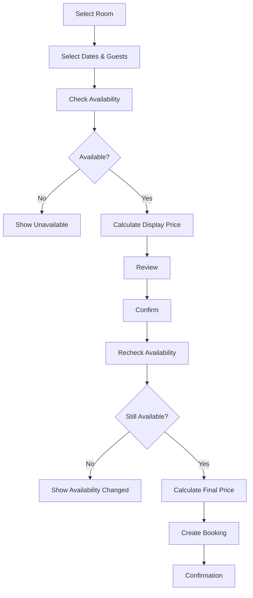

# Activity — Hotel Booking

```mermaid
flowchart TD
    A[Select Room] --> B[Select Dates & Guests]
    B --> C[Check Availability]
    C --> D{Available?}
    D -->|No| E[Show Unavailable]
    D -->|Yes| F[Calculate Display Price]
    F --> G[Review]
    G --> H[Confirm]
    H --> I[Recheck Availability]
    I --> J{Still Available?}
    J -->|No| K[Show Availability Changed]
    J -->|Yes| L[Calculate Final Price]
    L --> M[Create Booking]
    M --> N[Confirmation]
```
