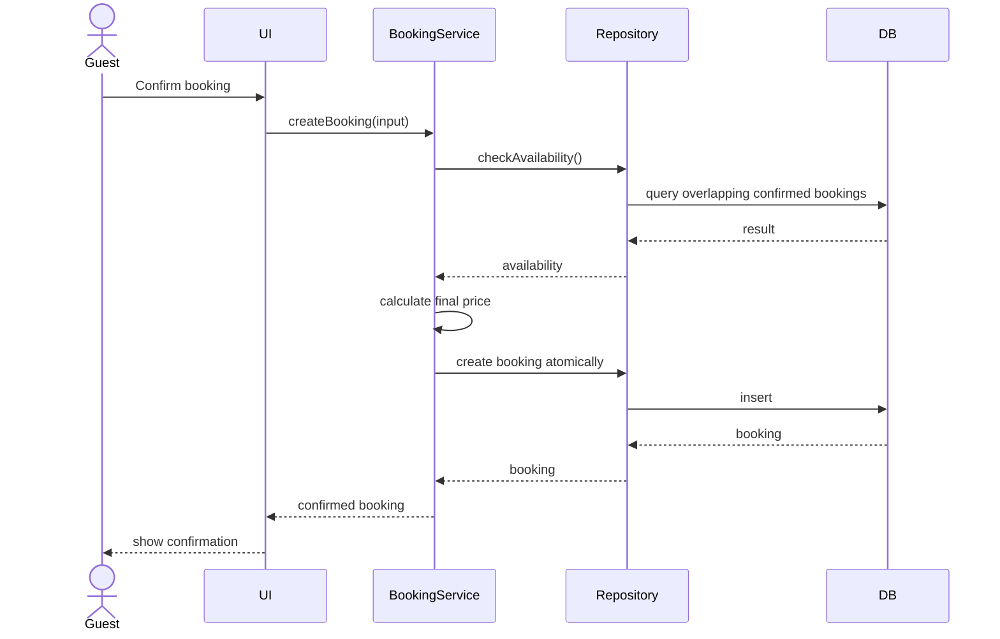

# Sequence — Hotel Booking

```mermaid
sequenceDiagram
    actor Guest
    participant UI
    participant BookingService
    participant Repository
    participant DB

    Guest->>UI: Confirm booking
    UI->>BookingService: createBooking(input)
    BookingService->>Repository: checkAvailability()
    Repository->>DB: query overlapping confirmed bookings
    DB-->>Repository: result
    Repository-->>BookingService: availability
    BookingService->>BookingService: calculate final price
    BookingService->>Repository: create booking atomically
    Repository->>DB: insert
    DB-->>Repository: booking
    Repository-->>BookingService: booking
    BookingService-->>UI: confirmed booking
    UI-->>Guest: show confirmation
```
