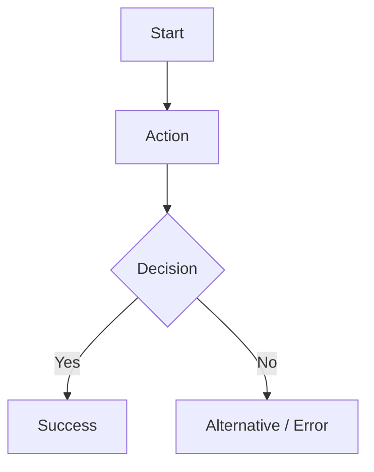

# Activity / Flow — [Feature]

```mermaid
flowchart TD
    A[Start] --> B[Action]
    B --> C{Decision}
    C -->|Yes| D[Success]
    C -->|No| E[Alternative / Error]
```

## Notes
- Model product/business behavior, not implementation details.
