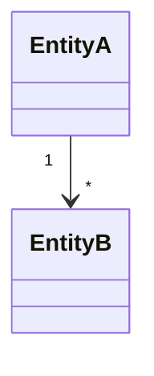

# Domain Model

## Concepts
- **[Entity/Value Object]** — [Business meaning]

## Relationships

## Notes
Keep this business-oriented. Do not model framework components or database-specific details here.
