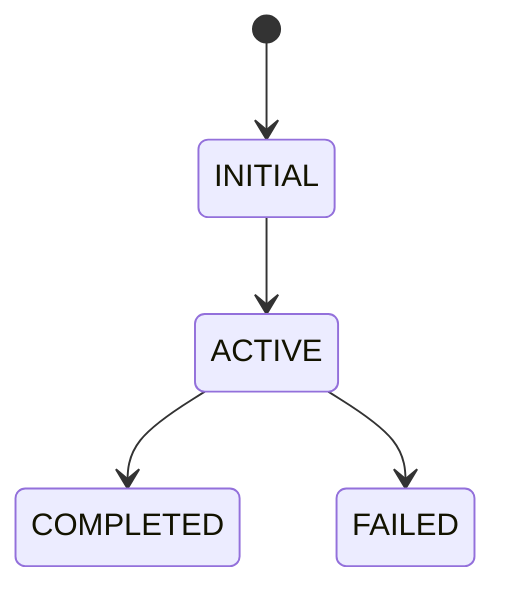

# State Model — [Feature / Entity]

```mermaid
stateDiagram-v2
    [*] --> INITIAL
    INITIAL --> ACTIVE
    ACTIVE --> COMPLETED
    ACTIVE --> FAILED
```

## Transition Rules
| From | Event | To | Guard / Rule |
|---|---|---|---|
| INITIAL | [event] | ACTIVE | [rule] |
