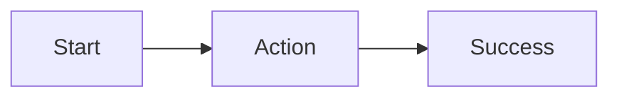

# User Journeys

## Journey: [Name]

### Actor
[User/role]

### Entry
[Starting condition]

### Goal
[Desired outcome]

### Main Journey

### Failure / Alternate Outcomes
- [Outcome]

### Success Condition
[Observable success]
