# Photographer Management Platform — Domain & Technical Blueprint

**Source of truth:** `photographer_management_uml_draft.md`  
**Status:** Recommended blueprint for MVP implementation  
**Date:** 2026-09-25

**Implementation decision:** Drizzle ORM is the selected schema, query, and migration layer. The draft UML remains the source of truth for product and domain decisions.

## 1. Domain Review

The source draft has a sound domain direction and preserves the most important decisions:

- `User` is an authenticated internal account; `Client` is a customer record.
- One `User` can own multiple `Workspace` records.
- `WorkspaceMember` is intentionally deferred for MVP.
- `ServiceItemDefinition` is reusable workspace-level metadata.
- `ServiceItem` stores service-specific values.
- `ProjectItem` is a historical snapshot of the agreed deal.
- `ServiceFieldDefinition` and `ProjectFieldValue` handle service-specific booking fields.
- `ProjectAddOn` extends entitlement and/or billing independently from discounts.
- `SelectionGroup` is the source of client selection entitlement.
- `Gallery` is client-facing but does not own the external photo files.
- `GallerySource` represents concrete external resources; Google Drive is only the first provider.
- MVP Google Drive integration uses Owner-supplied folders shared as “Anyone with the link”; the platform does not connect the Owner's Google account.
- The same client Gallery link is used for proofing and final delivery. The Owner manually creates `edited` and/or `print` folders under the linked Google Drive folder and uploads finished files there.
- `MessageTemplate` generates WhatsApp deep links; the system does not send messages in MVP.
- One Project-level client access token is shared by that Project's gallery and issued invoice links.

The domain is ready to move from conceptual UML to implementation design, with the following clarifications.

## 2. Issues and Inconsistencies Found

### 2.1 Required corrections

| Area | Finding | Recommendation |
|---|---|---|
| Workspace ownership | Most classes imply workspace ownership, but several relationships rely on indirect ownership only. | Persist `workspaceId` on tenant-owned rows; enforce same-workspace foreign keys and verify ownership in every application query. |
| Authentication | `User.passwordHash` conflicts with Better Auth being the authentication owner. | Map the conceptual `User` to Better Auth's single `user` table, extended with domain `status`; Better Auth owns credential, session, and verification records. Do not create a second domain user table. |
| Gallery password | A plain `password` attribute would be unsafe, while the agreed WhatsApp template needs `galleryPassword`. | Require a gallery password for MVP, store only its hash, and require owner re-entry and verification when rendering a WhatsApp template after initial setup. Never persist the raw password. |
| Private links | A readable slug alone is predictable. | Use one high-entropy `Project.clientAccessToken` for gallery and invoice links within the same Project; an optional gallery slug is display-only. |
| ProjectFieldValue | A value tied only to `fieldDefinitionId` can become ambiguous after definition edits or deletion. | Store snapshot metadata and enforce one value per project and logical field key. Preserve historical rows. |
| Selection limits | `effectiveLimit` is described as both stored and calculated. | Keep `extraLimit` as a transactionally maintained summary of approved add-ons linked to the group; derive `effectiveLimit = baseLimit + extraLimit`. |
| Selection status | `PhotoSelection` has `SELECTED`, `SUBMITTED`, and `LOCKED`, while `SelectionGroup` also needs lifecycle rules. | Make submission/locking group-level operations, remove the duplicate per-photo status, and validate all selections in a transaction. MVP submissions cannot be reopened. |
| Invoice totals | `subtotal`, `discount`, and `total` need calculation rules. | Store immutable line snapshots; calculate totals server-side and record rounding/currency policy. |
| External URLs | `sourceUrl`, `thumbnailUrl`, and `previewUrl` can expose storage resources. | Treat them as provider metadata; issue server-controlled or short-lived URLs where possible. |
| Gallery source sync | “Sync / load photos” is underspecified. | Define idempotent import/upsert by `(gallerySourceId, externalFileId)` and record sync status/error metadata. |
| Project service relation | The draft uses `serviceId` while also snapshotting service items. | Keep `serviceId` as source reference, but treat `ProjectItem` as the authoritative historical deal representation. |
| Invoice/payment state | Manual status updates can drift from payments. | Derive invoice status from recorded payments except for `DRAFT` and `CANCELLED`. |
| Lifecycle cardinality | Some `1..*` relationships are not true while a record is in `DRAFT` or when a service needs no photo selection. | Model persisted children as `0..*`; enforce minimum children when publishing a gallery or issuing an invoice. |
| Add-on target | `relatedProjectItemId` alone does not uniquely identify the affected selection bucket. | Add nullable `selectionGroupId`, required for selection-related add-ons, and enforce that the group and project item belong to the same project. |
| Invoice numbering | Workspace-scoped invoice uniqueness requires a `workspaceId` column absent from the original Invoice class. | Add `workspaceId` to Invoice and enforce `(workspaceId, invoiceNumber)` uniqueness. |

### 2.2 Deliberate non-changes

These are not bugs and should remain as decisions:

- Do not add `WorkspaceMember` to MVP.
- Do not make Freelancer a system actor in MVP.
- Do not merge `Client` into `User`.
- Do not replace `SelectionGroup` with one project-wide photo limit.
- Do not add `Message`, `MessageLog`, or WhatsApp delivery status before direct sending exists.
- Do not make Cloudflare, Next.js, Neon, or Better Auth domain classes.

## 3. Formal Domain Class Diagram

```mermaid
classDiagram
    class User {
      +id: AuthUserId
      +name: string
      +email: string
      +status: UserStatus
      +emailVerifiedAt: datetime?
      +createdAt: datetime
      +updatedAt: datetime
      +updateProfile(name)
      +changeStatus(status)
    }

    class Workspace {
      +id: UUID
      +ownerUserId: AuthUserId
      +name: string
      +brandName: string
      +invoicePrefix: string
      +defaultCurrency: string
      +isActive: boolean
      +rename(name)
      +updateBranding(data)
      +deactivate()
    }

    class WorkspaceSourceConfig {
      +id: UUID
      +workspaceId: UUID
      +provider: SourceProvider
      +displayName: string
      +configData: JSONB
      +isActive: boolean
      +activate()
      +deactivate()
    }

    class MessageTemplate {
      +id: UUID
      +workspaceId: UUID
      +type: MessageTemplateType
      +channel: MessageChannel
      +content: text
      +isActive: boolean
      +render(context)
      +buildWhatsAppLink(context)
    }

    class ServiceCategory {
      +id: UUID
      +workspaceId: UUID
      +name: string
      +isActive: boolean
      +rename(name)
    }

    class ServiceItemDefinition {
      +id: UUID
      +workspaceId: UUID
      +name: string
      +valueType: ValueType
      +unit: string?
      +selectionRequired: boolean
      +selectionType: SelectionType?
      +isActive: boolean
      +archive()
    }

    class Service {
      +id: UUID
      +workspaceId: UUID
      +categoryId: UUID
      +name: string
      +basePrice: money
      +currency: string
      +isActive: boolean
      +publish()
      +archive()
    }

    class ServiceItem {
      +id: UUID
      +serviceId: UUID
      +definitionId: UUID
      +value: JSONB
      +sortOrder: integer
      +changeValue(value)
    }

    class ServiceFieldDefinition {
      +id: UUID
      +serviceId: UUID
      +name: string
      +key: string
      +fieldType: FieldType
      +isRequired: boolean
      +options: JSONB?
      +sortOrder: integer
      +validate(value)
    }

    class Client {
      +id: UUID
      +workspaceId: UUID
      +name: string
      +phone: string?
      +whatsappNumber: string?
      +email: string?
      +archive()
    }

    class Project {
      +id: UUID
      +workspaceId: UUID
      +clientId: UUID
      +serviceId: UUID
      +clientAccessToken: string
      +title: string
      +eventDate: date?
      +agreedPrice: money
      +currency: string
      +status: ProjectStatus
      +completedAt: datetime?
      +completedByUserId: AuthUserId?
      +createFromService()
      +transitionTo(status)
      +addSession()
      +approveAddOn()
      +markDelivered()
      +markCompleted(ownerUserId)
    }

    class ProjectItem {
      +id: UUID
      +projectId: UUID
      +sourceServiceItemId: UUID?
      +sourceDefinitionId: UUID?
      +name: string
      +valueType: ValueType
      +value: JSONB
      +unit: string?
      +selectionRequired: boolean
      +selectionType: SelectionType?
      +updateDealValue(value)
    }

    class ProjectFieldValue {
      +id: UUID
      +projectId: UUID
      +fieldDefinitionId: UUID?
      +fieldKey: string
      +fieldName: string
      +fieldType: FieldType
      +value: JSONB
      +validate()
    }

    class ProjectAddOn {
      +id: UUID
      +projectId: UUID
      +relatedProjectItemId: UUID?
      +selectionGroupId: UUID?
      +name: string
      +quantity: decimal
      +unit: string?
      +unitPrice: money
      +totalAmount: money
      +status: AddOnStatus
      +approve()
      +cancel()
    }

    class Session {
      +id: UUID
      +projectId: UUID
      +name: string
      +sessionDate: date?
      +startTime: time?
      +endTime: time?
      +status: SessionStatus
      +reschedule(date, time)
    }

    class TeamMember {
      +id: UUID
      +workspaceId: UUID
      +name: string
      +role: string
      +defaultFee: money?
      +isActive: boolean
      +archive()
    }

    class ProjectAssignment {
      +id: UUID
      +projectId: UUID
      +teamMemberId: UUID
      +role: string
      +fee: money?
      +status: AssignmentStatus
      +confirm()
      +remove()
    }

    class Gallery {
      +id: UUID
      +projectId: UUID
      +title: string
      +slug: string?
      +passwordHash: string
      +passwordVersion: integer
      +status: GalleryStatus
      +publishedAt: datetime?
      +finalDeliveryPublishedAt: datetime?
      +expiresAt: datetime?
      +publish()
      +publishFinalDelivery()
      +expire()
      +archive()
      +verifyPassword(password)
      +rotatePassword(newPassword)
    }

    class GallerySource {
      +id: UUID
      +galleryId: UUID
      +workspaceSourceConfigId: UUID
      +externalResourceId: string
      +resourceKey: string?
      +sourceUrl: string?
      +syncStatus: SyncStatus
      +lastSyncedAt: datetime?
      +sync()
    }

    class Photo {
      +id: UUID
      +galleryId: UUID
      +gallerySourceId: UUID
      +sessionId: UUID?
      +externalFileId: string
      +resourceKey: string?
      +fileName: string
      +assetRole: PhotoAssetRole
      +thumbnailMetadata: JSONB?
      +sortOrder: integer
      +isAvailable: boolean
    }

    class SelectionGroup {
      +id: UUID
      +projectId: UUID
      +sourceProjectItemId: UUID?
      +name: string
      +selectionType: SelectionType
      +baseLimit: decimal
      +extraLimit: decimal
      +unit: string?
      +status: SelectionGroupStatus
      +submittedAt: datetime?
      +lockedAt: datetime?
      +effectiveLimit()
      +submit()
      +lock()
    }

    class PhotoSelection {
      +id: UUID
      +selectionGroupId: UUID
      +photoId: UUID
      +quantity: decimal
      +selectedAt: datetime
      +select(quantity)
      +remove()
    }

    class Invoice {
      +id: UUID
      +workspaceId: UUID
      +projectId: UUID
      +invoiceNumber: string
      +issueDate: date
      +dueDate: date?
      +currency: string
      +subtotal: money
      +discount: money
      +total: money
      +status: InvoiceStatus
      +setDiscount(amount)
      +recalculate()
      +cancel()
      +recordPayment(amount)
    }

    class InvoiceItem {
      +id: UUID
      +invoiceId: UUID
      +projectAddOnId: UUID?
      +description: string
      +quantity: decimal
      +unitPrice: money
      +amount: money
    }

    class Payment {
      +id: UUID
      +invoiceId: UUID
      +paymentDate: date
      +amount: money
      +paymentMethod: PaymentMethod
      +referenceNumber: string?
      +notes: string?
      +voidedAt: datetime?
      +void()
    }

    User "1" --> "0..*" Workspace : owns
    Workspace "1" *-- "0..*" MessageTemplate
    Workspace "1" *-- "0..*" WorkspaceSourceConfig
    Workspace "1" *-- "0..*" ServiceCategory
    Workspace "1" *-- "0..*" ServiceItemDefinition
    Workspace "1" *-- "0..*" Client
    Workspace "1" *-- "0..*" TeamMember
    ServiceCategory "1" --> "0..*" Service
    Service "1" *-- "0..*" ServiceItem
    ServiceItemDefinition "1" --> "0..*" ServiceItem
    Service "1" *-- "0..*" ServiceFieldDefinition
    Client "1" --> "0..*" Project
    Service "1" --> "0..*" Project : source template
    Project "1" *-- "0..*" ProjectItem
    Project "1" *-- "0..*" ProjectFieldValue
    ServiceFieldDefinition "0..1" --> "0..*" ProjectFieldValue : source definition
    Project "1" *-- "0..*" ProjectAddOn
    ProjectItem "0..1" --> "0..*" ProjectAddOn : related item
    Project "1" *-- "0..*" Session
    Project "1" *-- "0..*" ProjectAssignment
    TeamMember "1" --> "0..*" ProjectAssignment
    Project "1" *-- "0..1" Gallery
    Gallery "1" *-- "0..*" GallerySource
    WorkspaceSourceConfig "1" --> "0..*" GallerySource
    Gallery "1" *-- "0..*" Photo
    GallerySource "1" --> "0..*" Photo
    Session "1" --> "0..*" Photo
    Project "1" *-- "0..*" SelectionGroup
    ProjectItem "0..1" --> "0..*" SelectionGroup : source item
    SelectionGroup "0..1" --> "0..*" ProjectAddOn : entitlement target
    SelectionGroup "1" *-- "0..*" PhotoSelection
    Photo "1" --> "0..*" PhotoSelection
    Project "1" *-- "0..*" Invoice
    Invoice "1" *-- "0..*" InvoiceItem
    Invoice "1" *-- "0..*" Payment
```

### Responsibility boundaries

- Conceptual `User` maps to Better Auth's `user` row with domain `status` and `emailVerifiedAt` extensions. Better Auth owns credentials, sessions, and the verified-state transition; the verification timestamp is written as part of that transition. The domain uses the stable user ID and status, without a duplicate user table.
- `Workspace` is the tenant boundary and brand context.
- `Service` and its definitions are reusable configuration, not historical deal data.
- For MVP, `ServiceItemDefinition.valueType` is limited to `NUMBER` and `RANGE`. Both “20 edited photos” and “5 printed photos” are numeric items with different names/units; “1–2 persons” is a range. Boolean/text service benefits are deferred. This does not restrict `ServiceFieldDefinition`, which still collects text, dates, and other booking inputs.
- `Project` is the operational aggregate for one client engagement.
- `Gallery` is the controlled access boundary for client-facing photos.
- `SelectionGroup` owns entitlement rules; `PhotoSelection` owns individual choices.
- `Invoice` owns billing totals and status; `Payment` records money received.

### Lifecycle and entitlement invariants

- `User` can have zero workspaces between registration and first-workspace creation; the app redirects verified users with zero workspaces to onboarding.
- A draft Gallery can have zero sources. Publishing requires at least one active, accessible `GallerySource`, a non-empty `passwordHash`, and its Project's high-entropy client access token.
- The Project token is generated once when the Project is created. Gallery links and each issued Invoice link for that Project use the same token, with the Invoice ID identifying a specific invoice. Rotating the token invalidates both kinds of previously shared link. The gallery still requires its own password.
- The Owner may rotate the Gallery password after sharing. Rotation replaces the hash, increments `passwordVersion`, and invalidates existing password-authenticated Gallery sessions; the old password stops working immediately. The Project token and Invoice links do not change. Show the Owner a warning to share the new password with the Client.
- Proofing and final delivery use the same Gallery link, Project token, and password. The Owner manually creates `edited` and/or `print` child folders and uploads finished files; the platform only reads and syncs them. Root-level images are selectable `PROOF` photos. Files directly inside `edited` or `print` are `EDITED` or `PRINT` delivery assets and cannot be selected again.
- Finished files remain hidden in the Gallery UI until the Owner publishes final delivery. That action requires at least one synced `EDITED` or `PRINT` file, records `finalDeliveryPublishedAt`, and transitions the Project to `DELIVERED`. In MVP, each finished file is an independent downloadable Photo row; there is no mapping back to an original `PROOF` Photo.
- Only the Owner can move a `DELIVERED` Project to `COMPLETED`. Record who completed it and when. Invoice payment status never changes Project status automatically; show any outstanding invoice balance to the Owner before completion without blocking the action in MVP.
- A Project may have zero `SelectionGroup` rows when its service contains no selection benefit. Project and invoice draft rows may temporarily have zero items; a project created from a service snapshots all available service items atomically, and issuing an invoice requires at least one item.
- Validate `ServiceItem.value` and its `ProjectItem` snapshot as discriminated values: `NUMBER` stores `{ value: nonNegativeDecimal }`; `RANGE` stores `{ min: nonNegativeDecimal, max: nonNegativeDecimal }` with `min <= max`. Units and names come from the definition snapshot. A definition with `selectionRequired = true` must be `NUMBER`, and its selection limit must be a whole number. These rules are enforced on writes even though the value is stored as JSONB.
- `ProjectAddOn.selectionGroupId` is required exactly when an approved add-on changes photo selection entitlement. Its `projectId` must equal the group's `projectId`; if `relatedProjectItemId` is set, it must match `SelectionGroup.sourceProjectItemId`.
- `SelectionGroup.extraLimit` equals the sum of `quantity` on approved, selection-related add-ons targeting that group. Approval and cancellation update this summary in one database transaction; `effectiveLimit` is calculated from `baseLimit + extraLimit`.
- A Client can change `PhotoSelection` rows only while the group is `OPEN`. Submitting moves the group to `SUBMITTED` permanently for MVP; the Owner can then move it to `LOCKED` when production starts. Neither Owner nor Client can reopen a submitted or locked group in MVP. The group owns status; individual selections do not have separate lifecycle status.
- `selectionGroupId` is the indicator that an add-on changes a photo-selection limit. The target must be selected before approval; an approved add-on's target and quantity cannot be edited in place. Use a new add-on or a controlled cancellation and replacement.
- Cancelling an add-on is rejected if it would reduce the limit below selections already saved. Once its invoice is issued or paid, an add-on also requires an explicit billing adjustment rather than a silent cancellation. Draft invoice lines can be removed or recalculated in the same transaction.
- On approval, an add-on is added to the project's sole draft invoice, or a new draft invoice is created. Permit at most one draft invoice per Project; issued invoices remain immutable, and additional add-ons are billed on a later draft invoice. This preserves the draft's ability to have multiple invoices per Project over time.
- MVP payments are entered manually by the Owner with amount, date, method, and optional reference/notes. There is no payment gateway, proof upload, refund, or overpayment workflow. Reject amounts above the Invoice's remaining balance. The Owner may void a mistaken entry with an audit timestamp; only non-voided payments count toward Invoice status.
- MVP discounts are a single non-negative monetary amount on a draft Invoice. The Owner may set it from zero up to the Invoice subtotal; `total = subtotal - discount` is calculated server-side. The amount becomes immutable when the Invoice is issued. Discount changes neither ProjectItems nor SelectionGroup entitlement. There are no coupons, percentages, or per-line discounts in MVP.
- MVP amounts use `IDR` only. Store a currency code on Workspace defaults, Service prices, Project deal snapshots, and Invoices so additional currencies can be enabled later. A Project snapshots its Service currency; an Invoice uses that Project currency. Add-on prices inherit Project currency, while InvoiceItems and Payments inherit Invoice currency. Reject mixed currencies within one Project or Invoice; no exchange-rate conversion is in MVP. There is no automatic tax calculation or tax-specific field in MVP.

## 4. Formal Use Case Diagram

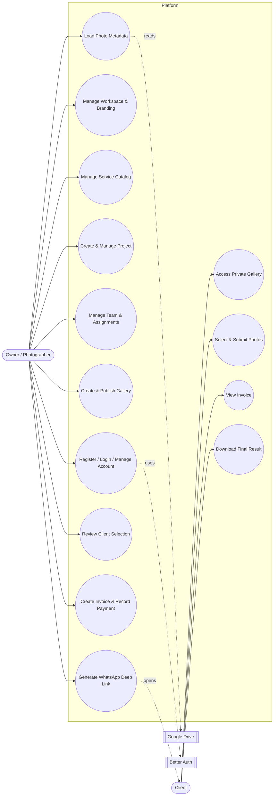

## 5. Activity Diagrams

### 5.1 Authentication and onboarding

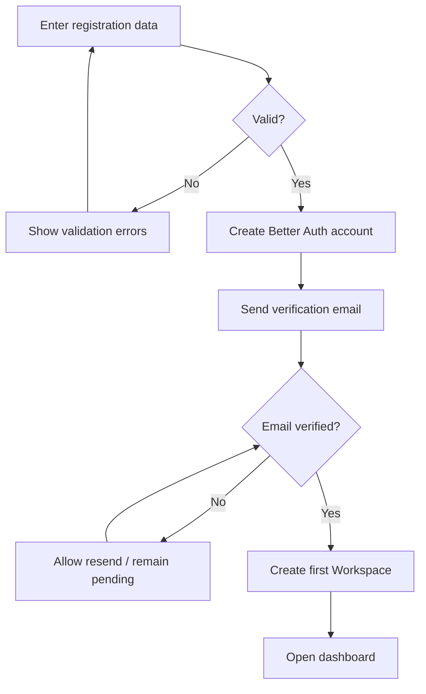

### 5.2 Create project from service

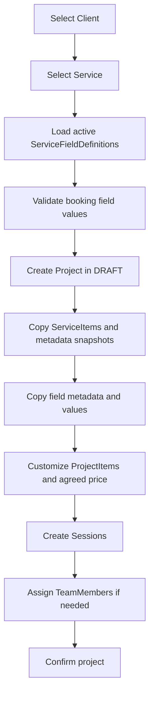

### 5.3 Gallery and photo metadata

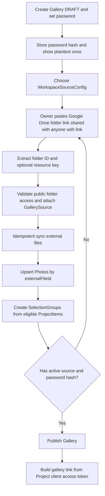

The Google Drive adapter reads root-level image files as `PROOF` and files directly under manually created `edited` and `print` child folders as finished delivery files. Folder names are matched case-insensitively; unrelated folders and deeper nesting are ignored for MVP. The Owner creates folders and uploads files in Drive; the platform's API key only reads public metadata.

### 5.4 Client selection

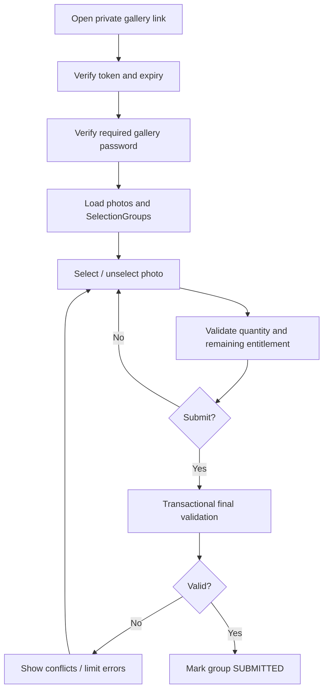

`PhotoSelection` may reference only `PROOF` photos from that Project's Gallery. Finished `EDITED` and `PRINT` files are excluded from selection limits.

### 5.5 Add-on and billing

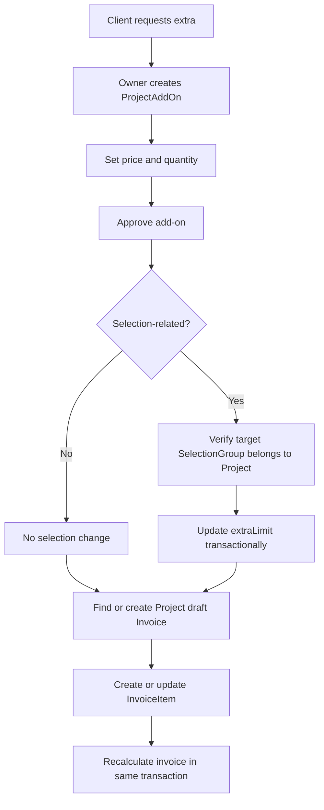

### 5.6 Final delivery in the same Gallery

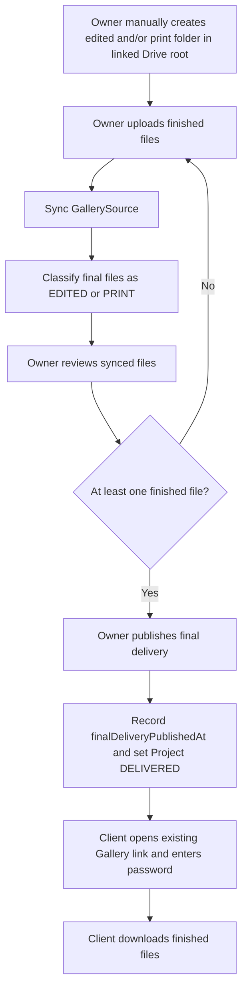

## 6. Sequence Diagrams

### 6.1 Create Project from Service

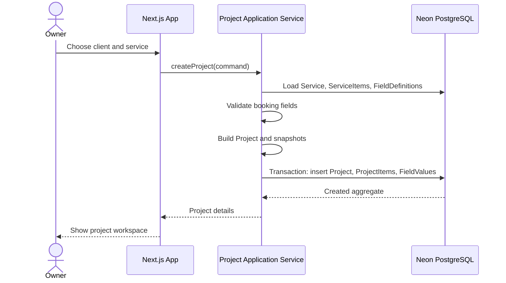

### 6.2 Load photos from Google Drive

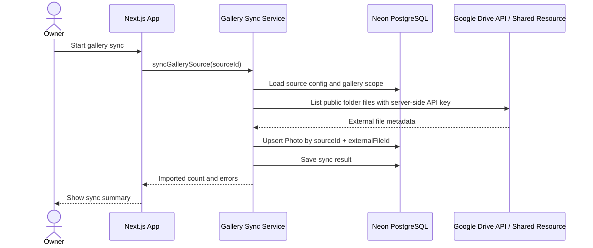

### 6.3 Client submits selection

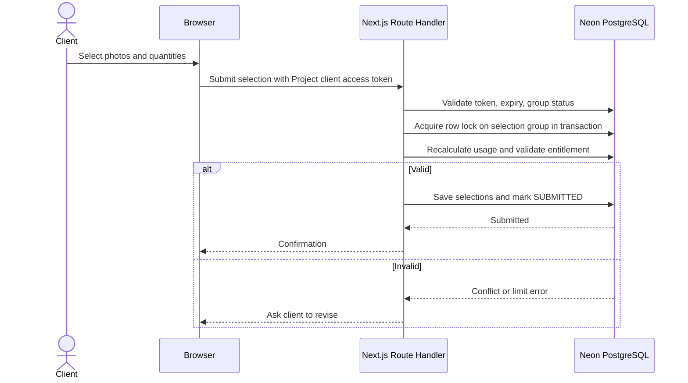

### 6.4 Share gallery via WhatsApp

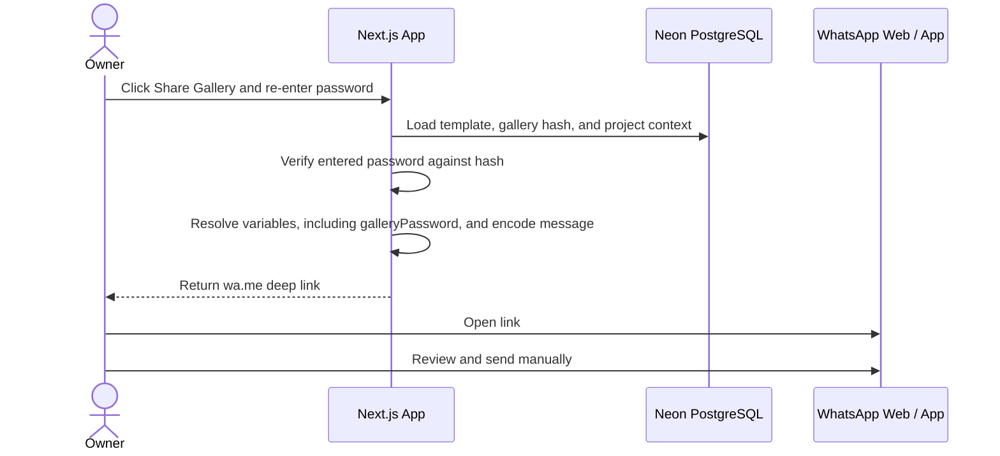

The raw gallery password is accepted only for initial setup, owner re-entry at sharing time, and Owner-initiated rotation. The server stores only the hash and must not log the submitted password or generated message. Rotation invalidates the old password and existing password-authenticated Gallery sessions; the Owner must communicate the new password. The agreed `{{galleryPassword}}` template variable is therefore available only during a share action with verified owner re-entry. Because a WhatsApp deep link contains the prefilled message, the owner must be told that sharing places the password in the link and WhatsApp draft; it is not an invisible secret channel.

### 6.5 Invoice and payment

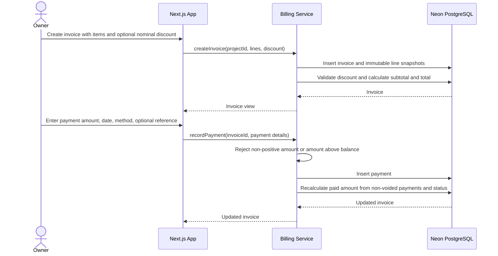

## 7. State Diagrams

### 7.1 Project

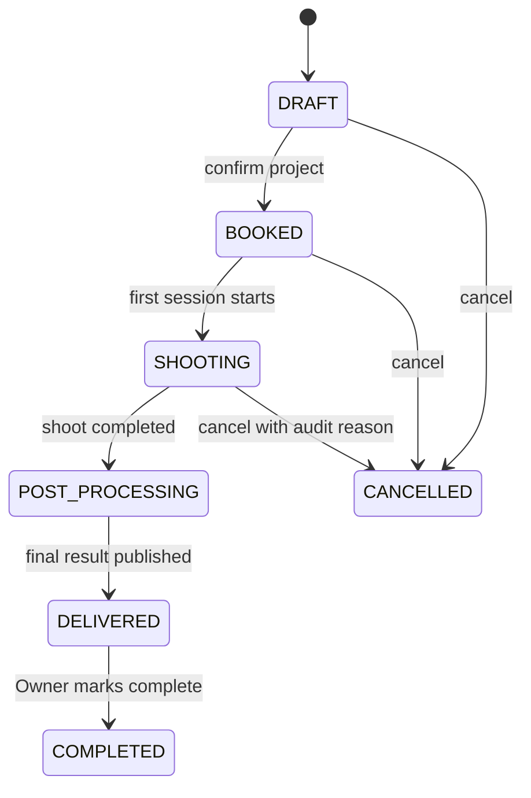

Recommended rule: `CANCELLED` is terminal for MVP. If reopening is required later, implement an explicit audited reactivation transition.

`COMPLETED` is an explicit Owner action available after `DELIVERED`. Show unpaid invoice balances before confirmation, but do not automatically complete or block completion based on Invoice status in MVP.

### 7.2 Invoice

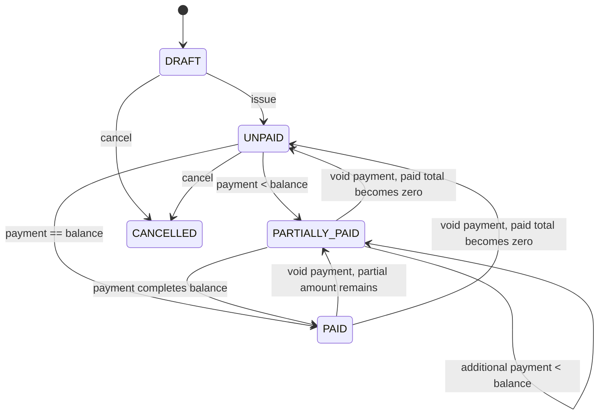

`UNPAID`, `PARTIALLY_PAID`, and `PAID` are derived from the sum of non-voided manual payments. The Owner can void an incorrect record with an audit timestamp; this is a correction, not a refund. Reject overpayments. Refunds and proof uploads are outside MVP.

### 7.3 SelectionGroup

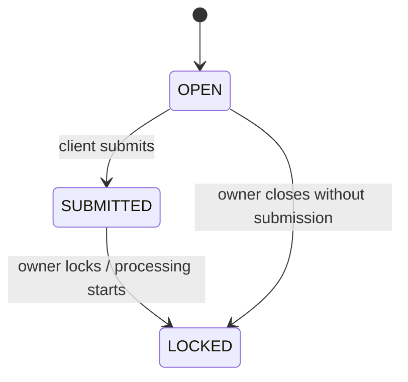

Selection mutations are allowed only in `OPEN`. In MVP, neither `SUBMITTED` nor `LOCKED` can transition back to `OPEN`; no reopen action is exposed. `PhotoSelection` has no duplicate status field.

### 7.4 Gallery

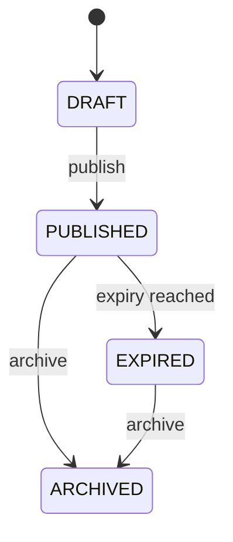

## 8. Technical Architecture

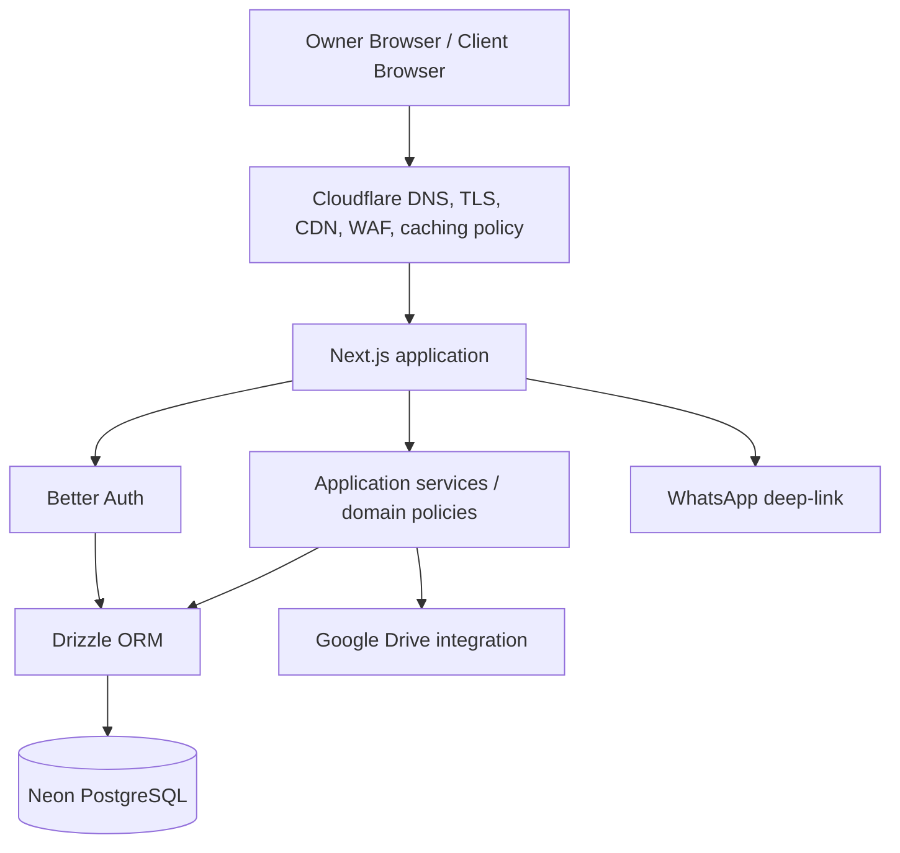

### Recommended layer boundaries

```text
app/
  routes and pages
  server actions / route handlers

modules/
  auth/
  workspace/
  catalog/
  projects/
  galleries/
  selection/
  billing/
  messaging/

domain/
  entities and value objects
  invariants and state transitions

infrastructure/
  better-auth/
  drizzle/
  neon/
  google-drive/
  whatsapp/
  cloudflare/
```

### Runtime guidance

- Next.js owns pages, server-side orchestration, route handlers, and client-facing flows.
- Better Auth owns sessions, credential flows, email verification, password reset, and future organization support.
- Drizzle defines the PostgreSQL schema and migrations, performs application queries and transactions, and supplies the database adapter used by Better Auth.
- Neon PostgreSQL is the system of record for domain data.
- The Google Drive adapter accepts an Owner-supplied “Anyone with the link” folder URL, extracts its folder ID and optional resource key, and lists public folder metadata with a server-side Google Cloud API key. It classifies root-level images as `PROOF` and files in Owner-created `edited` and `print` child folders as finished assets. The domain depends on a `GallerySourceProvider` interface, not Google Drive types. No Owner OAuth connection is used in MVP and the platform does not create folders or upload files. See [Google's public-folder listing guide](https://developers.google.com/workspace/drive/api/guides/search-files), [folder creation guide](https://developers.google.com/workspace/drive/api/guides/folder), and [resource-key guidance](https://developers.google.com/workspace/drive/api/guides/resource-keys).
- WhatsApp integration is a URL generator, not a message delivery service in MVP.
- Cloudflare should provide DNS, TLS, edge protection, deployment/runtime, and carefully selected caching. Private gallery and invoice responses must not be publicly cached.

### Cloudflare boundaries

Use Cloudflare for:

- DNS and TLS
- WAF/rate limiting where available
- static assets and safe public caching
- deployment/runtime compatible with the selected Next.js adapter
- request-level protection for public gallery endpoints

Do not move domain state or authorization into edge-only storage unnecessarily. Neon remains the source of truth. Do not expose Google Drive credentials or private source URLs to the browser.

## 9. Database Mapping

### 9.1 Tables

| Table | Important columns | Constraints / indexes |
|---|---|---|
| `user` | Better Auth fields, domain `status` and `email_verified_at` extensions | One Better Auth-managed user row; no duplicate domain user table. `workspace.owner_user_id` references its actual primary-key type. |
| `workspace` | `id`, `owner_user_id`, brand fields, `default_currency` | Index `owner_user_id`; unique `(owner_user_id, name)` if desired. MVP default is `IDR`. |
| `workspace_source_config` | `workspace_id`, `provider`, `config_data` | Index workspace; unique display name per workspace. For MVP public Google Drive folders, do not put an OAuth credential or platform API key in `config_data`; keep the API key in server secrets. |
| `message_template` | `workspace_id`, `type`, `channel`, `content` | Unique active template key per workspace/type/channel. |
| `service_category` | `workspace_id`, `name`, `is_active` | Unique normalized name per workspace. |
| `service_item_definition` | `workspace_id`, type/unit/selection metadata | Unique normalized name or key per workspace. MVP `value_type` accepts only `NUMBER` or `RANGE`; selection-required definitions must be `NUMBER`. |
| `service` | `workspace_id`, `category_id`, price, `currency`, status | Index workspace/category; soft archive. MVP currency is `IDR`. |
| `service_item` | `service_id`, `definition_id`, typed JSONB `value`, sort | Unique `(service_id, definition_id)`; same-workspace service/definition constraint. Validate numeric or min/max shape from the referenced definition. |
| `service_field_definition` | `service_id`, `key`, type/options | Unique `(service_id, key)`. |
| `client` | `workspace_id`, contact fields | Index workspace and normalized phone/email. |
| `project` | `workspace_id`, client/service IDs, unique `client_access_token`, agreed price, `currency`, status, nullable `completed_at`/`completed_by_user_id` | Index `(workspace_id, status)`, event date, client; same-workspace client/service constraints. Snapshot Service currency and generate a high-entropy token at creation. Only Owner can set completion fields after `DELIVERED`. |
| `project_item` | project ID, source IDs, snapshot type/metadata and typed JSONB value | Validate and preserve `NUMBER` or `RANGE` snapshot; never mutate historical metadata automatically. |
| `project_field_value` | project ID, field key, snapshot metadata, JSON value | Unique `(project_id, field_key)`. |
| `session` | project ID, date/time/status | Index project/date. |
| `team_member` | workspace ID, role/status | Index workspace/active. |
| `project_assignment` | project/team member, fee/status | Unique `(project_id, team_member_id, role)` as appropriate. |
| `gallery` | project ID, optional display slug, non-null password hash, `password_version`, `final_delivery_published_at`, status | Unique project ID. Access uses the Project token and required gallery password, never the slug alone. Increment version on rotation to invalidate prior Gallery password sessions. |
| `gallery_source` | gallery/config IDs, external folder ID, optional resource key, sync fields | Unique `(workspace_source_config_id, external_resource_id, gallery_id)` or provider-specific equivalent. |
| `photo` | gallery/source IDs, external file ID, optional resource key, `asset_role`, session ID | Unique `(gallery_source_id, external_file_id)`; index gallery/role/order. `asset_role` is `PROOF`, `EDITED`, or `PRINT`; only `PROOF` is selectable. Finished files have no `source_photo_id` mapping in MVP. |
| `selection_group` | project ID, project item, `base_limit`, `extra_limit`, status, nullable `submitted_at`/`locked_at` | Index project/status; unique logical group key per project; check both limits are non-negative. No reopen transition in MVP. |
| `photo_selection` | group/photo IDs, quantity, `selected_at` | Unique `(selection_group_id, photo_id)`; check quantity > 0. Lifecycle status is held only by SelectionGroup. |
| `project_add_on` | project/item IDs, nullable `selection_group_id`, quantity, amount, status | Selection add-ons must target a group in the same project; check positive quantity/non-negative amount; index project/status. |
| `invoice` | `workspace_id`, project ID, number, `currency`, `subtotal`, `discount`, `total`, status | Unique `(workspace_id, invoice_number)` and partial unique `(project_id)` while status is `DRAFT`; same-workspace project FK; index project/status. Currency equals Project currency. Check `0 <= discount <= subtotal` and calculate `total = subtotal - discount`; change discount only in `DRAFT`. |
| `invoice_item` | invoice/add-on IDs, snapshots, amount | Immutable after issue except explicit adjustment flow. |
| `payment` | invoice ID, amount/date/method, optional reference/notes, nullable `voided_at` and `voided_by` | Index invoice/date; check amount > 0. Owner records manually; reject amount above remaining balance; sum only non-voided rows. No proof file or refund table in MVP. |

### 9.2 Data types

- Use UUIDs for domain entity IDs. Match `workspace.owner_user_id` to the actual Better Auth `user.id` type; treat it as an opaque `AuthUserId` rather than assuming UUID.
- Use a decimal PostgreSQL type for money, for example `numeric(18,3)`, and validate fractional precision according to the currency. IDR inputs display as whole rupiah in MVP. Do not use floating-point values for money.
- Use `jsonb` for provider-specific configuration, strictly validated `ServiceItem`/`ProjectItem` values, booking field values, and options. MVP package values have only `NUMBER` (`{ value }`) or `RANGE` (`{ min, max }`) shapes; this does not change booking field types.
- Persist ISO currency codes on Workspace default, Service, Project, and Invoice. In MVP only `IDR` may be chosen; this prepares storage for later currencies without adding conversion logic. Add-ons inherit Project currency; InvoiceItems and Payments inherit Invoice currency.
- Do not model automatic tax, tax rate, or tax totals in MVP. If tax is required by a future product decision, design it explicitly before enabling it on invoices.
- Use timestamps with timezone for audit fields; use date/time types for photography schedule semantics.
- Prefer application-level enums backed by checked strings or PostgreSQL enums only when migration flexibility is acceptable.

### 9.3 Workspace and relationship constraints

- Add `workspace_id` to every tenant-owned domain table, including child tables such as `service_item`, `project_item`, `gallery_source`, `photo_selection`, `invoice_item`, and `payment`. These columns are relational scope keys, even when the domain class reaches the workspace through its parent.
- Declare a unique key on `(workspace_id, id)` for each tenant-owned parent and use composite foreign keys wherever a child references another tenant-owned row. Examples: `project(workspace_id, client_id)` → `client(workspace_id, id)`; `project(workspace_id, service_id)` → `service(workspace_id, id)`; `service(workspace_id, category_id)` → `service_category(workspace_id, id)`; `invoice(workspace_id, project_id)` → `project(workspace_id, id)`.
- The `service_item` definition, gallery source configuration, team assignment, and add-on target must also resolve to the same workspace. For relationships that must share one project, such as add-on → SelectionGroup or PhotoSelection → Photo, verify the project path in a transaction; add explicit composite project keys or a database trigger where a plain FK cannot express the path. Application authorization checks remain required.
- Enforce one gallery per project with a unique `gallery.project_id`. Enforce one photo selection per `(selection_group_id, photo_id)` and one imported photo per `(gallery_source_id, external_file_id)`. A selection submission must confirm that its photo belongs to the Gallery of the group's Project.
- A selection submission must use a `PROOF` photo. Final `EDITED`/`PRINT` files are separate external-file metadata rows and remain hidden in the Gallery UI until `final_delivery_published_at` is set. Proofing and final download sections share one client link.
- Do not infer an original proofing Photo from a final file name or folder path in MVP. `EDITED` and `PRINT` files are independent downloads; add explicit variant links only if a future workflow needs them.
- All owner reads and writes require both an authenticated user and ownership of the active workspace. Database constraints defend integrity; they do not replace request authorization.

### 9.4 Snapshot and entitlement rules

1. `ProjectItem` is authoritative for the agreed package item after project creation.
2. `ProjectFieldValue` preserves field key/name/type at booking time.
3. `InvoiceItem` preserves description, quantity, unit price, and amount at invoice issue time.
4. Source template changes affect future projects only.
5. Deleting a source definition must be archive-only while historical snapshots reference it.
6. `SelectionGroup.extraLimit` is updated only by the add-on approval/cancellation transaction and must equal the sum of approved targeted add-on quantities. `effectiveLimit` is derived, not stored.
7. An add-on that targets a SelectionGroup cannot be cancelled when current selections would exceed the reduced limit; issued or paid billing requires an explicit adjustment before cancellation.
8. Payment entry and correction are transactional with Invoice balance/status recalculation. Manual entry cannot exceed the remaining balance; voiding a mistaken entry excludes it from the paid sum but retains its row for audit. No refund or payment-proof attachment is modeled in MVP.
9. `Invoice.discount` is one nominal amount, default zero, settable only before issue. It cannot exceed the subtotal and does not add or remove Project entitlements.
10. All amounts in a Project and its Invoices have one currency. MVP accepts `IDR` only; keep currency codes on priced aggregates for future currencies without conversion or tax calculations.
11. Only `NUMBER` and `RANGE` package item values are accepted in MVP. A selection entitlement derives from a whole-number `NUMBER` item, never from a range.

### 9.5 ORM decision

**Drizzle ORM is selected.** Define the PostgreSQL tables, indexes, checks, composite foreign keys, queries, transactions, and migration files in Drizzle. Use Better Auth's Drizzle adapter against the same database and its generated auth schema; extend its `user` table for domain status and verification timestamp instead of maintaining a second identity table. Verify generated auth schema and adapter configuration against the installed library versions before writing the first migration. See the [Better Auth Drizzle adapter](https://better-auth.com/docs/adapters/drizzle) and [Better Auth database schema](https://better-auth.com/docs/concepts/database) documentation.

## 10. Security and Data Isolation

### Authentication

- Better Auth is the authority for password credentials, sessions, verification, and reset flows.
- Store only the stable authenticated user ID in domain ownership references. `User.status` and `emailVerifiedAt` extend Better Auth's single `user` table. Better Auth's verified state remains authoritative; update the timestamp within the verification lifecycle.
- Require verified email before creating or opening a production workspace, unless an explicit onboarding policy says otherwise.
- Use secure, httpOnly, same-site session cookies and rotate/revoke sessions on sensitive account events.

### Authorization

- Every owner request must resolve an active workspace context.
- Every repository query must include `workspaceId` or derive it through an authorized aggregate.
- Never trust a workspace ID supplied by the browser without verifying ownership or membership.
- Client-facing endpoints must resolve the Project client access token, then verify that the requested Gallery or issued Invoice belongs to that Project. Owner sessions do not authorize client access.
- Add server-side checks for project, gallery, invoice, selection group, photo, and payment cross-workspace references.

### Private gallery access

- Generate a cryptographically random, unique client access token per Project; do not rely on sequential IDs or guessable slugs. Both gallery and invoice links for the same Project carry that token.
- Require a gallery password for MVP and store only its hash. Require owner re-entry to populate `{{galleryPassword}}` when sharing again.
- Allow the Owner to rotate the Gallery password after sharing. Increment `passwordVersion` and reject password-authenticated Gallery sessions created under an older version; warn that the Client must receive the new password. Invoice links continue to use the unchanged Project token.
- Rate-limit password attempts and public selection submissions.
- Respect `expiresAt` and `status` on every public request.
- Do not send the Google Cloud API key or direct Drive folder links to the client. In the selected MVP mode, the folder and inherited files are link-shared at Google; anyone who obtains a direct Drive link can bypass the app's token and Gallery password. Show this limitation to the Owner during setup. The app's password protects its gallery UI, not Google's public link. If the folder's sharing permission is revoked, sync and media access can fail.
- Prefer short-lived signed/proxied media URLs or a controlled image proxy when provider access is private.

### Invoice and client privacy

- Invoice links use the same Project token as the gallery and identify an issued Invoice in that Project, for example `/i/{clientAccessToken}/{invoiceId}`. Gallery links use `/g/{clientAccessToken}`. A token holder can access the Project's issued invoices through those links; draft and cancelled invoices remain owner-only.
- Avoid putting client PII or passwords in application URLs or logs. The agreed WhatsApp prefilled-message flow necessarily carries the gallery password in the outbound deep link when `{{galleryPassword}}` is used; show the message to the owner before opening WhatsApp and never log that link.
- Redact provider credentials, tokens, and private link secrets from application logs.
- Validate and sanitize template variables and message output.

### Integrity and abuse controls

- Use transactions for selection submission, add-on approval with invoice changes, payment recording, and invoice total calculation.
- Use idempotency keys for sync commands and payment recording requests.
- Add audit fields (`createdBy`, `updatedBy`, timestamps) to sensitive owner actions.
- Apply rate limits to login, password verification, public gallery access, sync, and WhatsApp link generation.
- Define backup/restore and retention policy for Neon data before production launch.

## 11. Decision Log

**Resolved — client access model:** One high-entropy token per Project is used for both its Gallery and issued Invoice links. Gallery access additionally requires the agreed password. Rotating the Project token invalidates all previously shared Gallery and Invoice links for that Project.

**Resolved — Gallery password rotation:** The Owner may rotate the password after sharing. The previous password and existing Gallery password sessions are invalidated immediately; the Owner sends the new password to the Client. Invoice links are unaffected.

**Resolved — Google Drive access:** For MVP, the Owner sets a folder to “Anyone with the link” and pastes its link into the platform. The server uses a Google Cloud API key to list public-folder metadata, preserving folder/file resource keys where required. No Owner OAuth connection or service-account folder sharing is used. The app warns that possession of a direct Drive link bypasses its gallery access controls.

**Resolved — final delivery:** The Client uses the same Gallery link for proofing and final downloads. The Owner manually creates `edited` and/or `print` folders under the linked public Google Drive root and uploads finished files. The platform syncs them read-only, and the Owner publishes final delivery after reviewing them. The Gallery then exposes finished downloads and the Project becomes `DELIVERED`. No separate delivery URL or Google Drive write access is needed for MVP.

**Resolved — payment behavior:** The Owner records payments manually with amount, date, method, and optional reference/notes. An erroneous record can be voided with an audit timestamp and the Invoice balance is recalculated. Reject amounts above the remaining balance. Payment gateway, proof upload, refund, and overpayment flows are out of MVP.

**Resolved — Project completion:** The Owner explicitly marks a `DELIVERED` Project as `COMPLETED`. Record actor and time. Invoice status never completes the Project automatically; display any unpaid balance before the Owner confirms completion.

**Resolved — selection reopening:** A Client can edit selections only while the SelectionGroup is `OPEN`. After submission, neither the Client nor Owner can reopen it in MVP. The Owner may lock it for production; group status is the sole selection lifecycle status.

**Resolved — discount:** MVP supports one optional nominal discount amount on each draft Invoice. It reduces the Invoice total only and becomes fixed when the Invoice is issued. No coupons, percentage discounts, or per-item discounts are modeled.

**Resolved — currency and tax:** MVP displays and accepts IDR amounts only, with no automatic tax calculation. Currency codes are stored on Workspace, Service, Project, and Invoice so other currencies can be enabled later. No mixed-currency invoice or exchange-rate conversion is supported in MVP.

**Resolved — package item values:** MVP supports `NUMBER` and `RANGE` ServiceItem values only. Edited-photo and print quantities are numbers; person counts such as 1–2 are ranges. Boolean, free-text, and composite package values are deferred. Service-specific booking fields remain independent and can collect text or dates.

**Resolved — final photo mapping:** `EDITED` and `PRINT` files are independent downloadable Photo rows in MVP. The platform does not pair each finished file to its original selected `PROOF` Photo.

**Resolved for MVP — multi-user workspace:** Only the Owner has a system account and one Owner can own multiple Workspaces, as already decided in the source draft. Freelancer remains `TeamMember` without login; no `WorkspaceMember` table is needed in MVP. If staff access is requested later, decide between Better Auth Organizations and a domain membership model after roles and permissions are specified.

There are no remaining MVP open questions from the original list. Future staff access and linked photo variants are deferred features, not assumptions in the MVP schema.

## 12. Recommended Implementation Order

1. **Foundation and decisions**
   - Carry the resolved MVP decisions into the first Drizzle schema: independent final files, Owner-only workspace access, shared Project client tokens, public Drive folder links, manual payments, IDR-only pricing, and NUMBER/RANGE package items.
   - Define enums, ID strategy, timestamp/audit conventions, workspace scoping, and error model in Drizzle schemas.
   - Set the Better Auth `user` schema as the sole identity table and match all owner foreign keys to its primary-key type.

2. **Authentication and workspace onboarding**
   - Integrate Better Auth through its Drizzle adapter and review generated auth migrations before application migrations.
   - Implement register, verify email, login, logout, reset password, profile, and first-workspace creation.
   - Establish workspace context and authorization middleware.

3. **Workspace configuration**
   - Workspace branding.
   - Message templates.
   - Workspace source configuration.

4. **Service catalog**
   - Categories, item definitions, services, service items, and service field definitions.
   - Validate NUMBER/RANGE package values, whole-number selection entitlements, and active/archive behavior. Keep booking-field validation separate.

5. **Client and project creation**
   - Client management.
   - Project creation from service.
   - Transactional snapshot of `ProjectItem` and `ProjectFieldValue`.
   - Sessions, team members, and assignments.

6. **Gallery provider boundary**
   - Implement `GallerySourceProvider` interface.
   - Add a Google Drive public-folder adapter with a server-side API key and optional resource-key handling.
   - Create draft gallery with required password hash, validate an Owner-supplied public folder link, attach sources, and perform idempotent metadata sync of root proofing photos and `edited`/`print` finished files. Publish only with at least one active, accessible source.

7. **Private gallery access**
   - Token/password verification, expiry, rate limiting, safe photo delivery, and client-facing gallery UI.

8. **Selection workflow**
   - Generate selection groups from eligible project items.
   - Implement quantity-aware selection.
   - Add transactional submit, lock, and owner review. Submitted or locked groups cannot be reopened in MVP.

9. **Final delivery**
   - Let the Owner manually create `edited`/`print` Drive folders and upload finished files; sync them read-only through the existing GallerySource.
   - Let the Owner review and publish at least one finished file. Record `finalDeliveryPublishedAt`, move the Project to `DELIVERED`, and show independent downloads under the existing Gallery link.
   - Let the Owner mark a delivered Project `COMPLETED` manually; show any unpaid Invoice balance before confirmation.

10. **Add-ons and billing**
   - Add-on approval tied to the correct SelectionGroup and a draft invoice.
   - Transactionally maintain `extraLimit`, derive effective entitlement, and block cancellation that would invalidate saved selections.
   - Invoice with one optional draft-stage nominal discount, immutable issued invoice items, manual payment recording, voiding mistaken entries, and derived status. Reject overpayments; omit refund and proof-upload flows.

11. **Communication**
    - Template variable resolver.
    - WhatsApp deep-link generation for gallery, invoice, reminder, selection, and final delivery flows. Require owner password re-entry for `{{galleryPassword}}`.

12. **Operational hardening**
    - Workspace isolation tests.
    - Public-link abuse tests.
    - Concurrency tests for selection and payment.
    - Provider failure/retry tests.
    - Backups, observability, and Cloudflare caching/rate-limit review.

## 13. MVP Completion Criteria

The MVP is structurally ready when:

- an owner can register, verify email, create/select a workspace, and reach a dashboard;
- all domain reads and writes are workspace-isolated;
- a service can produce a project with immutable item and booking-field snapshots;
- a project can have sessions, team assignments, one gallery, and multiple external sources;
- Google Drive metadata sync is idempotent and does not expose provider credentials;
- a client can access a gallery protected by a Project token and password, use the same Project token for its issued Invoice links, select photos by selection group, set print quantities, and submit once;
- the Owner can upload finished files to manually created `edited`/`print` folders and publish Client downloads through the same Gallery link;
- finished files are downloadable independently without mapping to proofing-photo IDs;
- the Owner can manually mark a delivered Project complete, with actor and timestamp recorded, regardless of Invoice payment status;
- approved add-ons update their targeted selection group and draft invoice consistently, and cancellation cannot invalidate saved selections;
- invoice totals and payment status are transactionally correct;
- service, project, and invoice prices use IDR in MVP, with persisted currency codes and no automatic tax or currency conversion;
- WhatsApp links are generated with resolved templates and sent manually by the owner;
- state transitions, public access, and sensitive owner actions are tested and auditable.
