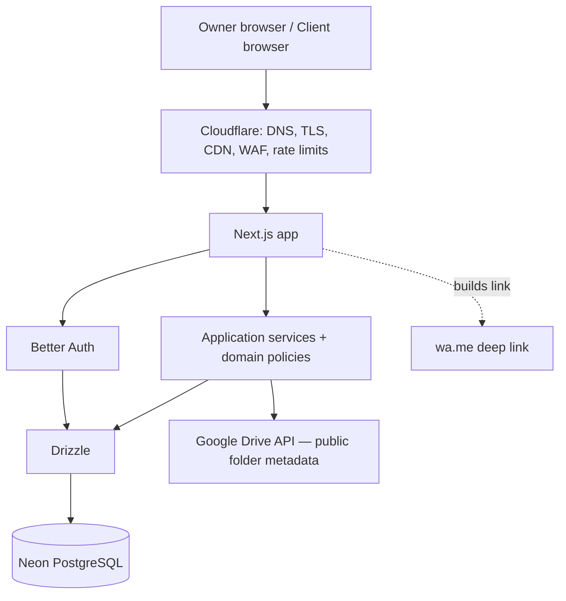

# Architecture Overview

Status: ACCEPTED (migrated from blueprint §8–§10 on 2026-09-25)

## Context



## Boundaries

```text
src/
  app/                 Next.js routes, pages, layouts, server actions, route handlers (thin)
  features/<feature>/  Product-facing bounded contexts, each with domain/application/ui
      auth, workspace, booking, gallery, finance, communications
  adapters/            Vendor implementations of application-owned ports
      auth, db, email, storage, queue, source
  composition/         Dependency-injection/composition root; wires ports to adapters
  ui/                  Shared design-system primitives and patterns
  shared/              Small genuinely cross-feature types/errors/utilities
```

Each feature is internally structured as `domain/`, `application/`, and `ui/`. Dependency direction is `app → composition → features/application → features/domain`; feature application code depends on ports, and `adapters/` implements those ports. `features/domain` imports no framework or vendor code. `composition/` is the only place that wires concrete adapters to ports.

### Unit folder and test convention

Every meaningful implementation unit gets its own folder. The implementation, sibling TDD test, types, and runtime schema are co-located when applicable:

```text
src/features/auth/application/use-cases/register-owner/
  register-owner.ts
  register-owner.test.ts
  register-owner.types.ts
  register-owner.schema.ts

src/features/auth/ui/register-form/
  register-form.tsx
  register-form.test.tsx
  register-form.types.ts
  register-form.schema.ts
```

Unit tests live beside the unit they drive. Cross-boundary integration tests and browser journeys remain in `tests/integration/` and `tests/e2e/`.

## Responsibilities
### UI and routing (`app/`, `features/*/ui`, `ui/`)
Rendering, form UX, client-side validation for feedback, calling server actions. No business rules, no direct DB access.
### Feature application (`features/*/application`)
Resolve session + workspace context, authorize, validate input (Zod), run use cases inside transactions, map domain errors to responses.
### Feature domain (`features/*/domain`)
Invariants and transitions from [business-rules.md](../domain/business-rules.md): value shapes, limits, lifecycle guards, totals.
### Adapters (`adapters/`)
Drizzle schema + repositories, Better Auth, Resend, Drive, R2, Queues, WhatsApp, Cloudflare, and secrets access. Adapters are vendor-facing implementations only and never define product policy.
### Composition (`composition/`)
Construct feature use cases with concrete adapters and expose safe entry points to `app/`. No business rules belong here.

## Cross-Cutting Concerns

### Authentication / authorization
- Better Auth: credentials, sessions (secure, httpOnly, same-site cookies), verification, reset.
- Every owner request resolves an active workspace owned by the session user (BR-WS-003).
- Every repository query is scoped by `workspaceId` or reached through an authorized aggregate.
- Client endpoints authorize only by project token (+ gallery password session), then verify the requested gallery/invoice belongs to that project (BR-ACC-*).

### Data mapping rules (see [ADR-003](decisions/ADR-003-workspace-isolation.md), [ADR-007](decisions/ADR-007-money-and-currency.md))
- UUID for domain IDs; Better Auth user ID treated as opaque `AuthUserId`.
- `workspace_id` on every tenant-owned table including children; unique `(workspace_id, id)` on parents; composite FKs for cross-table references.
- Project-path relations (add-on → group, selection → photo) verified in the transaction; add composite project keys or triggers where FKs can't express them.
- Money: `numeric(18,3)`, never floats. JSONB for provider config, package values, booking values — always schema-validated.
- `timestamptz` for audit fields; `date`/`time` for schedule semantics.
- Enums as checked strings unless migration flexibility is irrelevant.
- Key uniqueness: `gallery.project_id`; `photo(gallery_source_id, external_file_id)`; `photo_selection(selection_group_id, photo_id)`; `invoice(workspace_id, invoice_number)`; partial unique `invoice(project_id) WHERE status='DRAFT'`; `service_item(service_id, definition_id)`; `service_field_definition(service_id, key)`; `project_field_value(project_id, field_key)`.
- Table-level constraint reference: `_source/photographer_management_platform_blueprint.md` §9.

### Consistency
Transactions (with row locks where contention exists) for: project creation snapshot, selection change/submit, add-on approve/cancel + invoice, invoice recalculation, payment record/void. Idempotency keys for sync and payment recording.

### Validation
Zod at trust boundaries; domain functions re-check invariants; DB constraints as last line of defense.

### Error handling
Expected failures are typed domain errors (e.g. `SelectionLimitExceeded`, `InvoiceNotDraft`) mapped to user-facing messages; unexpected errors are logged and shown generically.

### Logging / observability
Structured logs with workspace/project IDs; never log passwords, tokens, WhatsApp links, API keys, Drive links, or client PII.

### Security
- Rate limits: login, gallery password, public gallery access, selection submit, sync, WhatsApp link generation.
- Private gallery/invoice responses: `Cache-Control: private, no-store`; never edge-cached.
- Media served via controlled proxy/short-lived URLs; no provider credentials to the browser.
- Audit fields on sensitive owner actions (BR-AUD-001).
- Backup/restore and retention policy for Neon defined before production.

## Localization boundaries

[ADR-021](decisions/ADR-021-next-intl-bilingual-localization.md) selects next-intl. Request-scoped locale resolution and message assembly belong to composition; framework adapters and UI translate stable domain errors. Feature messages stay in sibling `*.copy.ts` units. Domain code accepts plain values/types when needed and imports no translation framework. No new top-level architecture folder is introduced. HTML, next-intl and React Aria share the active locale; paired authored content stays owned by its feature. Persistence/schema, safe formatting/parsing and legacy rollout require technical design before implementation.
