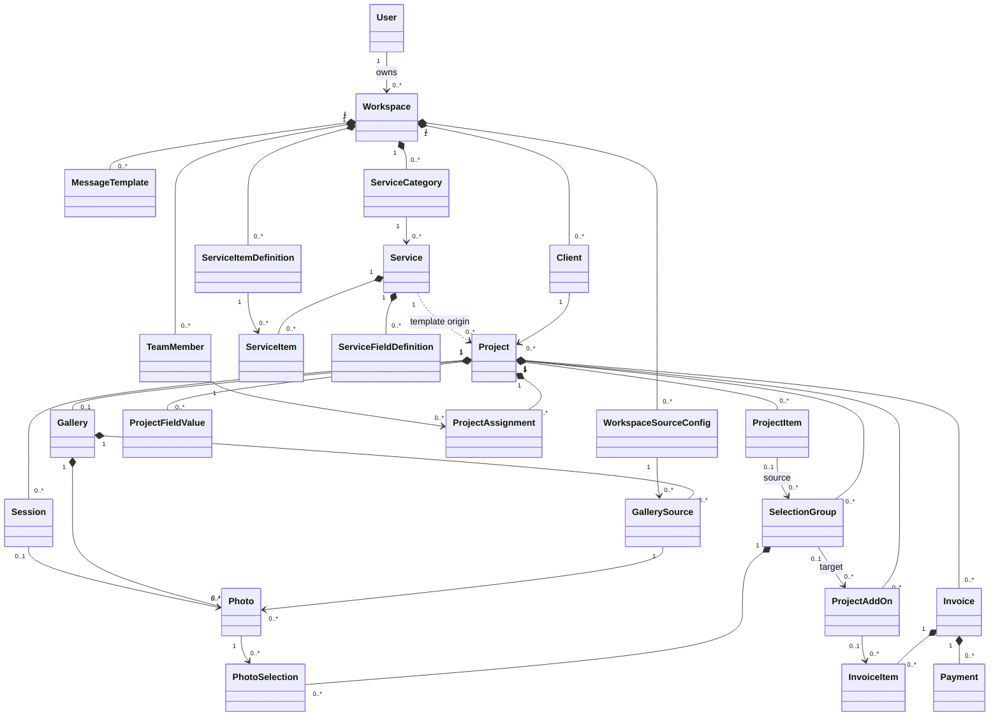
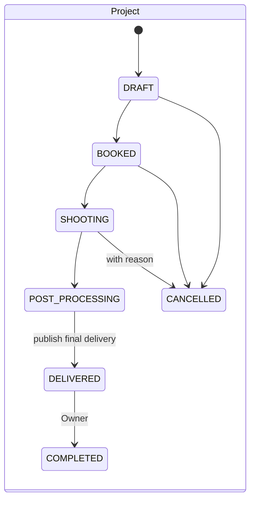
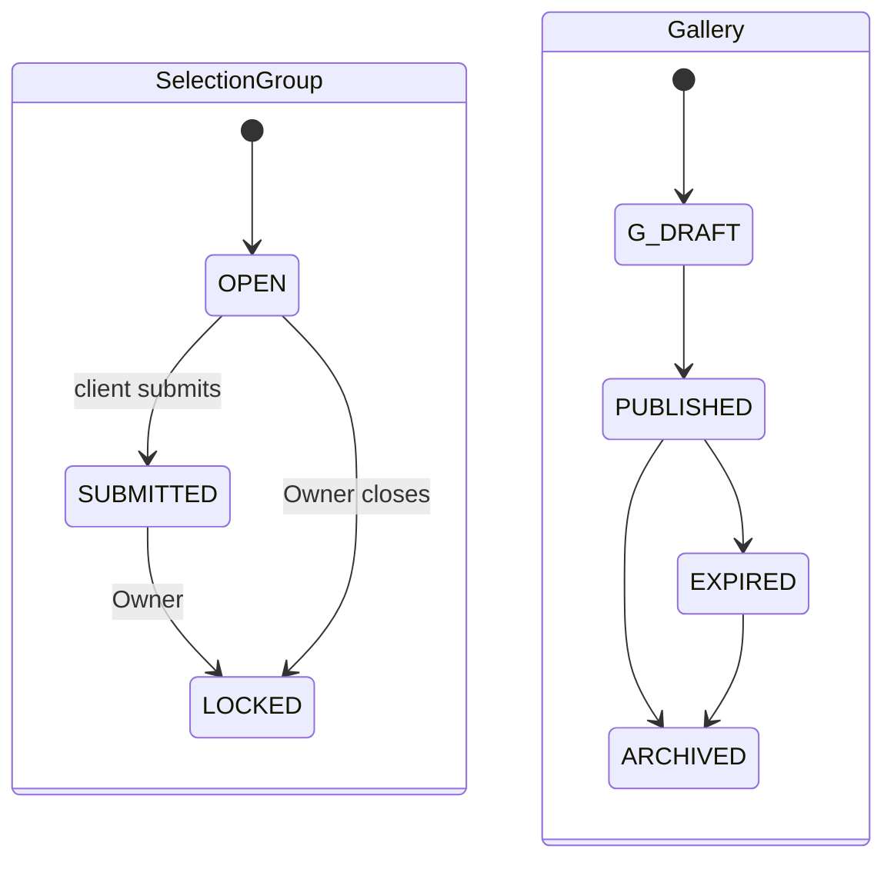
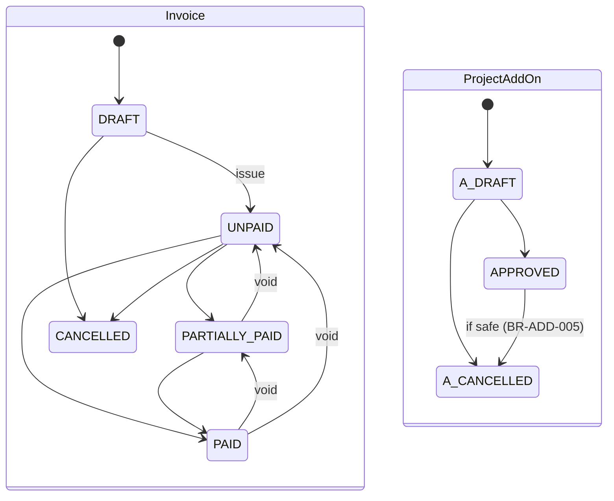

# Domain Model

Status: ACCEPTED (migrated from `_source/` on 2026-09-25). Business-oriented; persistence details live in [architecture/overview.md](../architecture/overview.md). Full attribute lists: `_source/photographer_management_platform_blueprint.md` §3 (reference only).

## Concepts

**Identity & tenancy**
- **User (Owner)** — authenticated internal account; owns workspaces.
- **Workspace** — one brand/business; the tenant boundary. Holds branding, invoice prefix, default currency.
- **MessageTemplate** — reusable, typed WhatsApp message with `{{variables}}`.
- **WorkspaceSourceConfig** — provider configuration (MVP: Google Drive public links).

**Catalog (templates)**
- **ServiceCategory** — grouping of services (Wedding, Family…).
- **ServiceItemDefinition** — reusable *what* a package benefit is (Edited Photos, Person), with value type, unit, and whether it creates a selection entitlement.
- **Service** — a sellable package with base price.
- **ServiceItem** — *how much* of a definition a service includes (`{value}` or `{min,max}`).
- **ServiceFieldDefinition** — extra booking input a service needs (Campus Name, Graduation Date).

**Engagement**
- **Client** — customer record; never logs in.
- **Project** — one engagement for one client; operational aggregate; owns the client access token and agreed price.
- **ProjectItem** — frozen snapshot of an agreed package benefit.
- **ProjectFieldValue** — frozen booking input with field metadata snapshot.
- **Session** — a shoot within a project.
- **TeamMember** — freelancer resource; **ProjectAssignment** — their role/fee on a project.

**Gallery & selection**
- **Gallery** — client-facing access boundary for a project's photos; password-protected; also the final delivery point.
- **GallerySource** — a concrete external folder feeding a gallery.
- **Photo** — metadata for one external file with role `PROOF` | `EDITED` | `PRINT`.
- **SelectionGroup** — an entitlement bucket ("Edited Photos 12 / 25") with base + extra limit and its own lifecycle.
- **PhotoSelection** — a client's choice of a proof photo in a group, with quantity.
- **ProjectAddOn** — purchased extra (entitlement and/or billing).

**Billing**
- **Invoice** — billing document for a project; totals and derived status.
- **InvoiceItem** — immutable line snapshot.
- **Payment** — manually recorded money received; voidable.

## Relationships

`0..*` covers draft/onboarding states; minimums apply at transitions (publish gallery ≥1 source — BR-GAL-004; issue invoice ≥1 line — BR-INV-003).

## Lifecycles

## Aggregate responsibilities
- **Workspace** — tenant boundary and brand context.
- **Service** (+ items, fields) — reusable configuration, not history.
- **Project** — deal snapshot, token, status, sessions, assignments, add-ons.
- **Gallery** — access control for client media; final delivery publication.
- **SelectionGroup** — entitlement and selection lifecycle; **PhotoSelection** — individual choices.
- **Invoice** — totals and derived status; **Payment** — money received.

## Notes
Better Auth, Drizzle, Neon, Next.js, Cloudflare, and Google Drive are not domain concepts.
