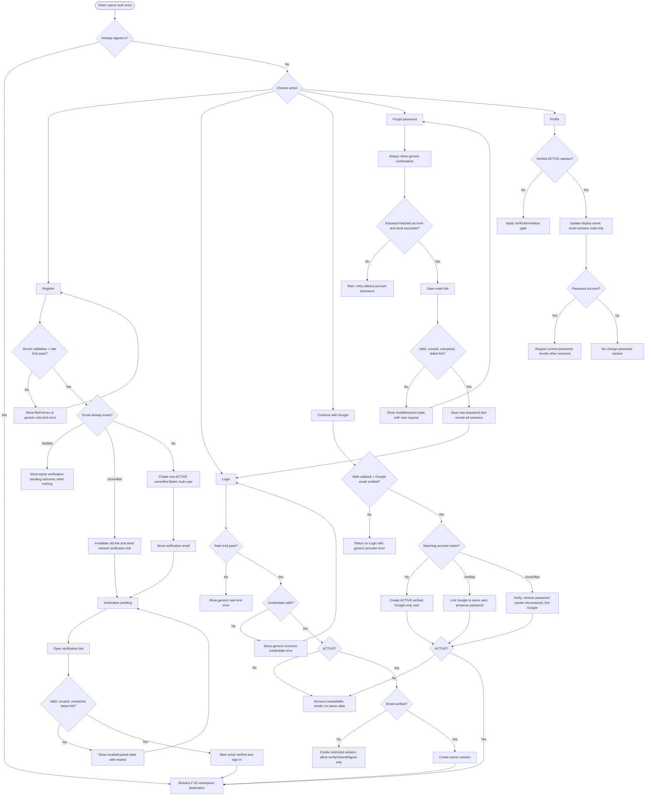

# F-01 Auth — Activity Flow

Key gates are server-authoritative: status is checked on every Owner request, verification is required before workspace access, and enumeration-sensitive branches return indistinguishable public outcomes.
