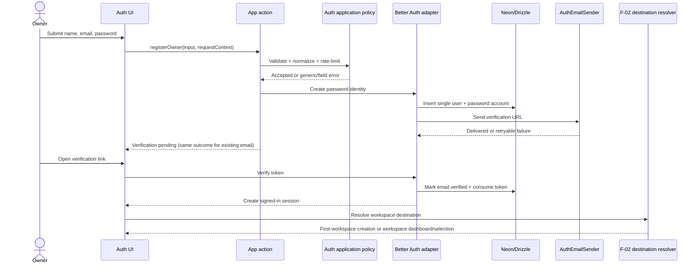
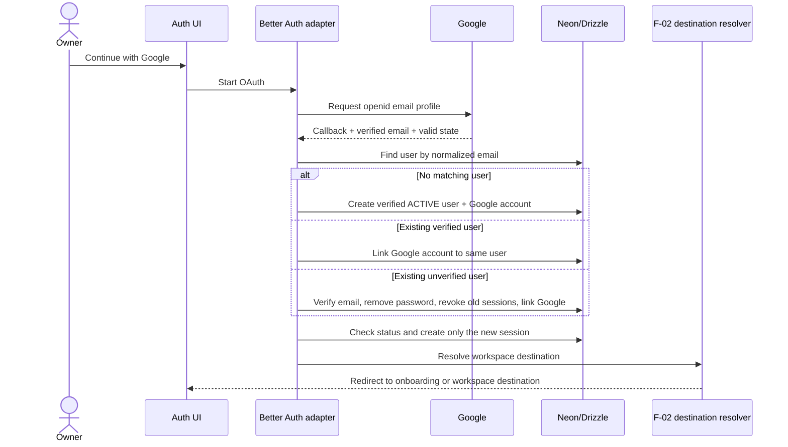

# F-01 Auth — Interaction Sequences

## Password registration and verification



## Password login and request gate

```mermaid
sequenceDiagram
    actor Owner
    participant UI as Login UI
    participant App as App action/route
    participant Policy as Auth policy
    participant BA as Better Auth adapter
    participant DB as Neon/Drizzle
    participant F2 as F-02 destination resolver

    Owner->>UI: Submit email + password
    UI->>App: loginOwner(input, requestContext)
    App->>Policy: Validate + rate-limit
    App->>BA: Authenticate credentials
    BA->>DB: Read user/account
    DB-->>BA: Credential result
    alt Invalid credentials or rate limited
        BA-->>App: Generic public error
        App-->>UI: Incorrect credentials / too many attempts
    else Credentials valid
        App->>Policy: Check ACTIVE status + verified email
        alt Suspended or disabled
            Policy-->>App: Account unavailable
            App-->>UI: Account unavailable; no owner data
        else Unverified
            BA-->>App: Restricted session
            App-->>UI: Verification pending
        else Verified and active
            BA-->>App: Owner session
            App->>F2: Resolve workspace destination
            F2-->>App: Onboarding or dashboard/selection
            App-->>UI: Redirect
        end
    end
```

## Google linking guard



Invalid state, cancelled consent, or an unverified Google email exits before any user/account/session mutation.
