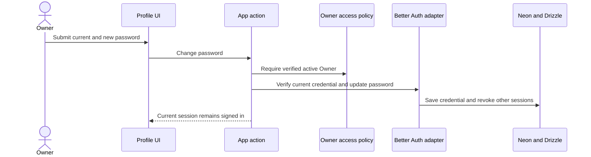

# Change password

```mermaid
sequenceDiagram
    actor Owner
    participant UI as Profile UI
    participant App as App action
    participant Policy as Owner access policy
    participant BA as Better Auth adapter
    participant DB as Neon and Drizzle

    Owner->>UI: Submit current and new password
    UI->>App: Change password
    App->>Policy: Require verified active Owner
    App->>BA: Verify current credential and update password
    BA->>DB: Save credential and revoke other sessions
    App-->>UI: Current session remains signed in
```
