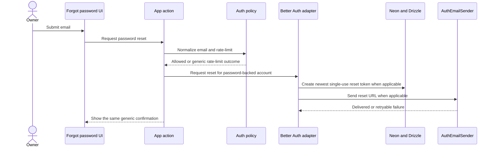

# Forgot-password request

```mermaid
sequenceDiagram
    actor Owner
    participant UI as Forgot password UI
    participant App as App action
    participant Policy as Auth policy
    participant BA as Better Auth adapter
    participant DB as Neon and Drizzle
    participant Email as AuthEmailSender

    Owner->>UI: Submit email
    UI->>App: Request password reset
    App->>Policy: Normalize email and rate-limit
    Policy-->>App: Allowed or generic rate-limit outcome
    App->>BA: Request reset for password-backed account
    BA->>DB: Create newest single-use reset token when applicable
    BA->>Email: Send reset URL when applicable
    Email-->>BA: Delivered or retryable failure
    App-->>UI: Show the same generic confirmation
```

Google-only accounts receive the same public response but no reset email.
