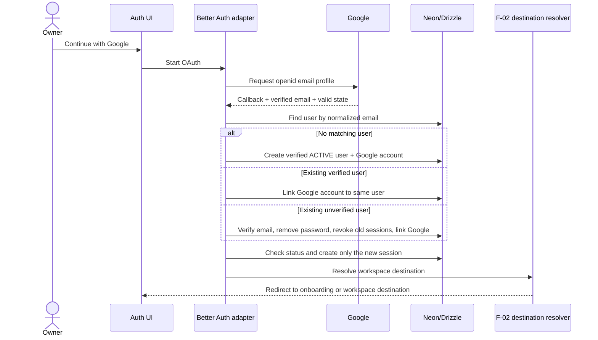

# Google sign-in and account linking

```mermaid
sequenceDiagram
    actor Owner
    participant UI as Auth UI
    participant BA as Better Auth adapter
    participant Google
    participant DB as Neon/Drizzle
    participant F2 as F-02 destination resolver

    Owner->>UI: Continue with Google
    UI->>BA: Start OAuth
    BA->>Google: Request openid email profile
    Google-->>BA: Callback + verified email + valid state
    BA->>DB: Find user by normalized email
    alt No matching user
        BA->>DB: Create verified ACTIVE user + Google account
    else Existing verified user
        BA->>DB: Link Google account to same user
    else Existing unverified user
        BA->>DB: Verify email, remove password, revoke old sessions, link Google
    end
    BA->>DB: Check status and create only the new session
    BA->>F2: Resolve workspace destination
    F2-->>UI: Redirect to onboarding or workspace destination
```

Invalid state, cancelled consent, or an unverified Google email exits before any user/account/session mutation.
