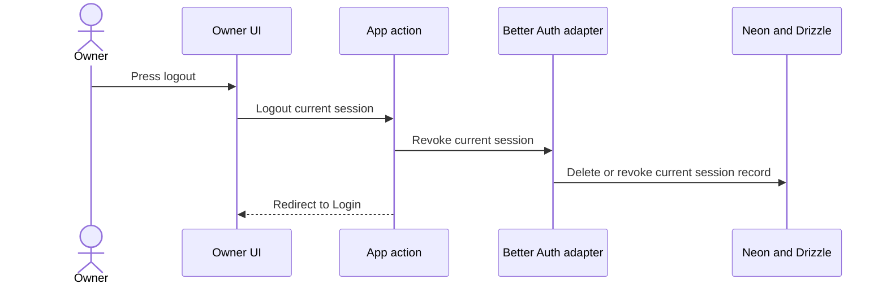

# Logout

```mermaid
sequenceDiagram
    actor Owner
    participant UI as Owner UI
    participant App as App action
    participant BA as Better Auth adapter
    participant DB as Neon and Drizzle

    Owner->>UI: Press logout
    UI->>App: Logout current session
    App->>BA: Revoke current session
    BA->>DB: Delete or revoke current session record
    App-->>UI: Redirect to Login
```
