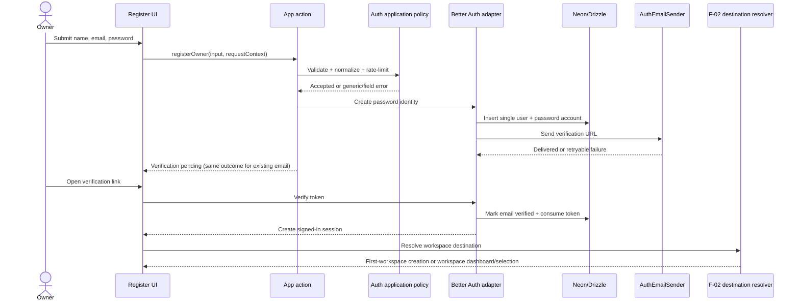

# Email/password registration and verification

```mermaid
sequenceDiagram
    actor Owner
    participant UI as Register UI
    participant App as App action
    participant Policy as Auth application policy
    participant BA as Better Auth adapter
    participant DB as Neon/Drizzle
    participant Email as AuthEmailSender
    participant F2 as F-02 destination resolver

    Owner->>UI: Submit name, email, password
    UI->>App: registerOwner(input, requestContext)
    App->>Policy: Validate + normalize + rate-limit
    Policy-->>App: Accepted or generic/field error
    App->>BA: Create password identity
    BA->>DB: Insert single user + password account
    BA->>Email: Send verification URL
    Email-->>BA: Delivered or retryable failure
    App-->>UI: Verification pending (same outcome for existing email)
    Owner->>UI: Open verification link
    UI->>BA: Verify token
    BA->>DB: Mark email verified + consume token
    BA-->>UI: Create signed-in session
    UI->>F2: Resolve workspace destination
    F2-->>UI: First-workspace creation or workspace dashboard/selection
```
