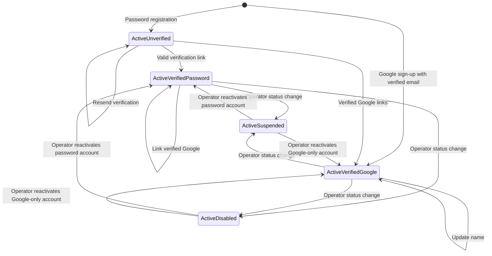
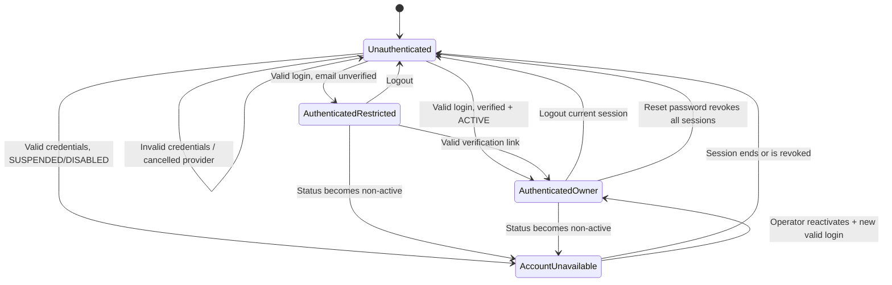

# F-01 Auth — State Model

## Identity lifecycle

`ActiveVerifiedPassword` and `ActiveVerifiedGoogle` are both `status = ACTIVE` and `emailVerifiedAt != null`; the difference is whether a password account exists. Reset password keeps the password-backed identity in the same state and revokes all sessions. Linking Google to an unverified password registration removes the password account as part of the transition.

## Request access state

Every owner page, server action, and route handler re-checks the current status and verification gate. Middleware may provide an early redirect but cannot replace this transition guard.
