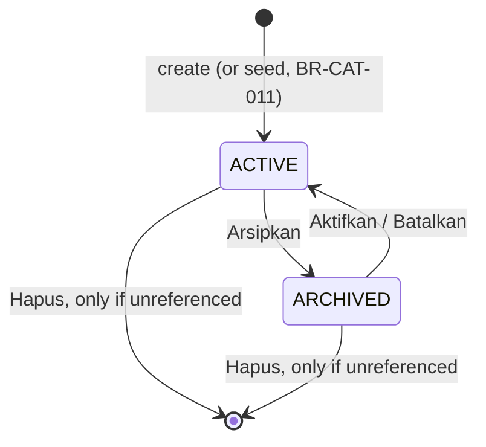

# Feature: Service catalog

ID: F-05 · Slug: `catalog`
Status: PLANNED (2026-10-02, [technical-design.md](technical-design.md) · [plan.md](plan.md)); designed 2026-10-02 ([design.md](design.md)); specified 2026-10-02 · Journey: J-02 Catalog setup
Consumer: F-07 `projects` (a project is created from an active service and snapshots its items and booking fields, BR-PRJ-001)

## Goal
The Owner describes what they sell: reusable package benefits (*item paket*), categories, and services with a base price, the amount of each benefit they include, and the extra booking inputs they need. Projects created later copy this as their deal.

## User Story
As a photographer (Owner), I want to set up my packages once, for example *Wisuda Basic*: Rp 750.000, 25 edited photos, 5 prints, 1–2 persons, with *Nama kampus* and *Tanggal wisuda* to fill at booking, so that booking a client only means picking a service.

## Preconditions
- F-02 Workspace (DONE): verified `WorkspaceContext`, App Shell, workspace creation.
- F-17 App Shell (DONE): the nav slot `services` (*Layanan*, icon `package`, group *KATALOG*), currently a *Segera hadir* placeholder.
- ADR-016: workspace creation and seeding share one transaction, opened in composition.
- Actor: a signed-in, verified, active Owner inside a workspace they own (BR-WS-003).

## Screens and Inputs
*Layanan* (`/w/[workspaceId]/services`) has three tabs (Owner 2026-10-02): **Layanan** · **Kategori** · **Item paket**. A service opens on its own sub-page (A-2).

| Screen | Fields |
|---|---|
| Item paket (list) | per definition: name, value type, unit, selection badge, status · actions *Ubah*, *Arsipkan* / *Aktifkan*, *Hapus* · page action *Tambah item* |
| Item paket form | name · value type (*Angka* `NUMBER` / *Rentang* `RANGE`) · unit (optional, ≤ 20 chars, A-4) · *Dipakai untuk pilihan foto klien* (`selectionRequired`) · selection type (*Foto edit* `EDIT` / *Foto cetak* `PRINT`) |
| Kategori (list) | per category: name, service count, status · *Ganti nama*, *Arsipkan* / *Aktifkan*, *Hapus* · *Tambah kategori* |
| Kategori form | name |
| Layanan (list) | services grouped by category: name, base price, item summary, status · *Arsipkan* / *Aktifkan*, *Hapus* · *Tambah layanan* |
| Tambah layanan | name · category (active categories) · base price (IDR, whole rupiah, ≥ 0) |
| Service detail | **Info:** name, category, base price · **Item paket:** list of service items (definition, value, unit), add / edit value / remove / reorder · **Field booking:** list of fields (name, type, required, options), add / edit / remove / reorder |
| Service item form | definition (active, not yet in this service) · value: one number (`NUMBER`) or *min* and *max* (`RANGE`) |
| Booking field form | name · type (*Teks*, *Teks panjang*, *Angka*, *Tanggal*, *Ya/Tidak*, *Pilihan*) · required · options (for *Pilihan* only) |

## Main Flow — J-02 set up a service
1. Owner opens *Layanan*. The server verifies the workspace. The *Layanan* tab lists services by category; a new workspace has none, so the empty state points to *Tambah layanan* and, if no category exists, to *Tambah kategori* first (A-6).
2. **Item paket:** the tab already holds the four seeded definitions (BR-CAT-011). The Owner adds another, e.g. *Album* (`NUMBER`, unit *buah*, no selection). The server validates it (BR-CAT-001, 002, 007, 009) and saves it.
3. **Kategori:** the Owner adds *Wisuda*. The server validates the name (BR-CAT-009).
4. **Tambah layanan:** the Owner enters *Wisuda Basic*, category *Wisuda*, price 750000. The server stores the price as exact IDR with currency `IDR` (BR-CUR-001, BR-CUR-003) and opens the service detail page.
5. **Attach items:** the Owner adds *Foto edit* = 25, *Foto cetak* = 5, *Jumlah orang* = 1–2. For each, the server checks the definition is active, same workspace and not yet in the service (BR-CAT-005), and validates the value against its type (BR-CAT-001, BR-CAT-002).
6. **Add booking fields:** *Nama kampus* (*Teks*, required), *Tanggal wisuda* (*Tanggal*, required), *Ukuran toga* (*Pilihan*: S, M, L, optional). The server derives a key from each name, unique in the service (BR-CAT-006, A-3).
7. Each save shows a success toast. The service is active and available to F-07.

## Alternative Flows
- **Edit:** any catalog record can be edited the same way it was created. Changes affect only projects created afterwards (BR-CAT-003). A definition used by a service keeps its value type and selection settings locked; the form shows them read-only with the reason (BR-CAT-010).
- **Reorder:** service items and booking fields have an order; *Naikkan* / *Turunkan* move one place (A-5). F-07 snapshots them in this order.
- **Remove a service item or booking field:** removed at once after confirmation; it is part of the service template only (BR-CAT-003).
- **Archive / unarchive** (category, definition, service): takes effect at once, without confirmation; the row shows *Diarsipkan*, a toast confirms with *Batalkan* (BR-CAT-008). Archived records stay listed, after active ones, and:
  - an archived definition can't be added to a service; services that already use it keep it;
  - an archived category can't be chosen for a new or edited service; its services keep it;
  - an archived service can't be chosen for a new project (F-07).
- **Delete** (category, definition, service): asks for confirmation (*Hapus "{name}"?*). Allowed only if nothing refers to it (BR-CAT-008): a category with no services; a definition used by no service; a service no project was created from (F-07 onward). Otherwise the dialog explains and offers *Arsipkan*.
- **Change a service's category:** pick another active category on the Info section.
- **New workspace:** created with the four seeded definitions in the same transaction (BR-CAT-011, ADR-016).
- **Existing workspaces:** a data migration backfills the seeded definitions, skipping names that already exist. Only the Owner applies migrations (AGENTS.md).

## Lifecycle (BR-CAT-008)
Applies to categories, item definitions and services.

*Referenced* means: a category has services; a definition is used by a service item or a project snapshot; a project was created from the service (F-07 onward). Referenced records can only be archived (BR-CAT-004).

## Error Cases
- Name empty after trim or longer than 60 characters → field error; nothing saved (BR-CAT-009).
- Name already used by a record of the same kind in the workspace, ignoring case, archived included, including a race with another tab → *Nama ini sudah dipakai*; nothing saved. The database's unique index is the authority (C-003).
- `RANGE` with *min* > *max*, a negative value, or a non-number → field error (BR-CAT-001).
- Selection definition not `NUMBER`, a fractional selection value, or selection on without a type → field error (BR-CAT-002, BR-CAT-007).
- Changing the value type or selection settings of a used definition, by bypassing the form → rejected (BR-CAT-010).
- Adding a definition already in the service, or an archived one → rejected (BR-CAT-005, BR-CAT-008).
- Booking field name already in the service → field error; a *Pilihan* field with no options, an empty option or duplicate options → field error (A-3).
- Base price negative, fractional, or above the money limit → field error (BR-CUR-001, BR-CUR-003, A-7).
- Delete of a record still referenced → blocked, nothing deleted; archive offered (BR-CAT-004, BR-CAT-008).
- The record, or the workspace in the URL, is not owned or doesn't exist → *not found*, no data (BR-WS-003, ADR-015). Workspace, service and definition IDs in a request body are checked against the verified workspace, never trusted (C-101).
- Unexpected server error → danger toast with *Coba lagi*; the form keeps the input, stored data is unchanged (C-007).

## UI States (C-007)
- Each tab list: loading, populated, empty, with archived rows.
- Service detail: loading, populated, no items, no booking fields, archived service (banner + *Aktifkan*).
- Forms (dialogs): idle, field error, read-only locked fields (BR-CAT-010), submitting, server error (toast).
- Delete confirmation: idle, deleting, blocked (in use → *Arsipkan*).
- Toasts: created, saved, archived (with *Batalkan*), unarchived, deleted, removed, server error.

## Business Rules
- BR-CAT-001 … BR-CAT-011 — catalog
- BR-CUR-001, BR-CUR-003 — IDR, exact money (service base price and currency)
- BR-PRJ-001 — what F-07 will snapshot from this catalog (shapes the data, not built here)
- BR-WS-002, BR-WS-003 — tenant isolation, verified workspace context
- Constitution: C-003, C-004, C-005, C-007, C-008, C-101, C-105
- ADR-015, ADR-016

## Assumptions (low-risk, reversible — confirm or change anytime)
- **A-1 Nav:** the existing slot *Layanan* (`services`, icon `package`) becomes the real page; *Tim* stays *Segera hadir*. The tabs use the Segmented control (C23).
- **A-2 Service detail sub-page:** `/w/[workspaceId]/services/[serviceId]`, using the F-17 sub-page bar. Creating a service asks only name, category and price, then opens this page.
- **A-3 Booking field key:** generated from the name when the field is created (lowercase, `_`-separated, suffixed `_2`, `_3` on clash), hidden from the Owner, and unchanged when the field is renamed, so project snapshots stay stable. *Pilihan* options: 1–50 options, each 1–60 characters, unique ignoring case, ordered as entered.
- **A-4 Unit:** optional free text, up to 20 characters, e.g. *foto*, *lembar*, *orang*, *jam*.
- **A-5 Reorder:** move up / down buttons; no drag and drop in MVP.
- **A-6 Category required:** every service belongs to exactly one category (blueprint `categoryId`). The *Tambah layanan* dialog lets the Owner create a category inline if none is active.
- **A-7 Price limit:** base price 0 … 999.999.999.999 IDR, whole rupiah.
- **A-8 Service list summary:** each service row shows up to three items, e.g. *25 foto edit · 5 lembar cetak · 1–2 orang*.
- **A-9 Audit:** each record stores `createdAt`, `updatedAt`, `updatedBy`; no history.
- **A-10 Concurrent edits:** last write wins, except name and key uniqueness and the one-item-per-definition rule, which the database enforces.
- **A-11 Service names unique per workspace** (BR-CAT-009), so a project's origin service is unambiguous in pickers.

## Dependencies
- F-02 Workspace: `WorkspaceContext`, App Shell, workspace creation (seeding joins its transaction per ADR-016, like F-03 and F-04).
- F-17 App Shell: the *Layanan* nav slot and the sub-page bar.
- F-07 Projects: chooses active services, snapshots items and fields, and makes services and definitions *referenced* for BR-CAT-004 / BR-CAT-008. Until F-07 exists, only service items refer to definitions.

## Out of Scope
- Draft / publish for services; selection types other than `EDIT` and `PRINT`; package value types other than `NUMBER` / `RANGE` (scope.md).
- Service descriptions, images, public price lists, add-on prices (F-13), discounts, tax.
- Booking-field validation rules beyond type, required and options (no min/max, regex, defaults).
- Duplicating a service, bulk edit, import, drag-and-drop ordering, history.
- Creating projects and validating booking values (F-07).

## Open Questions / SPEC GAPS
- None blocking. F-07 discovery must decide whether an archived service's existing projects are affected (expected: no, BR-PRJ-001) and how booking values are validated against these field types.
- For design: `/sdv:design-feature catalog` needs the three tabs (loading, populated, empty, archived rows), the service detail sub-page (empty and filled sections), the forms (default, field error, locked fields), delete confirmation (idle, blocked) and toasts, desktop and phone, as HTML exports (AGENTS.md).
