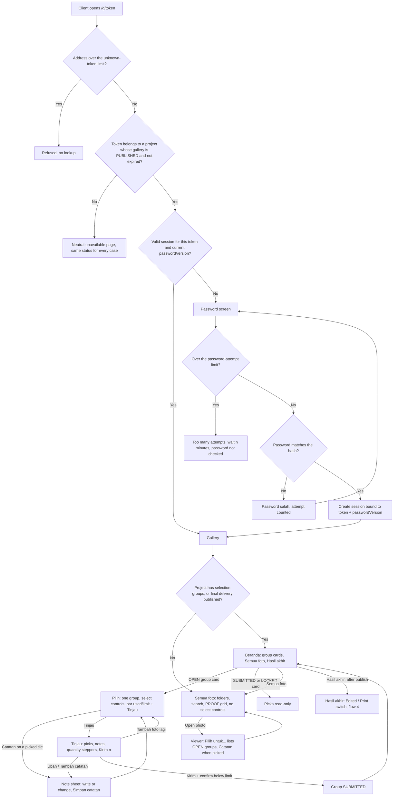
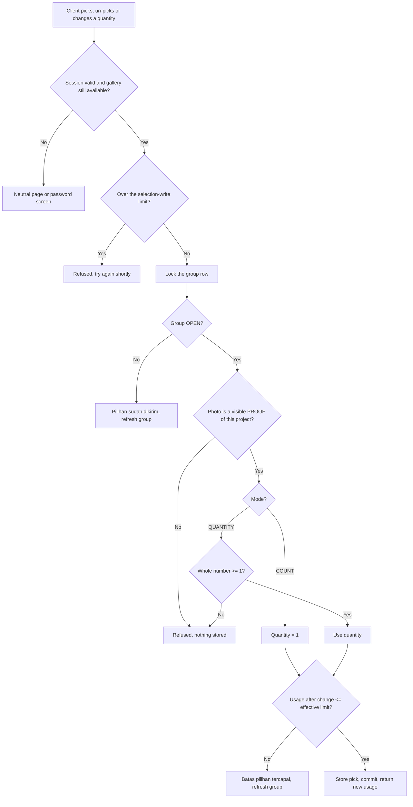
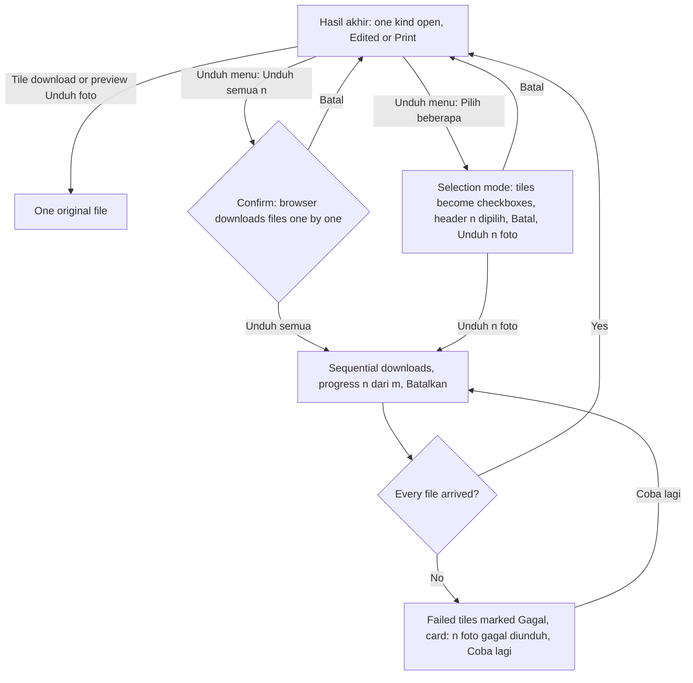

# Activity / Flow — Client access

Two flows have real branching: the client gate (what a request is allowed to see) and the pick (what happens to one change). Rate limits run before any lookup so unknown tokens cost nothing.

## 1. Client request to `/g/{token}`

On desktop every page below Beranda returns there through the breadcrumb; phones use a *Beranda* button (A-26).

## 2. One pick change

## 3. Owner: deal edit, add-on, delivery, completion

```mermaid
flowchart TD
    subgraph Edit[Edit a project item while BOOKED]
      E1[Owner edits or removes a selection item] --> E2{Group has picks above the new value, or is not OPEN?}
      E2 -->|Yes| E3[Refused with current usage]
      E2 -->|No| E4[Group follows the item]
    end
    subgraph Addon[Add-on]
      A1[Owner creates DRAFT add-on] --> A2{Approve?}
      A2 -->|Cancel draft| A3[CANCELLED]
      A2 -->|Approve| A4{Target group OPEN or SUBMITTED?}
      A4 -->|No| A5[Refused]
      A4 -->|Yes| A6[APPROVED, extraLimit up, SUBMITTED group back to OPEN, actor + time, no invoice until F-14]
      A6 --> A7{Cancel later?}
      A7 -->|Limit would drop below usage| A8[Refused with usage]
      A7 -->|Safe| A9[CANCELLED, extraLimit down]
    end
    subgraph Deliver[Final delivery and completion]
      D1[Owner publishes final delivery] --> D2{Gallery PUBLISHED, finished file synced, status BOOKED, SHOOTING or POST_PROCESSING?}
      D2 -->|No| D3[Refused with reason]
      D2 -->|Yes| D4[Record publishedAt, project DELIVERED, one transaction]
      D4 --> D5[Owner marks complete, confirm] --> D6[COMPLETED, actor + time]
    end
```

## 4. Hasil akhir downloads (client, A-33)

## Notes
- The gate checks availability before the session, so a stale session on an expired gallery gets the neutral page, not the password screen.
- Rate-limit order: unknown-token limit, then lookup, then password-attempt limit, then the hash check.
- Link rotation (flow 4 of the spec) is a single action with no branches; it is in the sequence diagram.
