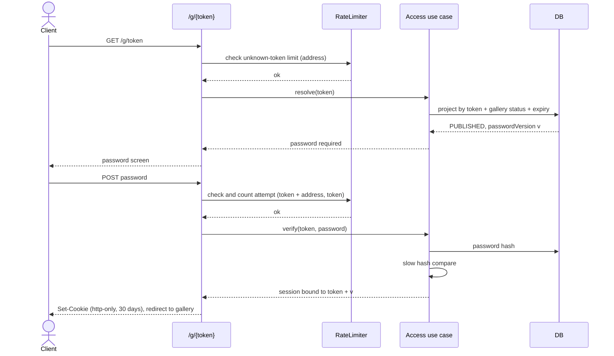
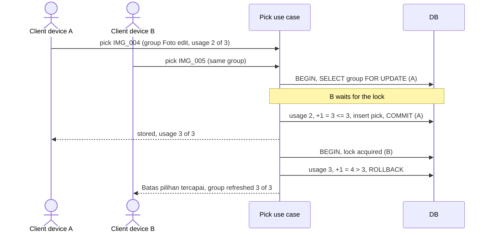
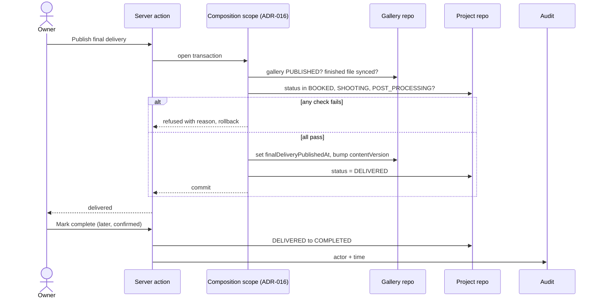
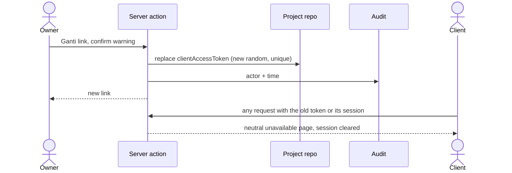

# Sequence — Client access

Order matters in four places: signing in (limits before hash), a concurrent pick (lock then check), final delivery (one transaction across features, ADR-016) and link rotation (every session ends).

## 1. Sign in

## 2. Two devices pick at the same time

## 3. Publish final delivery and complete

## 4. Rotate the link

## Notes
- Sessions carry the token and `passwordVersion`; a request is valid only if both still match, so token rotation and password rotation end sessions without a session table (a technical-design choice).
- Downloads are not diagrammed: they are a single authorised read per file (token + session, visible finished photo, then Google's host or the media route, ADR-019) with no ordering risk. The design runs *several* and *all* as sequential per-file downloads with progress (A-33, activity flow 4); whether that fits the budget is technical-design risk R-1.
