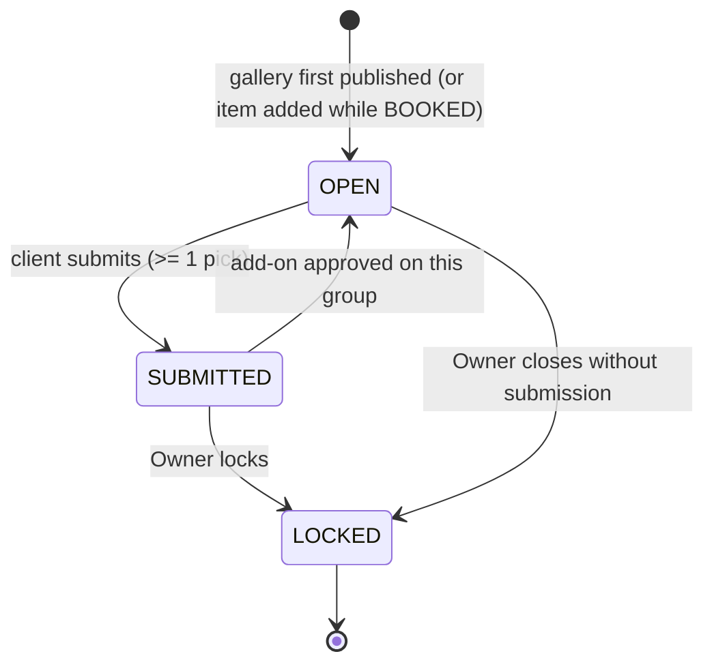
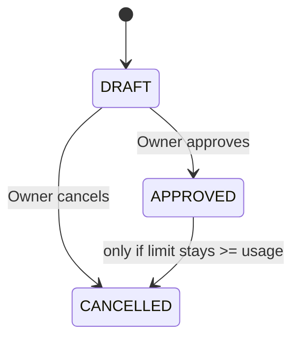
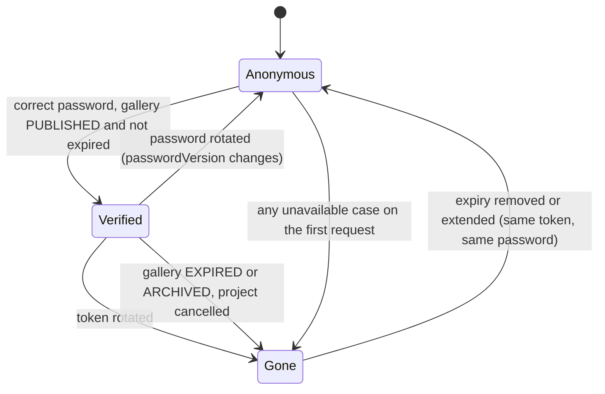

# State Model — Client access

Three lifecycles matter here: the selection group, the add-on, and the client session's validity. The gallery, project and invoice lifecycles are owned by F-09, F-07 and F-14 and are only referenced.

## Selection group (BR-SEL-005)

| From | Event | To | Guard / Rule |
|---|---|---|---|
| (none) | gallery first published | OPEN | the project item has `selectionRequired`; one group per item, limit from the item (BR-SEL-001) |
| (none) | selection item added while the deal is editable | OPEN | BR-PRJ-009 |
| OPEN | client submits | SUBMITTED | at least one pick; below the limit needs confirmation (A-5); one transaction under the group lock (BR-SEL-006) |
| SUBMITTED | add-on approved on this group | OPEN | extraLimit up in the same transaction; picks kept; the client may submit again (BR-SEL-005, A-22) |
| SUBMITTED | Owner locks | LOCKED | records actor and time (BR-AUD-001) |
| OPEN | Owner closes | LOCKED | records actor and time |
| OPEN | pick, un-pick, quantity change | OPEN | usage <= effective limit (BR-SEL-003) |
| SUBMITTED, LOCKED | any client change | unchanged | refused: *Pilihan sudah dikirim* (BR-SEL-005) |
| OPEN | Owner edits the item | OPEN | refused if it removes the item with picks or with an `APPROVED` add-on on the group, or lowers the value below usage (BR-PRJ-009) |
| SUBMITTED, LOCKED | Owner edits the item | unchanged | refused |

## Add-on (BR-ADD-003)

| From | Event | To | Guard / Rule |
|---|---|---|---|
| DRAFT | approve | APPROVED | target group exists, same project, `OPEN` or `SUBMITTED` (A-10), reopening a submitted one; extraLimit up in the same transaction; actor and time (BR-ADD-004, BR-AUD-001); invoice line only once F-14 exists |
| DRAFT | cancel | CANCELLED | none |
| APPROVED | cancel | CANCELLED | reduced limit >= current usage (BR-ADD-005); extraLimit down; actor and time |
| APPROVED | edit target, quantity or price | unchanged | refused; create a new add-on (BR-ADD-003) |

## What a client can reach (validity, not stored status)

Access is derived on every request from the gallery, the project and the session; nothing is stored per client.

| State | Meaning | Sees |
|---|---|---|
| Anonymous | no valid session for this token and `passwordVersion` | password screen, or the neutral page if unavailable |
| Verified | valid session, gallery available | visible PROOF photos, groups, and finished files after delivery |
| Gone | token unknown or gallery unavailable | the neutral page only |

`Gone` after expiry returns to `Anonymous` and then `Verified` only if the session cookie still matches (A-1); archived and cancelled never return.

## Final delivery (a flag, not a status)

`finalDeliveryPublishedAt` is set once and never cleared; no unpublish (BR-DEL-003). It moves the project to `DELIVERED` in the same transaction and unlocks `EDITED` / `PRINT` for the client. It is not a state machine of its own, so no diagram.

## Skipped
- Gallery, project, invoice lifecycles: owned elsewhere (BR-GAL-005, BR-PRJ-004, BR-INV-006).
- Client session as a stored entity: none is stored by design (A-1).
