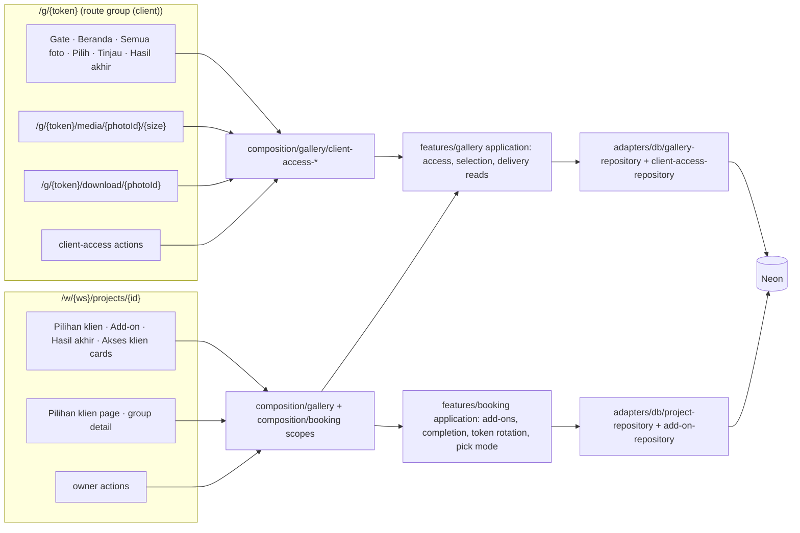

# Technical Design — Client access (F-10)

Status: APPROVED (2026-10-06; Owner 2026-10-06, delegated: "jawab sesuai rekomendasi kamu")

## Context

F-10 opens the first public surface of Shutrly: `/g/{token}`. A client with the project link and the current gallery password signs in without an account, lands on **Beranda**, picks photos per selection group (Pilih → Tinjau → Kirim), and later downloads the finished files from the same link. On the Owner side, F-10 adds four cards to the project page (Pilihan klien, Add-on, Hasil akhir, Akses klien) and the flows behind them: review and lock picks, add-ons that raise a group's limit, publish final delivery, mark the project complete, and rotate the link. It also replaces the catalog's fixed `EDIT`/`PRINT` selection type with a pick mode and a pick-notes flag.

It builds on:
- **F-07 projects** (`features/booking`): `project.client_access_token` (43-char base64url, write-once today, TD D-6), `project_item` snapshots, status steps, deal edits under the project lock (`editProject`).
- **F-09 gallery** (`features/gallery`): stored status + derived `EXPIRED` (D-1), password hash and `password_version` (D-3), `content_version` (D-24), photo kinds and `missing_at`, the browse reader (D-12), direct Google image URLs with the media-route fallback (D-10, D-22), the Neon rate limiter behind `GalleryRateLimiterPort` (D-19), `PhotoTile`, `FolderTile` and `MediaViewer` in `src/ui/patterns` (D-17).

Runtime budget: Workers Free (ADR-018). Every request here is one page render or one action with a handful of queries; images come from Google (ADR-019), so a gallery view costs 1–2 Worker requests.

## Relevant Authority

- **Constitution:** C-003, C-004, C-005, C-006, C-007, C-008, C-009, C-101, C-103 (v1.2), C-104, C-105.
- **Business rules:** BR-ACC-001, -003, -004, -005; BR-SEL-001…007; BR-DEL-001…004; BR-ADD-001…006; BR-PRJ-001, -003, -004, -005, -006, -009, -010; BR-GAL-003, -005, -006, -007, -009; BR-CAT-007, -010, -011; BR-CUR-001…003; BR-AUD-001; BR-WS-002, -003.
- **Spec:** [spec.md](spec.md) A-1…A-34, FC-001…FC-009 (all `RESOLVED`; this design follows each recorded decision).
- **Acceptance criteria:** AC-ACC-001…014, AC-SEL-001…021, AC-CAT-001, AC-ADD-001…007, AC-DEL-001…007 ([acceptance-criteria.md](acceptance-criteria.md)).
- **Diagrams:** [activity.md](diagrams/activity.md) (gate, pick, Owner flows, downloads), [sequence.md](diagrams/sequence.md), [state.md](diagrams/state.md).
- **Design:** [design.md](design.md) (APPROVED 2026-10-06), exports indexed in [exports/INDEX.md](exports/INDEX.md).
- **ADRs:** ADR-003 (isolation), ADR-004/ADR-017 (token, password), ADR-007 (money), ADR-009 (Neon pool), ADR-010 (React Aria), ADR-013 (rate-limit store), ADR-015 (URL-scoped workspace), ADR-016 (cross-feature transactions), ADR-018 (free tier), ADR-019 (media, `content_version`), and the new **ADR-023** (client sessions and public limits, this plan).

## Architecture



### Decisions

| ID | Decision | Why |
|---|---|---|
| D-1 | **Feature placement.** Client access, selection groups, picks, final-delivery reads and every client screen live in `features/gallery` (the *Gallery & selection* context of the domain model). Add-ons, project completion, link rotation and the catalog pick mode live in `features/booking`, because the project owns them (domain model › Project). Where one rule spans both, composition opens one transaction (ADR-016) over both repositories: **deal edits with groups** (D-10), **add-on approve/cancel** (D-16), **publish final delivery** (D-17). | A feature never imports another; ADR-016 is the existing pattern (`withProjectCancellationScope`). |
| D-2 | **Routes.** A route group `src/app/(client)/` with its own root layout (no Owner shell, no Better Auth). Pages: `/g/[token]` (gate, then Beranda, or Semua foto per A-31), `/g/[token]/photos`, `/g/[token]/picks/[groupId]`, `/g/[token]/picks/[groupId]/review` (also the read-only *Lihat pilihan* when the group isn't `OPEN`), `/g/[token]/final`. Route handlers: `/g/[token]/media/[photoId]/[size]` (image fallback) and `/g/[token]/download/[photoId]` (one original file). Client server actions live in `src/app/actions/client-access/` and are called from these pages, so they post to a `/g/{token}/…` URL. `proxy.ts` adds `/g` to `PUBLIC_PREFIXES`. | Everything a client calls sits under `/g/{token}`, so one cookie path covers pages, actions and route handlers (D-3). An Owner session plays no part (BR-ACC-003). |
| D-3 | **Client session (ADR-023):** a stateless signed cookie, no session table. Name `shutrly_gallery`, `HttpOnly; Secure; SameSite=Lax; Path=/g/<token>; Max-Age=2592000` (30 days, A-1). Value `<payload>.<mac>`, both base64url: payload `{ v: 1, sid, projectId, galleryId, pv, th, exp }`, where `pv` is the gallery's `password_version`, `th` the first 16 bytes of SHA-256(token) in hex and `sid` 16 random bytes. MAC = HMAC-SHA-256 over the payload with the Worker secret `CLIENT_SESSION_KEY`, compared in constant time. A request is signed in only if the MAC holds, `exp` is in the future, `th` matches the URL token, and `projectId`, `galleryId` and `pv` match the gallery resolved from the token. | Password rotation (new `pv`) and link rotation (new `th`, new path) end every session with no write (sequence › Notes, AC-ACC-008, -009). No per-request session query on Workers Free. |
| D-4 | **The gate** (activity flow 1), in this order on every client page, action and route handler: (1) `peek` the unknown-token limit for the address; over → refuse with the neutral page, no lookup (AC-ACC-005). (2) Resolve the token with one `*Unscoped` read: project id, workspace id, project status, gallery id, stored status, `expires_at`, `password_version`, `content_version`, `final_delivery_published_at`, workspace brand name, project title, client first name. (3) Unavailable (no project, no gallery, gallery not `PUBLISHED` or past `expires_at`, project `CANCELLED`) → the neutral page; when the token matched no project, `hit` the unknown-token counter. (4) Verify the session (D-3); none → the password screen. | BR-ACC-001/003, AC-ACC-004…007, A-3. One query plus at most two counter calls per request. |
| D-5 | **Password check.** `POST` from the password screen runs `hit` on `pw:<token-hash>:<ip>` (5 per 15 min) and `pw:<token-hash>` (20 per hour) **before** the hash compare. Either over → *Terlalu banyak percobaan. Coba lagi dalam n menit.* with n from the window end, and the hash is not checked (AC-ACC-003). Then `PasswordHasherPort.verify` (the F-09 hasher). Wrong → *Password salah*. Right → set the cookie and redirect to `/g/{token}`. Every attempt counts, the correct one too. | A-2. Counting the correct attempt is simpler than un-counting it, and a client who gets it right within five tries is never refused. |
| D-6 | **Limits as named constants** in `features/gallery/domain/client-access-limits` (BR-ACC-004, A-2): `PASSWORD_PER_TOKEN_AND_ADDRESS` 5 / 900 s, `PASSWORD_PER_TOKEN` 20 / 3600 s, `UNKNOWN_TOKEN_PER_ADDRESS` 30 / 3600 s, `SELECTION_WRITES_PER_SESSION` 120 / 60 s. Counter keys never contain the token or the address in clear: `sha256-hex` of them (C-103). The counters reuse the Neon table and adapter of ADR-013 through `GalleryRateLimiterPort`, which gains `peek` (ADR-023). | No new storage on the free tier; same atomic upsert. |
| D-7 | **Neutral page.** Every unavailable case renders the same component (`ClientUnavailable`, copy *Galeri tidak tersedia* / *Link ini tidak berlaku atau galerinya sedang tidak dibuka.*) with HTTP 404, no brand, no title (AC-ACC-004). Media and file routes answer an empty 404 in the same cases. | One code path, so no case can leak by accident. |
| D-8 | **Private responses.** `next.config.ts` sends `Cache-Control: private, no-store` and `X-Robots-Tag: noindex` for `/g/:path*`, except the media route, which sends `private, max-age=600` like F-09 D-10. Pages and JSON are never edge-cached (BR-ACC-005, AC-ACC-012). | One header rule covers every page and action. |
| D-9 | **Data model** (Database Changes): `selection_group`, `photo_selection`, `project_add_on`; new columns on `gallery` (final delivery), `project` (completion, link rotation) and the pick mode on `service_item_definition` / `project_item`. | BR-SEL-001…006, BR-ADD-*, BR-DEL-003, BR-PRJ-003/005, BR-AUD-001. |
| D-10 | **Groups.** (a) `publishGallery` creates one `OPEN` group per selection project item (BR-SEL-001) in its existing transaction, only when the project has none yet; the gallery adapter reads `project_item` directly, like F-09 D-14. (b) Migration backfill creates groups for galleries already `PUBLISHED`/`EXPIRED` (A-23). (c) **Deal edits** (`addProjectItem`, `updateProjectItemValue`, `removeProjectItem`) run in `withProjectDealEditScope` (ADR-016): the booking use case writes the item; then the gallery use case `syncGroupWithItem` locks the group `FOR UPDATE` and either creates it (item added, gallery published), sets `base_limit` (value changed), or deletes it (item removed, no picks), first clearing the target of its `DRAFT`/`CANCELLED` add-ons. It refuses a group that isn't `OPEN`, a lower value below usage, a removal with picks, or a removal while an `APPROVED` add-on targets the group (BR-PRJ-009, AC-SEL-013/014/022; Owner 2026-10-07); the scope then rolls back and the action returns a field error with the usage. | Groups exist only once the client can pick. The group keeps `base_limit` so a usage check never needs the item. |
| D-11 | **Usage and limits are pure domain** (`features/gallery/domain/selection-usage`): `usageOf(mode, picks)`, `effectiveLimit(base, extra)` (BR-SEL-002, never stored), `checkPickChange({ mode, limit, usage, current, next })` → `OK` or `LIMIT_REACHED` (BR-SEL-003, A-9), `canSubmit`, `remainingPlaces`. The application computes usage in SQL (`count(*)` or `sum(quantity)`) inside the locked transaction and hands it to the domain. | Dozens of cases in milliseconds; the SQL and the domain agree by test. |
| D-12 | **Picks** (`setPick` use case, one per change): rate limit (D-6) → lock the group row `FOR UPDATE` (BR-SEL-006) → group must be `OPEN` (else `GROUP_NOT_OPEN`, *Pilihan sudah dikirim*) → the photo must be a `PROOF` of the same gallery, not missing, source not removed (else `PHOTO_NOT_SELECTABLE`, AC-SEL-006) → usage check → insert, update quantity, or delete (un-pick deletes the note, A-32). `COUNT` groups store quantity 1; `QUANTITY` groups take a whole number 1…remaining (A-9). A missing photo already picked can still be un-picked (A-8). **Notes** (`setPickNote`): same lock and `OPEN` check, the group's item must allow notes, ≤ 500 characters after trimming, an empty note clears it (BR-SEL-004, AC-SEL-021). | C-005; the lock serialises concurrent picks (sequence 2, AC-SEL-004). |
| D-13 | **Submit** (`submitSelectionGroup`): lock, `OPEN`, at least one pick (A-5, AC-SEL-009), usage below the limit needs `confirmBelowLimit: true` from the client or the result is `NEEDS_CONFIRMATION { remaining }`; then `submitted_at` and, only when usage reaches the effective limit, `SUBMITTED`; below the limit the group stays `OPEN` (Owner 2026-10-07). **Owner lock/close** (`lockSelectionGroup`): *Kunci pilihan* locks a `SUBMITTED` group or an `OPEN` one with `submitted_at`; *Tutup pilihan* closes an `OPEN` group never sent (separate confirm); both `→ LOCKED`, with `locked_at` / `locked_by` (BR-SEL-005, BR-AUD-001). | State table in state.md. |
| D-14 | **Copy list** (A-6): pure `formatPickList(mode, picks)` builds one line per pick, `× n` for quantity groups, ` — note` with line breaks turned into spaces; the Owner page copies it with the Clipboard API and shows the toast. | AC-SEL-010; no server round trip. |
| D-15 | **Client photo reads.** A client photo view is `{ id, fileName, folderPath, imageUrl, fallbackUrl, missing }`: `imageUrl` from `directImageUrl` (F-09 D-22, `w600` tiles, `w1600` preview), `fallbackUrl` = `/g/{token}/media/{id}/{thumb|preview}`. Before final delivery only visible `PROOF` photos; after it also `EDITED`/`PRINT` on Hasil akhir; never a removed source; never a folder ID, resource key or Drive link (BR-ACC-005, AC-ACC-011/012). Semua foto reuses the F-09 browse queries (D-12) through a client mode of `GalleryBrowseReaderPort` that hides missing photos. A picked photo that went missing is still returned to its group's views, flagged `missing`, so the client can un-pick it (A-8). | One read path, two visibility rules, both tested. |
| D-16 | **Add-ons** (`features/booking`). `project_add_on` with money in `numeric(18,3)`, whole IDR (ADR-007, BR-CUR-*). `createAddOn` validates description 1–100, quantity ≥ 1, unit price whole ≥ 0, computes `total = quantity × unitPrice` server-side (BR-ADD-006, A-10) and checks the target belongs to the same project (BR-ADD-002, via the gallery's group port in the scope). **Approve** and **cancel** run in `withAddOnScope` (ADR-016): booking changes the add-on status with actor and time; gallery `adjustExtraLimit(groupId, ±quantity)` locks the group, refuses a `LOCKED` target on approve, reopens a `SUBMITTED` group on approve (BR-ADD-004, AC-ADD-007), and refuses a cancel that would leave the limit below usage (BR-ADD-005, AC-ADD-005). *Hapus draf* (design menu) deletes a `DRAFT` add-on, which never changed anything; approved add-ons are only cancelled (BR-ADD-003; spec A-35, Owner 2026-10-06, delegated: "jawab sesuai rekomendasi kamu"). No invoice line (FC-001). | One transaction across both features, as BR-ADD-004 demands. |
| D-17 | **Final delivery.** `withFinalDeliveryScope` (ADR-016, sequence 3) locks **project first, then gallery**, the order F-09's cancel path uses. Booking `markProjectDelivered` locks the project and moves `BOOKED | SHOOTING | POST_PROCESSING → DELIVERED` (BR-DEL-003, BR-PRJ-004), else `PROJECT_STATUS`; then gallery `publishFinalDelivery` locks the gallery, requires `PUBLISHED` and not expired (A-17) and at least one visible, not-missing `EDITED`/`PRINT` photo, sets `final_delivery_published_at` / `_by` and bumps `content_version`. Either refusal throws and rolls back both. **Completion** (`completeProject`, booking): `DELIVERED → COMPLETED` with `completed_at` / `completed_by` (BR-PRJ-005, AC-DEL-007). | One transaction; refusals carry their reason (AC-DEL-002). |
| D-18 | **Downloads.** `GET /g/{token}/download/{photoId}` runs the gate and the session check, then requires final delivery published and a visible, not-missing `EDITED`/`PRINT` photo. It streams the original through the provider port's new `download(file)` (Drive v3 `files.get?alt=media&key=…`, the key stays in the adapter), with `Content-Disposition: attachment; filename*=UTF-8''<name>`, the upstream `Content-Type` and `Cache-Control: private, no-store`. The client UI downloads one file with a plain link; *Unduh semua* and *Pilih beberapa* fetch the same URLs **one at a time** as blobs and save each, so the page can count *n dari m*, offer *Batalkan*, and mark a failed file *Gagal* with *Coba lagi* (A-33, AC-DEL-003/005). | A same-origin route can name the file and never shows a folder link or ID (BR-DEL-004, BR-ACC-005). It costs one Worker request and one subrequest per file, and streaming uses little CPU (risk R-1, spiked in Slice 0). |
| D-19 | **Link rotation** (booking `rotateClientAccessToken`): lock the project, refuse `CANCELLED`, generate a new token with the existing `AccessTokenGeneratorPort` (CSPRNG, 43 chars, BR-PRJ-003, A-16), write `token_rotated_at` / `_by`, return the new link. Old links resolve to nothing (neutral page); old cookies carry the old path and token hash, so every session ends (AC-ACC-009). The gallery password is unchanged. | No session store to clean. `content_version` is not bumped: the gate runs before any cached read (D-22). |
| D-20 | **Owner surfaces.** ~~`ProjectDetailScreen` gains slots `selectionCard`, `addOnCard`, `deliveryCard`, `accessCard`~~ (built in Slices 6–10). **Revised (Owner 2026-10-07, design Owner 7, A-34):** the gallery page (`GalleryPageScreen`, F-09) shows, in order, the F-10 *Akses klien* card (replacing F-09's `AccessCard`), *Pilihan klien*, *Hasil akhir*, then *Sumber foto* and *Foto*, all in the 720 column, the photo preview 6 photos in 3 columns. The project page keeps only `addOnCard`; its *Galeri* card gains two summary rows (*Pilihan klien*, *Hasil akhir*) and the header shows *Tandai selesai* as the main action on a `DELIVERED` project (phone action bar). The *Hasil akhir* card no longer offers *Tandai selesai*. The Owner pages move under the gallery (Owner 2026-10-07): `/w/[ws]/projects/[id]/gallery/picks` (all groups) and `/w/[ws]/projects/[id]/gallery/picks/[groupId]` (one group, picks with notes, *Salin nama file*, *Kunci pilihan*, *Tutup pilihan*), breadcrumb parent *Galeri*; they replace `…/[id]/pilihan` and `…/[id]/pilihan/[groupId]` (Slice 6). *Ganti password* on the Akses klien card reuses F-09's rotate dialog. | Design Owner groups 1–5, revised by Owner 7. |
| D-21 | **Client UI units.** Feature components in `features/gallery/ui/`: `client-shell` (desktop: brand bar + Page Header with breadcrumb, content 1096 or 720; phone: brand bar + Mobile Header + content), `client-header`, `group-summary`, `pick-row`, `client-unavailable`, `password-form`, Beranda, Pilih, Tinjau, Hasil akhir screens, the note sheet and the hooks behind them. **Promoted to `src/ui`:** `PhotoTile` gains a selectable variant (select control, quantity chip, note marker, *Catatan* button on `surface.on-media`), matching the planned library promotion *Photo Tile/Selectable*; new primitive `Stepper` (library C08, not yet in code). | design.md › Tokens and components; board B decides local vs shared. |
| D-22 | **Cache of client gallery data (ADR-019 point 5, last slice).** The Semua foto / Hasil akhir photo-list JSON for a folder page is cached with the Workers Cache API under a synthetic key `galleryId:contentVersion:kind:path:cursor`, read only **after** the gate passed. Selection data (groups, picks) is never cached. `publishFinalDelivery` bumps `content_version` (new in F-10). Build it only if Slice 0's check shows Cache API calls don't count against the 50-subrequest limit, or count but leave room (R-2). | ADR-019 point 5 belongs to F-10. |
| D-23 | **Logging and redaction.** The client composition never logs the token, the cookie, the address or a file URL; errors log project and workspace ids only (C-103). Counter keys are hashed (D-6). | Route params carry the token. |
| D-24 | **Pick mode** (FC-007, FC-009): `service_item_definition` and `project_item` get `pick_mode` (`COUNT` | `QUANTITY`, set exactly when `selection_required`) and `allows_pick_notes` (boolean, default false). Migration backfill: `EDIT → COUNT` with notes on, `PRINT → QUANTITY` with notes off. During the transition the code **dual-writes** `selection_type` (`COUNT → EDIT`, `QUANTITY → PRINT`) so other branches on the shared database keep working (R-4); a later cleanup migration drops it. The item-definition dialog gets *Mode pilihan* (radio) and *Klien bisa memberi catatan* (switch); both are fixed once a service uses the definition (BR-CAT-010). The seed sets *Foto edit* COUNT + notes on, *Foto cetak* QUANTITY + notes off (BR-CAT-011, AC-CAT-001). | Spec R-4; the migration is additive. |

## Database Changes

Three migrations, each generated by drizzle-kit, reviewed and committed before `pnpm db:migrate` on the non-production database (tech-stack › Deployment). All are additive; no column another branch uses is dropped or renamed.

### `0015_pick_mode` (Slice 1)

- `service_item_definition`: `pick_mode text null`, `allows_pick_notes boolean not null default false`; checks `pick_mode is null or pick_mode in ('COUNT','QUANTITY')`, `selection_required = (pick_mode is not null)`, `not allows_pick_notes or selection_required`.
- `project_item`: the same two columns and checks.
- Backfill both tables: `pick_mode = case selection_type when 'EDIT' then 'COUNT' when 'PRINT' then 'QUANTITY' end`, `allows_pick_notes = (selection_type = 'EDIT')`.
- Drop `*_selection_ck` (`selection_required = (selection_type is not null)`) on both tables, so a row written by new code is valid even if a future write leaves `selection_type` null; keep the column and its value check.

### `0016_selection` (Slice 3)

```text
selection_group
  id uuid pk, workspace_id uuid not null, project_id uuid not null,
  project_item_id uuid not null, gallery_id uuid not null,
  base_limit int not null check (base_limit >= 0),
  extra_limit int not null default 0 check (extra_limit >= 0),
  status text not null default 'OPEN' check (status in ('OPEN','SUBMITTED','LOCKED')),
  submitted_at timestamptz, locked_at timestamptz, locked_by text → user(id) on delete set null,
  created_at, updated_at
  unique (workspace_id, id); unique (project_item_id)
  fk (workspace_id, project_id) → project; fk (workspace_id, project_item_id) → project_item on delete restrict;
  fk (workspace_id, gallery_id) → gallery on delete cascade
  check ((status = 'LOCKED') = (locked_at is not null))
  index (project_id)

photo_selection
  id uuid pk, workspace_id uuid not null, selection_group_id uuid not null, photo_id uuid not null,
  quantity int not null check (quantity > 0), note text check (note is null or char_length(note) between 1 and 500),
  created_at, updated_at
  unique (selection_group_id, photo_id)
  fk (workspace_id, selection_group_id) → selection_group on delete cascade
  fk (workspace_id, photo_id) → gallery_photo on delete restrict
  index (photo_id)

gallery: final_delivery_published_at timestamptz, final_delivery_published_by text → user(id) on delete set null
         check (final_delivery_published_at is null or status <> 'DRAFT')
project: completed_at timestamptz, completed_by text → user(id),
         token_rotated_at timestamptz, token_rotated_by text → user(id)
         check ((status = 'COMPLETED') = (completed_at is not null))  -- added NOT VALID, then validated after backfill
```

- **Backfill (A-23):** for every gallery `PUBLISHED` or past its expiry, insert one `OPEN` group per `project_item` with `selection_required`, `base_limit` = the item's whole-number value.
- **Backfill `completed_at`:** existing `COMPLETED` projects get `updated_at` (none exist in production; keeps the check valid).
- **Project path (architecture › Data mapping):** the photo's gallery equals the group's gallery; checked in `setPick` inside the locked transaction (D-12), because a plain FK can't express it.
- `photo_id … on delete restrict`: a picked photo row is never deleted (missing photos are kept, BR-GAL-006); deleting a draft gallery can't hit it (no groups before publish).

### `0017_add_on` (Slice 7)

```text
project_add_on
  id uuid pk, workspace_id uuid not null, project_id uuid not null, selection_group_id uuid null,
  description text not null check (char_length between 1 and 100 and = btrim),
  quantity int not null check (quantity >= 1),
  unit_price numeric(18,3) not null check (unit_price >= 0 and unit_price = trunc(unit_price)),
  total_amount numeric(18,3) not null check (total_amount = quantity * unit_price),
  currency text not null default 'IDR' check (currency = 'IDR'),
  status text not null default 'DRAFT' check (status in ('DRAFT','APPROVED','CANCELLED')),
  approved_at, approved_by, cancelled_at, cancelled_by, created_by, created_at, updated_at
  fk (workspace_id, project_id) → project on delete cascade
  fk (workspace_id, selection_group_id) → selection_group on delete restrict
  check ((status = 'CANCELLED') = (cancelled_at is not null))
  check (status = 'DRAFT' or status = 'CANCELLED' or approved_at is not null)
  check (status <> 'DRAFT' or approved_at is null)
  index (project_id, created_at)
```

`extra_limit` stays a stored, transactionally maintained sum (BR-SEL-002: "maintained transactionally"); an integration test checks it equals the sum of approved add-ons after every approve and cancel.

## Server / API Interface

All Owner actions resolve the workspace from the URL and the session (ADR-015, C-101) through the existing owner guard. All client entry points run the gate (D-4) and the session check (D-3) first; none accepts a workspace, project or gallery id from the browser: those come from the token.

### Client (`src/app/actions/client-access/`, route handlers under `/g/[token]`)

| Entry | Input | Result |
|---|---|---|
| page `/g/[token]` | — | neutral page · password screen · Beranda · Semua foto (A-31) |
| `signInGalleryAction` | `{ token, password }` | redirect · `WRONG_PASSWORD` · `TOO_MANY { minutes }` |
| page `/g/[token]/photos` | `?path&q&cursor` | folders + 48 photos (D-15) |
| `loadMorePhotosAction` | `{ token, path, q, cursor }` | next page |
| page `/g/[token]/picks/[groupId]` | `?filter=picked` | group summary + grid with picks |
| `setPickAction` | `{ token, groupId, photoId, picked, quantity? }` | group usage · `LIMIT_REACHED` · `GROUP_NOT_OPEN` · `PHOTO_NOT_SELECTABLE` · `RATE_LIMITED` |
| `setPickNoteAction` | `{ token, groupId, photoId, note }` | ok · `GROUP_NOT_OPEN` · `NOTES_OFF` · field error |
| `listPickTargetsAction` | `{ token, photoId }` | groups for *Pilih untuk…* (A-30) |
| page `…/review` | — | picks with notes and quantities; read-only unless `OPEN` |
| `submitSelectionGroupAction` | `{ token, groupId, confirmBelowLimit }` | redirect to Beranda with toast · `NEEDS_CONFIRMATION { remaining }` · `NO_PICKS` · `GROUP_NOT_OPEN` |
| page `/g/[token]/final` | `?kind=EDITED\|PRINT&path&cursor` | finished files (after delivery, else neutral redirect to Beranda) |
| `GET /g/[token]/media/[photoId]/[size]` | — | image bytes or empty 404 |
| `GET /g/[token]/download/[photoId]` | — | original file (attachment) or empty 404 |

### Owner (`src/app/actions/gallery/`, `src/app/actions/booking/`)

| Entry | Use case(s) | AC |
|---|---|---|
| gallery page cards (revised 2026-10-07) | `getAccessCard`, `getSelectionCard`, `getDeliveryCard` | AC-ACC-009, AC-SEL-010, AC-DEL-001 |
| project page | `listAddOns`; the *Galeri* card summary and the *Tandai selesai* header action (`completeProject`) | AC-ADD-*, AC-DEL-007 |
| page `…/[id]/gallery/picks`, `…/gallery/picks/[groupId]` (was `…/[id]/pilihan…`, then `…/gallery/pilihan…`; English segments 2026-10-07) | `listSelectionGroups`, `getSelectionGroupDetail` | AC-SEL-010, -015 |
| `lockSelectionGroupAction` | `lockSelectionGroup` (`LOCK` or `CLOSE`) | AC-SEL-011 |
| `createAddOnAction` | `createAddOn` | AC-ADD-001…003, -006 |
| `approveAddOnAction` / `cancelAddOnAction` | `withAddOnScope`: booking + `adjustExtraLimit` | AC-ADD-001, -004, -005, -007 |
| `deleteDraftAddOnAction` | `deleteDraftAddOn` | — |
| `publishFinalDeliveryAction` | `withFinalDeliveryScope`: `publishFinalDelivery` + `markProjectDelivered` | AC-DEL-001, -002 |
| `completeProjectAction` | `completeProject` | AC-DEL-007 |
| `rotateClientLinkAction` | `rotateClientAccessToken` | AC-ACC-009 |
| item edits (existing actions) | now through `withProjectDealEditScope` | AC-SEL-013, -014 |
| item-definition add/update (existing) | pick mode + notes | AC-CAT-001 |

## Domain / Application Logic

**Gallery domain (new units):** `client-access-limits` (D-6), `client-session` (payload shape, expiry, `isSessionValid(session, gallery, tokenHash, now)`), `client-gallery-availability` (`isAvailableToClient(project, gallery, now)`, reusing F-09 `gallery-status`), `selection-usage` (D-11), `pick-note` (trim, ≤ 500, empty → null), `pick-list` (D-14), `selection-group-status` (transitions of state.md), `client-photo-visibility` (`visibleKindsFor(finalDeliveryPublished)`), `final-delivery` (preconditions, A-17).

**Gallery application (new use cases):** `resolve-client-access`, `sign-in-gallery`, `read-client-session`, `get-client-home` (Beranda: groups with usage, *Hasil akhir* state, A-24/A-31), `browse-client-photos`, `get-pick-view`, `set-pick`, `set-pick-note`, `list-pick-targets`, `get-review` (Tinjau / Lihat pilihan), `submit-selection-group`, `serve-client-photo`, `serve-client-file`, `list-selection-groups`, `get-selection-group-detail`, `lock-selection-group`, `sync-group-with-item`, `adjust-extra-limit`, `publish-final-delivery`, `get-delivery-card`. New ports: `client-access-repository` (gate read, `*Unscoped`), `selection-repository`, `client-session-signer` (HMAC over WebCrypto), and `peek` on `GalleryRateLimiterPort`; `GallerySourceProviderPort` gains `download`.

**Booking (new/changed):** domain `add-on` (amounts, lifecycle), `project-status` (`DELIVERED → COMPLETED`, `canMarkDelivered`), `pick-mode` (replaces `selection-type` naming in `item-definition-type`); use cases `create-add-on`, `approve-add-on`, `cancel-add-on`, `delete-draft-add-on`, `list-add-ons`, `mark-project-delivered`, `complete-project`, `rotate-client-access-token`; changed: item-definition add/update/seed, project snapshot (copies `pick_mode`, `allows_pick_notes`), the three item edits (now report the change to the scope).

**Composition:** `composition/gallery/client-access-flow` (gate, session cookie read/write through `next/headers`, address from `RequestContext.ip`), `client-selection-flow`, `client-delivery-flow`, `selection-owner-flow`; scopes `composition/booking/project-deal-edit-scope`, `composition/booking/add-on-scope`, `composition/gallery/final-delivery-scope`.

## UI Components

| Unit | Where | Notes |
|---|---|---|
| `Stepper` | `src/ui/primitives/stepper` (new) | Library C08: −/value/+, min 1, max = remaining, keyboard and labels (React Aria `NumberField`). |
| `PhotoTile` selectable | `src/ui/patterns/photo-tile` (extend) | `selection?: { selected, onToggle, label, quantity?, hasNote?, noteAction? }`; select control top-right, quantity chip, note marker, *Catatan* button on `--color-semantic-surface-on-media`. |
| `ClientShell` (desktop/phone), `ClientHeader` | `features/gallery/ui/client-shell`, `client-header` | Brand bar (studio, project), breadcrumb Page Header on desktop (A-26), Mobile Header + back button on phones; content 1096 or 720 (A-24, A-29). |
| `ClientUnavailable`, `PasswordForm` | `features/gallery/ui/…` | Gerbang exports. |
| `ClientHomeScreen` | `features/gallery/ui/client-home-screen` | *Foto Anda* card (Semua foto, Hasil akhir), *Pilih foto* card with one `GroupSummary` per group; *Halo, {first name}*. |
| `GroupSummary` | `features/gallery/ui/group-summary` | Name, status chip, usage bar (`progress.positive`, warning at the limit), text, action. |
| `ClientBrowseScreen` | `features/gallery/ui/client-browse-screen` | Reuses `FolderTile`, `PhotoTile`, browse toolbar patterns of F-09; viewer with *Pilih untuk…* and *Catatan*. |
| `PickScreen` | `features/gallery/ui/pick-screen` | Group summary bar with *Tinjau*, *Semua foto / Dipilih* filter, selectable grid (4 / 2 columns, A-28). |
| `PickNoteSheet` | `features/gallery/ui/pick-note-sheet` | Modal MD (desktop) / Bottom Sheet Form (phone), *Batal* / *Simpan catatan*, 500 counter. |
| `ReviewScreen`, `PickRow` | `features/gallery/ui/review-screen`, `pick-row` | Pick rows with thumbnail, name, folder, remove or `Stepper`, Alert/Info note with *Ubah/Tambah catatan*; footer *Tambah foto lagi* / *Kirim n foto*; below-limit confirm (Modal SM / Bottom Sheet Actions). |
| `DeliveryScreen` | `features/gallery/ui/delivery-screen` | *Edited / Print* switch, grid with per-tile download, *Unduh ▾* menu (Menu / Bottom Sheet Actions), *Unduh semua* confirm, progress card, failure alert, *Pilih beberapa* mode in the Page Header, preview with *Unduh foto* (A-33). |
| `useSequentialDownload` | `features/gallery/ui/use-sequential-download` | Fetch-and-save one by one, progress, cancel, failed list, retry (D-18). |
| Owner cards and pages | `features/gallery/ui/selection-card`, `selection-groups-screen`, `selection-group-screen`, `delivery-card`, `access-card` (extend F-09); `features/booking/ui/add-on-card`, `add-on-dialog`, `add-on-menu` | Owner exports 1–5. |
| Item-definition dialog | `features/booking/ui/item-definition-dialog` (change) | *Mode pilihan* radio + notes switch, locked when in use (Owner 6 exports). |

Every screen follows its HTML export (coding rules › Styling); copy lives in `*.copy.ts`.

## Validation

- Zod at every client entry: `token` (`^[A-Za-z0-9_-]{43}$`, else neutral page without a lookup), ids (uuid), `password` (1–64 chars; length beyond is a wrong password, not a 400), `quantity` (int 1…999), `note` (string ≤ 2000 raw, then trimmed ≤ 500 in the domain), `confirmBelowLimit` (boolean), browse query (F-09 schemas).
- Owner add-on form: React Hook Form + the same `createAddOnSchema` (description 1–100 trimmed, quantity int ≥ 1, unit price whole ≥ 0 as a string → decimal, optional group id). Errors as field errors (AC-ADD-006).
- Item-definition schema: `pickMode` required iff `selectionRequired`; `allowsPickNotes` only with selection.
- The server never trusts a limit, usage, status, price or total from the browser (C-004).

## Error Handling

| Code | Where | User sees |
|---|---|---|
| neutral (any unavailable case, bad token format, unknown-token limit) | gate | *Galeri tidak tersedia* page, 404 |
| `WRONG_PASSWORD` | sign-in | *Password salah*, field keeps focus |
| `TOO_MANY { minutes }` | sign-in | *Terlalu banyak percobaan. Coba lagi dalam n menit.* |
| session invalid mid-use | any client action | redirect to the password screen (AC-ACC-008) |
| `LIMIT_REACHED` | pick, quantity, *Pilih untuk…* | *Batas pilihan tercapai* alert; group refreshed |
| `GROUP_NOT_OPEN` | pick, note, submit | *Pilihan sudah dikirim* alert; view refreshed |
| `PHOTO_NOT_SELECTABLE` | pick | generic refusal toast (never names another project's photo) |
| `NEEDS_CONFIRMATION { remaining }` | submit | confirm dialog naming the places left |
| `NO_PICKS` | submit | *Kirim* disabled; a direct request is refused |
| `RATE_LIMITED` | pick writes | *Terlalu banyak perubahan, coba lagi sebentar.* |
| `BELOW_USAGE { usage }`, `GROUP_NOT_OPEN` | deal edits | field error with the usage; nothing saved (AC-SEL-013/014) |
| `TARGET_LOCKED`, `TARGET_OTHER_PROJECT` | add-on create/approve | field / dialog error (AC-ADD-002) |
| `CANCEL_BELOW_USAGE { usage, limit }` | add-on cancel | *Batal ditolak* dialog with usage (AC-ADD-005) |
| `APPROVED_IMMUTABLE` | add-on edit | refused (AC-ADD-004) |
| `NO_FINISHED_FILE`, `GALLERY_NOT_PUBLISHED`, `PROJECT_STATUS` | final delivery | *Hasil akhir ditolak* dialog with the reason (AC-DEL-002) |
| download failure | `/download` | 404 / network error → tile *Gagal*, card *n foto gagal diunduh* + *Coba lagi* (AC-DEL-005) |
| unexpected | anywhere | generic error state with retry (C-007); logged without token, cookie, address or URL (D-23) |

## Concurrency / Consistency

- **Picks and submit:** every write locks its `selection_group` row `FOR UPDATE` before reading usage (BR-SEL-006, C-005). Two simultaneous picks serialise; the second sees the new usage (AC-SEL-004, integration test with two parallel transactions).
- **Deal edits vs picks:** `syncGroupWithItem` locks the group after the project lock, in that order everywhere (project → group), so a pick (group only) and an edit can't deadlock with a project-first path.
- **Add-on approve/cancel:** project add-on row `FOR UPDATE`, then the group `FOR UPDATE`, in one transaction; `extra_limit` changes only there.
- **Final delivery:** project `FOR UPDATE`, then gallery `FOR UPDATE`, the same order as F-09's cancel path, so the two can't deadlock (D-17).
- **Owner lock vs client submit:** both lock the group; whichever commits first wins, the other sees the new status (`GROUP_NOT_OPEN` or a lock of a `SUBMITTED` group).
- **Rate-limit counters:** atomic upsert (ADR-013).
- **Idempotency:** a repeated pick of a picked photo is a no-op; a repeated submit returns `GROUP_NOT_OPEN`; a repeated approve returns the add-on's current status.

## Security

- **Authorization:** client entries authorize only by token + valid session (C-104, BR-ACC-003); every repository read after the gate is scoped by the resolved `workspaceId` and `projectId`, and every id from the browser (group, photo) is checked to belong to that project (AC-ACC-006, AC-SEL-006). The gate read is the only `*Unscoped` function, justified by token resolution (coding rules › Data access).
- **Secrets:** new Worker secret `CLIENT_SESSION_KEY` (base64url, 32 bytes, same format check as `GALLERY_PASSWORD_KEY`) in `appEnvSchema`; the Owner provisions it for non-production and production. No password, hash, ciphertext, token of another project, folder ID, resource key or API key in any client page, payload or URL (AC-ACC-012; a test walks every client view and action result for the fixture's folder ID, hash and ciphertext).
- **Cookies:** `HttpOnly`, `Secure`, `SameSite=Lax`, path-scoped to the token; signed, not encrypted (it holds no secret).
- **Server actions** are Next's POST endpoints with their built-in origin check; client actions re-run the gate and session check, so a forged call without the cookie gets nothing.
- **Headers:** D-8; images keep `referrerPolicy="no-referrer"` (F-09 D-22).
- **Rate limits:** D-5/D-6 (BR-ACC-004). Cloudflare WAF stays the coarse flood guard (ADR-013).
- **Audit:** `locked_at/by`, `approved_at/by`, `cancelled_at/by`, `final_delivery_published_at/by`, `completed_at/by`, `token_rotated_at/by` (BR-AUD-001).

## Testing Strategy

Unit tests sit beside their units; integration tests in `tests/integration/gallery/client-access/` and `tests/integration/booking/add-ons/` against the shared non-production database, each seeding its own workspace (coding rules › Testing). E2E in `tests/e2e/client-access/` with `E2E_FAKE_DRIVE=1`.

| AC | Unit | Integration | E2E |
|---|---|---|---|
| AC-ACC-001 | client-session sign/verify | sign-in sets a valid cookie; reload skips the gate | J-04 open with link + password |
| AC-ACC-002, -003 | limits constants | 5 wrong → 6th refused even if right; hash not called (spy) | wrong password message |
| AC-ACC-004 | availability | six unavailable cases → identical body and status | neutral page |
| AC-ACC-005 | — | 30 unknown tokens → next refused, no lookup (spy) | — |
| AC-ACC-006, -007 | session token-hash match | cookie of T1 on T2; cross-project group/photo ids | Owner signed in still sees the gate |
| AC-ACC-008, -009, -010 | `isSessionValid` | rotation, link rotation, expiry and re-open | link rotation end to end |
| AC-ACC-011, -012 | visibility | page + JSON + image URLs exclude hidden photos; secret sweep | — |
| AC-ACC-013 | client photo view URLs | media route serves only visible photos | image fallback on error |
| AC-ACC-014 | — | — | axe on every client screen, phone + desktop; keyboard paths |
| AC-SEL-001, -016, -017, -020, -012 | usage, availability, home model | groups at publish + backfill; five groups by mode | Beranda cards |
| AC-SEL-002…007 | `checkPickChange` | autosave, server limit, **two parallel picks**, quantities, foreign photos, two groups | pick and un-pick |
| AC-SEL-008, -009, -018 | `canSubmit`, remaining | submit, below-limit confirm, no picks, quantity on Tinjau | J-04 submit |
| AC-SEL-010, -011 | `formatPickList` | Owner detail + lock/close with audit | lock from the Owner page |
| AC-SEL-013, -014 | — | deal edits through the scope, rollbacks | — |
| AC-SEL-022 | `sync-group-with-item` refusal and detach order | approved add-on refuses the removal (group kept); after cancelling, removal detaches all three | — |
| AC-SEL-015 | visibility of missing picks | missing pick still counts, can be un-picked | — |
| AC-SEL-019 | — | *Pilih untuk…* targets and refusals | viewer pick |
| AC-SEL-021 | `pick-note` | 501 chars refused, cleared on un-pick, read-only after submit, notes off | note from tile |
| AC-CAT-001 | pick mode rules | snapshot copies mode + notes; lock when used; seed | item-definition dialog |
| AC-ADD-001…007 | add-on amounts, lifecycle | approve/cancel scopes, reopen, below-usage refusal, extra_limit = sum | J-05 approve add-on, client sees new limit |
| AC-DEL-001, -002, -007 | final-delivery preconditions | scope commit/rollback, project DELIVERED, complete | publish from the card |
| AC-DEL-003…006 | — | download route: kind, missing, before delivery, headers, no folder ID | J-06 download one, several, all; failed file retry |

## Implementation Iterations

See [plan.md](plan.md): Slice 0 (base, spikes, inventory) and Slices 1–11, each with a **Read first** list and a done check.

## Risks / Open Questions

- **R-1 Original downloads (spike in Slice 0):** confirm that Drive v3 `files.get?alt=media` with the API key returns the original bytes of a link-shared file and that a Worker can stream a 10–25 MB file within the free plan (no buffering). If it can't, fall back to `https://lh3.googleusercontent.com/d/<id>=s0-d` (original size) behind the same route, and note the EXIF/quality difference for the Owner.
- **R-2 Cache API and subrequests (check in Slice 0, used in Slice 11):** whether `caches.default` calls count toward the 50-subrequest limit on Workers Free. If they count, Slice 11 still fits (one read, one write per miss); if the API is unavailable on OpenNext's runtime, skip D-22 and record it.
- **R-3 Link rotation:** `client_access_token` was write-once (F-07 D-6); its unique index stays, and the generator retries on a collision.
- **R-4 Pick-mode migration:** 39 files use `selectionType` (catalog and booking schema, domain, forms, tests). Slice 1 changes all of them and dual-writes the old column; the drop is a follow-up migration after merge.
- **R-5 Token in logs:** Cloudflare's own request logs (`wrangler tail`, dashboard) include URLs, so the token appears in infrastructure logs the app doesn't control. The app never logs it (D-23); keep log access to the Owner.
- **R-6 Bulk downloads on phones:** sequential blob downloads may each open a save prompt on iOS Safari. Verify on a phone in Slice 9; the design's confirm copy already warns the browser may ask.
- **Resolved:** *Hapus draf* deletes a draft add-on (D-16, spec A-35; Owner 2026-10-06, delegated: "jawab sesuai rekomendasi kamu").
- **Owner actions:** provision `CLIENT_SESSION_KEY` for production before ship (non-production: plan Slice 0.0); promote *Photo Tile/Selectable* in `design-system.lib.pen` (design workflow) when Slice 4 lands.

## Spike results (Slice 0, 2026-10-06)

- **R-1 downloads:** Drive v3 `files.get?alt=media&key=…` on a link-shared 8.5 MB JPEG from the Owner's test folder returned 200, `image/jpeg`, a `content-length` equal to the file size, and bytes whose MD5 equals Drive's `md5Checksum` (the original, EXIF included), in ~3 s from Indonesia. `lh3.googleusercontent.com/d/<id>=s0-d` answered **429** (HTML) on the same file. **Decision for D-18:** download through Drive `alt=media` only, streaming the upstream body into the response (`new Response(upstream.body)`, no buffering); no lh3 fallback. A Drive error maps to a *Gagal* tile on the client (AC-DEL-005).
- **R-2 Cache API:** Cloudflare's limits page says Cache API `put()`/`match()`/`delete()` calls "share the same quota as subrequests" (50 per request on Free). A miss costs 2 (match + put), a hit 1, so D-22 fits. Since ADR-020 (main, 2026-10-06) staging runs the same build on Netlify (Node), where `caches` doesn't exist. **Decision for D-22 (Slice 11):** use `globalThis.caches?.default` when present and skip caching otherwise; behaviour never depends on the cache.

## Implementation record

### Slice 0 (2026-10-06)
- Merged `main` (staging on Netlify, PRs #9–#11). Main's new ADR-020 is *staging on Netlify*, so this feature's ADR was renumbered **ADR-023** everywhere.
- `.dev.vars` copied from the F-09 worktree (same non-production database as the main checkout, plus `GALLERY_PASSWORD_KEY` and `GOOGLE_DRIVE_API_KEY`) and `CLIENT_SESSION_KEY` generated; `.env.test` copied. Neither is committed.
- Base gate: `pnpm typecheck` and `pnpm lint` pass. Spikes recorded above (Drive `alt=media` only; Cache API guarded). Inventory: [component-inventory.md](component-inventory.md).
- **Deviation:** the spike script stayed in the session scratchpad instead of `scripts/spikes/` (throwaway, holds no output worth keeping).

### Slice 1 (2026-10-06)
- Built `pick_mode` + `allows_pick_notes` on definitions and project items (`0015_pick_mode`, migrated on non-prod), pick-mode domain rules, schema, repositories, snapshot, seed, and the dialog's *Cara klien memilih* (OptionCardGroup, `images`/`layers`) with the locked Alert and *Klien bisa memberi catatan* switch. Item rows show *Pilihan klien: …* in their meta; package rows show *hitung foto* / *jumlah per foto*.
- Checks: booking unit + dom tests (156 files, 647 tests) pass; integration `catalog/pick-mode` (AC-CAT-001), `catalog-repositories`, `project-repository` pass; typecheck and lint pass; dialog compared with the exports at desktop and phone width.
- **Deviations:** steps 1.1, 1.2 and 1.4 landed as one commit (the rename can't compile in parts). Migration 0015 adds a transition trigger that derives `pick_mode` from `selection_type` when another branch writes only the old column (R-4); drop it with `selection_type`. Changing *Klien bisa memberi catatan* also counts as a locked type change (BR-CAT-010 lists pick mode; notes treated the same, per the locked export). `layers` icon added to the registry. Item-row icons follow the pick mode (`images` / `layers`), not the per-name icons drawn in `katalog-daftar`. The export's placeholder field labels (e.g. *Layanan* above the value type) keep the F-05 copy.

### Slice 2 (2026-10-06)
- Built the client gate: env key `CLIENT_SESSION_KEY`; domain limits, session, availability and token format; HMAC signer adapter; `findByTokenUnscoped` (one join); `resolveClientAccess` / `signInGallery` with hashed counter keys and `GalleryRateLimiterPort.peek`; composition `client-access-flow` (cookie `shutrly_gallery`, `Path=/g/<token>`); `/g/[token]` page with the password screen, a `not-found` neutral page (404) and a signed-in placeholder; `/g` public in `proxy.ts`; D-8 headers in `next.config.ts`.
- Checks: gallery, proxy, env and crypto unit/dom tests (75 files, 297 tests) pass; integration `client-access/gate` (14 tests: AC-ACC-001…008, -010, unknown-token limit without lookup, hash skipped over the limit) passes; typecheck, lint and `pnpm build` pass. Browser pass on a seeded throwaway studio: default, *salah*, *terkunci* (6th try), signed-in reload, rotation back to the gate, neutral 404 for an unknown link, desktop and phone, all matching the gerbang exports.
- **Deviations:** no own root layout for `(client)`: the app root layout has no Owner shell or auth, so the group uses it (D-2 intent kept). `ClientContext` has no `finalDeliveryPublished` yet (column arrives in `0016`); it carries `contentVersion` instead. The E2E spec `tests/e2e/client-access/gate.spec.ts` is written but **not run**: this machine has no Playwright browsers, and F-09 set the precedent of a manual in-app browser pass (Owner); axe was not run in the page either. `next dev` overrides `Cache-Control` with its own dev value; production keeps the config rule (`private, no-store`) — confirm on the first preview deploy. **DESIGN TOKEN GAP:** the gate card is 440 px wide in the export; no size token, so it uses `size.auth-form` (420 px).

### Slice 3 (2026-10-06)
- Built `0016_selection` (groups, picks, final-delivery / completion / link-rotation columns; tenant keys on `project_item` and `gallery_photo`; group backfill A-23; migrated non-prod), domain `selection-usage`, `client-photo-visibility`, `client-home`; selection repository; groups at publish (`createSelectionGroups` in the publish lock); `withProjectDealEditScope` with `syncGroupWithItem` for add/value/remove (refusals roll back with `SELECTION_IN_USE` + usage, or `SELECTION_CLOSED`); Beranda with landing (A-31); *Semua foto* through a client mode of the browse reader, client photo views, the `/g/<token>/media/<id>/<size>` fallback route and the read-only viewer; `ClientShell` (brand bar + Page Header with breadcrumb, or Mobile Header + phone back button).
- Checks: gallery/ui unit and dom tests pass (142 files); integration `client-access/*` (gate, backfill, groups, home, client photos) and the other gallery integration files pass (12 files, 64 tests); typecheck, lint and `pnpm build` pass. Browser pass on the seeded studio with real Drive photos: Beranda desktop/phone, *Semua foto* grid, folders, viewer, fallback route (200 `private, max-age=600`; 404 for a foreign id).
- **Deviations:** migration 0016 adds a transition trigger filling `completed_at` when other branches write `COMPLETED` without it; drizzle's statement order was fixed by hand (unique keys before the FKs that need them). Booking item edits moved to `composition/booking/project-deal-edit-flow` (+ `project-deal-edits`, `runDealEditTransaction` for tests); booking results gain `SELECTION_IN_USE` / `SELECTION_CLOSED` with toast copy not in Pencil. The browse reader's search is proofs-only in client mode. `MobileHeader` gained an optional workspace and a `leading` slot. Icons `download` (and `arrow-left` for buttons) added. `token-data.test.ts` expected 623 tokens; updated to 626 after the approved `surface.on-media` amendment (test was stale). **DESIGN TOKEN GAP:** the 260 px search field has no size token; a literal width is used like F-09's 280 px.

### Slice 4 (2026-10-06)
- Built pick writes: `withLockedGroup` (`SELECT … FOR UPDATE` on the group of this project) with a `PickWriter`, `listPickedPhotos`, use cases `set-pick` / `set-pick-note` with the per-session write limit (D-6), `get-pick-view`, `browse-pick-photos`, `list-pick-targets`; composition `client-selection-flow`, actions `client-access/picks.ts`; page `/g/[token]/pilih/[groupId]` (redirects to `…/tinjau` when the group isn't `OPEN`); `PickScreen` (summary with *Tinjau*, *Semua foto / Dipilih*, optimistic picks undone and re-read on refusal, limit alert), `PickNoteSheet`; viewer *Pilih untuk…* (Menu / Bottom Sheet) and *Catatan* with *Dipilih di: …*.
- Checks: unit and dom tests of the touched units pass (selection use cases, pick screen, note sheet, viewer, media viewer, icons: 50+ tests); integration `client-access/picks` (10 tests: AC-SEL-002…007 with two parallel picks, -015, -021, AC-ACC-006, `GROUP_NOT_OPEN`) passes; typecheck, lint and `pnpm build` pass. Browser pass on the seeded studio, desktop and phone: pick/un-pick with reload, *Batas pilihan tercapai* at 4/4 with disabled tiles, *Foto edit* markers and `× 1` chips, a note from a tile and from the viewer, *Pilih untuk…* into another group and its refusal when full. The two-tab check is covered by the parallel integration test, not a manual run.
- **Deviations:** Pilih's grid is flat (every visible proof, 48 per page, the client search with empty text) as drawn, not folder-browsed; the extra use case `browse-pick-photos` serves its pages. The subtitle names limit and unit only (*Pilih hingga 8 foto.*): the export's purpose (*untuk diedit*) isn't stored on studio-defined items. Other-group markers use the full group name (*Foto cetak × 1*), not the export's shortened *Cetak × 1* (A-25). *Tinjau* links to Slice 5's route (404 until then). The phone viewer follows `pratinjau-tulis-catatan` (*Catatan* + *Pilih untuk…* in the pick bar); `pratinjau-pilih-untuk` phone draws *Pilih foto* and a *Foto edit 3 / 8* hint, which is ambiguous with several groups. The sheet shows *n/m* as the row description: `SheetItem`'s count chip takes numbers only. With picks in several note groups, the viewer's *Catatan* opens the first open one in Beranda order. `MediaViewer` gained a `renderFooter` slot; icon `list-checks` registered and `list-checks` / `message-square-text` allowed on buttons; `GroupSummary` gained `isFull` (warning bar). Copy not in Pencil: the *Dipilih* empty state, refusal and failure toasts, the 500-character error.

### Slice 5 (2026-10-06)
- Built the `Stepper` primitive (React Aria `NumberField`, C08, 44 px hit area, story, tests; `minus` icon registered); domain `canSubmit`; `submit-selection-group` (lock → `OPEN` → at least one pick → `NEEDS_CONFIRMATION { remaining }` below the limit unless confirmed → `SUBMITTED` with `submitted_at`, per-session write limit) through a new `PickWriter.markSubmitted`; `get-review` (Tinjau for `OPEN`, the read-only *Lihat pilihan* otherwise, at `/g/[token]/pilih/[groupId]/tinjau`); `PickRow`, `ReviewScreen` (narrow 720), `ReviewConfirmDialog` (Modal / Bottom Sheet), a shared `PhotoThumb`, and a shared `pick-views` mapper for `get-pick-view`, `list-pick-targets` and `get-review`. Quantity and removal go through `set-pick`; Tinjau is the only quantity UI (A-29).
- Checks: unit/dom tests of gallery, composition, stepper, icon and button (108 files, 473 tests) pass; the whole `tests/integration/gallery/client-access` folder (7 files, 41 tests) passes, including `submit` (AC-SEL-008, -009, -018, two simultaneous submits with one winner, another project's group); typecheck, lint and `pnpm build` pass. Browser pass on the seeded studio at desktop and phone width: print stepper and removal saved across reload, the below-limit notice, send, Beranda with *Foto edit · Dikirim* and a toast, the read-only view, and Pilih redirecting to it. The seeded group was reopened afterwards (non-production, throwaway data).
- **Deviations:** the print export has no remove button, but AC-SEL-018 says the client removes a print pick on Tinjau, so every editable row has *Hapus* (an `x`); on phones a print row's stepper and *Hapus* take their own line so file names stay readable (the export keeps them inline). *Pilih lagi* in the notice goes to Pilih; the phone sheet shows only *Kirim n foto*, as drawn. `beranda-setelah-kirim` draws no toast, so the success toast (*… dikirim* / *Fotografer akan melihat pilihan Anda.*) is not in Pencil, like the *Dipilih* empty copy, the locked-group subtitle and the *× n* read-only quantity. The empty state reads *Kembali ke {group} dan ketuk foto untuk memilih*, not the export's *…yang ingin Anda edit* (a studio-defined item has no purpose word). React Aria's `NumberField` renders a `textbox`, not the spinbutton `stepper.md` suggests; arrow keys and labels work. The E2E spec for Tinjau was not written or run (no Playwright browsers on this machine, as in Slices 2–4); the browser pass stands in.

### Slice 6 (2026-10-06)
- Built domain `pick-list` (A-6) and `selection-group-status` (`lockCheck`, the card state A–E); `PickWriter.markLocked`; a small Owner reader (`selection-owner-reader`: project title, whether a gallery exists, selection item count); use cases `get-selection-card`, `list-selection-groups`, `get-selection-group-detail` (picks with folder, note, missing flag and last change) and `lock-selection-group` (`LOCK` needs `SUBMITTED`, `CLOSE` needs `OPEN`, under the group lock, with `locked_at` / `locked_by`); composition `selection-owner-flow`, action `src/app/actions/gallery/selection.ts`; pages `/w/[ws]/projects/[id]/pilihan` and `…/pilihan/[groupId]`; the `selectionCard` slot on `ProjectDetailScreen`; `SelectionCard`, groups and group screens, a lock dialog, `OwnerPickTile`; `PhotoThumb` fixed to `block`, `eye` / `lock` allowed on buttons, short date formatters.
- Checks: unit/dom tests of gallery, booking project detail, button and composition (120 files, 549 tests) pass; the whole `tests/integration/gallery/client-access` folder (8 files, 49 tests) passes, including `owner-selection` (AC-SEL-010, -011, -015, a client submit racing an Owner close with one winner, no reopening, tenant isolation, another project's group); typecheck, lint and `pnpm build` pass. Browser pass at desktop and phone width as the test Owner on the throwaway studio: groups page with the review banner and photo strips, the group page, *Kunci pilihan* and *Tutup pilihan* with their confirms and toasts, `locked_by` / `locked_at` recorded, the client then seeing both read-only. Ownership of that throwaway workspace was swapped to the test Owner for the pass and restored; its groups were reopened.
- **Deviations:** the plan's `formatPickList` uses a regex the repo's lint refuses (backtracking), so a line break becomes a space through split / trim / join, same output (tested). The lock confirm is a standard dialog, not the destructive one, because the destructive Modal drops the body text the exports show. The group page's *Salin nama file* and lock buttons sit in the content, since the page heading has no actions slot. The note marker on the photo (top-left chip) is not drawn; the *Catatan klien* block shows the note. The export subtitle names the purpose (*untuk diedit*); items have no such word, so it reads *Foto yang klien pilih.* The waiting banner says *Klien belum mengirim pilihan.* because the export's *sudah membuka galeri* isn't tracked. Copy not in Pencil: the lock toasts, the stale-status toast, the empty states, *Belum ada pilihan*. The in-app browser denies clipboard access, so only the failure toast was seen there; the copy itself is covered by a DOM test with a clipboard stub. The project page's card could not be seen on that throwaway project (the integration fixture's fake password ciphertext breaks the Galeri card); its five states are covered by DOM tests. No E2E spec (no Playwright browsers).

### Slice 7 (2026-10-07)
- Built `project_add_on` (`0017_add_on`, applied to the non-production database 2026-10-07) and the booking domain `add-on` (exact total by BigInt, lifecycle with idempotent repeats, `limitDelta`, A-11 statuses); the gallery domain `extra-limit` (refuses a `LOCKED` target, reopens a `SUBMITTED` group, refuses a cancel below usage, never changes status on cancel) and `PickWriter.setExtraLimit`; booking use cases `create-add-on`, `approve-add-on` / `cancel-add-on` (through `change-add-on-status`), `delete-draft-add-on`, `list-add-ons` (the card view); gallery `adjust-extra-limit` and `check-add-on-target`; the `AddOnTargetPort`, adapted by `composition/booking/add-on-targets`; `withAddOnScope` (add-on row lock, then group, one transaction; `AddOnRefusal` rolls back); `add-on-flow`, actions `src/app/actions/booking/add-ons.ts`; the `addOnCard` slot; `AddOnCard`, `AddOnDialog` (React Hook Form + `createAddOnSchema`, live total), `AddOnMenu`, `AddOnConfirmDialog`.
- Checks: `tests/integration/booking/add-ons/add-ons.test.ts` (8 tests: AC-ADD-001…007, `extra_limit` = sum of approved after every step, rollback of a refused approve and cancel) and the picks, submit, groups and owner-selection integration files pass (36 tests); related unit/dom tests pass (99 + 10 files); typecheck, `pnpm lint` and `pnpm build` pass. Browser pass at desktop and phone width as the test Owner on its own project (gallery still a draft, so no groups): empty card, form errors, live total, saving a draft, the draft menu, the approve confirm for an add-on without a group, *Hapus draf*. The refusal dialog, reopen and *3 / 8* are covered by the integration and DOM tests, not seen in the browser. No E2E spec (no Playwright browsers).
- **Deviations:** the group FK uses `on delete no action` instead of `restrict`, so a project or gallery cascade isn't order-dependent (same effect for a direct delete). Quantity has an upper bound of 9,999 and the total one of Rp 999.999.999.999 (`IDR_MAX`), which A-10 doesn't set, to keep the int and numeric columns in range. A target refusal at create is a field error on the target (`TARGET_LOCKED`, `NOT_AN_OPTION`); at approve it is a toast. `check-add-on-target` is a gallery use case the plan didn't list. A reopened group keeps `submitted_at` so the client's *Dibuka lagi* chip can be derived later; that chip is not built (Slice 3 scope). The rows' menu trigger (⋯) isn't drawn; it follows the catalog row actions. **Design drift:** the export's target field is named *Tambah ke grup* but shows the stock label *Layanan* and helper *Menentukan durasi dan harga dasar.*; the code uses *Tambah ke grup* and a new helper. Copy not in Pencil: the toasts, the row trigger label, the approve body without a group, the cancel body without a group, the target helper, and the price, quantity-bound and target error messages. *Hapus draf* has no confirm (none drawn). **Open:** removing a package item whose group an add-on targets now fails on the FK instead of a clean refusal (deal-edit path, Slice 0–3 code); a follow-up should refuse it with a message.

### Slice 8 (2026-10-07)
- Built the gallery domain `final-delivery` (every refusal reason at once, card states A–E) and booking `canMarkDelivered` / `canComplete`; `GalleryLifecycleWriter.countFinishedFiles` / `publishFinalDelivery` (sets `final_delivery_published_at` / `_by`, bumps `content_version`); project repository `lockStatus` (FOR UPDATE) and `markCompleted` (`completed_at` / `_by`); use cases `publish-final-delivery` (gallery), `mark-project-delivered` and `complete-project` (booking), `get-delivery-card` with a new `delivery-reader` port; `composition/gallery/final-delivery-scope` (project lock, then gallery; any refusal rolls both back) and `delivery-flow`; actions `src/app/actions/gallery/delivery.ts`; the `deliveryCard` slot; `DeliveryCard`, `DeliveryDialog` (publish, complete, refusal).
- Checks: `tests/integration/gallery/client-access/final-delivery.test.ts` (8 tests: AC-DEL-001, each AC-DEL-002 refusal with nothing changed, the project's move rolled back when the gallery refuses, all reasons together, tenant isolation, AC-DEL-007 with actor and time and the client keeping access) passes; related unit/dom tests pass (104 + 8 files); typecheck, `pnpm lint` and `pnpm build` pass. Browser pass on the test Owner's project (draft gallery, state E): the card and the refusal dialog with both reasons, nothing changed, no server errors. States B–D and the two confirms are covered by DOM tests only; publishing on a real project wasn't done (it moves a real project to *Terkirim* and can't be undone). No E2E spec (no Playwright browsers).
- **Deviations:** the publish dialog's export ends "Status proyek menjadi Dikirim"; the code says *Terkirim*, the project status label everywhere else (**design drift**, the frame should change). The separate *Tandai selesai* menu frame isn't wired: both card exports draw *Tandai selesai* as the card's button, which is the only entry. In states A and E *Publikasikan hasil akhir* skips the confirm and goes straight to the server, which answers with the reasons. The card is hidden on draft and cancelled projects. The *Hasil akhir* rows leave out a kind with no file. Copy not in Pencil: the toasts and the `PROJECT_STATUS` reason.

### Slice 9 (2026-10-07)
- Built `GallerySourceProviderPort.download` (Drive v3 `alt=media`, streamed, no redirects, the key never leaves the adapter; the fixture and test fakes too); use cases `serve-client-file` (only delivered, visible, not-missing EDITED / PRINT files of the client's gallery) and `get-delivery-files`; `ClientGalleryReaderPort.listFinishedPhotos`; `clientBrowseKind` so `browse-client-photos` reads EDITED / PRINT only after delivery; `client-file-headers` (attachment with the original name, `private, no-store`); route `/g/[token]/unduh/[photoId]` and page `/g/[token]/hasil-akhir` (redirects to Beranda before delivery); hooks `use-sequential-download` (one file at a time, progress, cancel, failures, retry) and `use-delivery-screen` / `use-file-selection`; `DeliveryScreen` (alert, *Unduh ▾* menu or sheet, *Unduh semua* confirm, progress card with *Batalkan*, failure alert with *Coba lagi* and *Gagal* tiles, *Pilih beberapa*, *Edited / Print* switch, preview with *Unduh foto*).
- Checks: `tests/integration/gallery/client-access/downloads.test.ts` (7 tests: AC-DEL-003 originals by name, AC-DEL-004 refusals before delivery / proof / missing / other project / removed folder, AC-DEL-005 one file gone, AC-DEL-006 a later file, no folder ID) and the whole client-access integration folder (10 files, 64 tests) pass; related unit/dom tests (121 files, 523 tests) pass; typecheck, `pnpm lint` and `pnpm build` pass; on the dev server an unknown token gets the empty 404 on both routes. Not done: the E2E spec (no Playwright browsers, as Slices 4–6), a browser pass of the page (no delivered project on the test data), and the R-6 phone check, which needs a real phone; all states are covered by DOM tests.
- **Deviations:** *Hasil akhir* lists all finished files of a kind in one flat grid by name, without folder levels or pages, because the exports draw a flat grid and *Unduh semua* needs every file of the kind. Tiles reuse `PhotoTile` (image height 220 vs 190 in the export); the download control is an icon link over the tile's corner and *Gagal* a warning chip, both composed in the feature instead of new `PhotoTile` props. On phones the *Beranda* button stays full width above the *Unduh* row (the export puts them side by side). The success alert shows on both kinds (the Print export has none). The menu trigger is named *Unduh* (its visible text) rather than a separate label. Copy not in Pencil: accessible names, the viewer's missing text and the empty-kind text.

### Slice 10 (2026-10-07)
- Built booking `rotate-client-access-token` (project lock, refuses `CANCELLED`, up to three tries on a unique collision, `token_rotated_at` / `_by`) with `ProjectWriter.rotateToken` (a savepoint, so a collision leaves the transaction usable); `client-link-flow` and action `src/app/actions/booking/client-link.ts`; gallery domain `access-card` (states A–C, masked link), port `client-link-reader`, use case `get-access-card` (reuses `getGalleryCard` for the Owner-only password and expiry; the link's origin is `BETTER_AUTH_URL`) and `access-card-flow`; `ProjectAccessCard` with *Ganti link* (`RotateLinkDialog`) and *Ganti password* (F-09's `RotatePasswordDialog`) in the new `accessCard` slot; the `key-round` icon, and `link` / `key-round` allowed on buttons.
- Checks: `tests/integration/gallery/client-access/gate.test.ts` gains AC-ACC-009 (new token stored with actor and time, the old link neutral, the old cookie rejected on the new link, the new link signs in with the same password), a real collision on the unique index retried, and a cancelled project refused (17 tests pass); related unit/dom tests pass; typecheck, `pnpm lint` and `pnpm build` pass. Browser: the card's draft state on the test Owner's project (masked link, password, note). *Ganti link* was not pressed there (it can't be undone); the integration and DOM tests cover it. No E2E spec (no Playwright browsers).
- **Deviations:** the project page's card is a new `ProjectAccessCard`; F-09's `AccessCard` on the gallery page is unchanged. The *Ganti link* confirm is a standard dialog with a danger button (the destructive Modal drops its body). A cancelled project with a gallery still published shows state C with the archived note, since only one note is drawn. Copy not in Pencil: copy-button names and the toasts.

### Slice 11 (2026-10-07)
- Built D-22: `ClientListCachePort` and `adapters/cache/workers-client-list-cache` (`caches.default` when present, a no-op otherwise, every error a miss), domain `client-list-key` (gallery, `content_version`, kind, source, path, search, cursor; no token), and a cached read in `browse-client-photos` that re-validates the page with `browsePageSchema` and maps to client views only afterwards, so a cached page never carries a token. Tests: `client-list-cache.test.ts` (stale until `content_version` moves, fresh after a sync bump and after a final-delivery publish, no token across a rotation) and `secrets-sweep.test.ts` (every client read and write result before and after delivery holds no folder ID or link, resource key, API key, password, hash or ciphertext; the `/g` header rules are `private, no-store` + `noindex`, the media route `private, max-age=600`). E2E `tests/e2e/client-access/journeys.spec.ts` runs J-04, J-05 and J-06 end to end on the fixture Drive with axe on the client screens at desktop and phone widths; it passes (Playwright Chromium installed on this machine on 2026-10-07; the dev server needs `E2E_FAKE_DRIVE=1`).
- The E2E found a bug that unit tests missed: `use-sequential-download` called the browser's `fetch` as `options.fetchFn(...)`, which throws *Illegal invocation*, so every bulk download failed in a real browser. Fixed (`18b7cbd`) with a regression test that fails on the old code.
- Checks: typecheck, `pnpm lint`, `pnpm build`; the client-access and add-ons integration folders (13 files, 80 tests); unit/dom tests of gallery, booking, composition, adapters, app and ui (393 files, 1,622 tests); the journeys E2E. Not run: `tests/e2e/client-access/gate.spec.ts` (needs the real-Drive smoke folder and a server without the fixture Drive) and the R-6 phone check (needs a real phone).
- **Deviations:** *Hasil akhir* lists are not cached (one indexed query of finished files); only *Semua foto* pages are. The journeys spec retries twice like `gallery-sync.spec.ts`, because the shared setup helpers have 5-second waits a cold dev server can miss.

### Fix: removing an item whose group has add-ons (2026-10-07)
- Found after Slice 7: `0017_add_on`'s group FK (`no action`) made `removeItemWithGroup` fail with a raw FK error, shown as a generic save failure, whenever any add-on targeted the group. The docs didn't say what should happen (SPEC GAP); the Owner chose: refuse while an `APPROVED` add-on targets the group, detach `DRAFT` and `CANCELLED` ones (BR-PRJ-009 amended, D-10c, AC-SEL-022; Owner 2026-10-07).
- Built: selection repository `hasApprovedAddOn` and `detachAddOns` (the gallery adapter reads and updates `project_add_on`, like it reads `project_item`); `syncGroupWithItem` refuses `REMOVING` with `SELECTION_HAS_ADD_ON`, otherwise detaches and then deletes the group; the deal-edit scope passes the code through as a `ProjectDomainCode`; `use-project-edits` shows it as a danger toast (copy `// not in Pencil`).
- Checks: `sync-group-with-item` unit tests (6) and `tests/integration/gallery/client-access/groups.test.ts` (5, including the refusal, the rollback keeping the group, and the detach); typecheck; prettier and eslint on the changed files.
- **Deviations:** the refusal is a toast, like the other D-10c refusals (`SELECTION_IN_USE`, `SELECTION_CLOSED`), not a field error: removing an item has no field to attach it to.

### Slice 12 · Owner 7 revision (2026-10-07)
- Built D-20 as revised (A-34, design Owner 7): the Owner picks pages moved to `/w/[ws]/projects/[id]/gallery/pilihan` and `…/gallery/pilihan/[groupId]` (`git mv`; breadcrumb parents *Galeri* and *Pilihan klien*); the old `…/[id]/pilihan` URLs return 404 with no redirect, since production has no data (Owner 2026-10-07). `GalleryPageScreen` gained the slots `accessCard`, `selectionCard`, `deliveryCard`, rendered before *Sumber foto* and replacing F-09's `AccessCard`; the page, its skeleton and every card use `size.content-narrow`; *Foto* previews 6 photos in 3 columns (`PREVIEW_PHOTO_COUNT` 6, copy *Cuplikan 6 foto pertama…*, no description on phones). The gallery route loads the access, selection and delivery cards. `ProjectDetailScreen` lost `selectionCard`, `deliveryCard`, `accessCard` and gained `headerAction` (desktop page actions, phone action bar, used when the project has no status step) and `headerMeta` (phone header line). The project route passes `CompleteProjectButton` (new, gallery UI; reuses `useDeliveryActions` and the *Tandai proyek selesai?* dialog) when `canComplete`, and on a published delivery the header meta *Hasil akhir dipublikasikan {date}* (`deliveredHeaderMeta`, booking `projectMetaLine`). `GalleryCard` takes the selection and delivery views and shows *Status · Sumber · Foto · Kedaluwarsa* (phone: *Status · Foto*) and the two summary rows (`gallery-summary-text`, rule table in plan Slice 12).
- Follow-ups in the same slice: on phones the *Akses klien* buttons stack full width as in `iGwTx` (they overflowed at 390); the gallery route gives each card slot a `key` (`8dd3737`). *Salin* on *Akses klien* now falls back when the browser refuses the Clipboard API (the Claude browser pane, in-app browsers): the row shows the whole value (the full link instead of the masked one) selected, with a warning toast *Belum tersalin · Teksnya sudah ditandai…* (`src/ui/copy-text`, `dae28de`). A `document.execCommand("copy")` fallback was rejected: it is deprecated and the lint config forbids disabling `sonarjs/*` (Owner 2026-10-07 chose selecting the text).
- Checks: typecheck, eslint and prettier on every changed file; dom/unit tests of `gallery-page-screen`, `gallery-photos-section`, `gallery-card`, `gallery-summary-text`, `delivery-card`, `delivery-text`, `complete-project-button`, `selection-card`, `selection-groups-screen`, `project-access-card`, `project-detail-screen`, `project-session-summary` and `ui/copy-text`; integration `tests/integration/gallery/gallery-sync.test.ts` (14); E2E `tests/e2e/client-access/journeys.spec.ts` passes (the lock now starts from the gallery page's *Tinjau pilihan*, publish from the gallery page, *Tandai selesai* from the project header; the old route answers 404). Screenshots at 1440 and 390 of the gallery page (`HT8V6`, `iGwTx`) and the delivered project page (`r71J5`, `QUSVb`) from a throwaway Playwright run on the fixture Drive matched the exports apart from the phone button overflow fixed above. Deployed `dae28de` to `staging--shutrly.netlify.app`; the Owner checks it by hand (the staging seed has no final delivery, so *Tandai selesai* can't be seen there).
- **Not verified yet:** dev logs *Each child in a list should have a unique "key" prop … passed a child from GalleryPage* on every gallery page load. Making `SelectionCard` a client component did not stop it (reverted); the slot keys in `8dd3737` are the next attempt and still need a dev run (port 3000 was held by a dev server of the main checkout that this session could not stop). Dev only; production renders the same.
- **Deviations:** the *Galeri* card no longer shows the password (the design drops it; AC-GAL-027 is met on the gallery page). The *Pilihan klien* card no longer offers *Buka galeri* while the gallery is unpublished (it sits on the gallery page). The export's weekday *Min, 5 Okt 2026* is a placeholder; the code shows the real weekday (5 Oct 2026 is a Monday, *Sen*). Summary-row wording for states the export doesn't draw is `// not in Pencil` (plan Slice 12 rule table). *Salin nama file* keeps the plain refusal toast: the list isn't on the page as one text to select. F-09's `AccessCard` and `CopyPasswordButton` are now unused but kept (no deletes without the Owner).
- Seen once, outside this slice: during a failed attempt of the throwaway screenshot run the server logged *Only plain objects … can be passed to Client Components* on `/g/[token]/pilih/[groupId]/tinjau`; the retry and the journeys E2E did not show it. Not investigated.

### Change: a partial submission keeps the group open (2026-10-07)
- Owner 2026-10-07 (staging test: a client with 10 *Foto edit* places sent 5 and could not pick the other 5): a submission below the effective limit records `submitted_at` and keeps the group `OPEN`, with picks and notes still changeable; a submission at the limit makes it `SUBMITTED`; the Owner locks a `SUBMITTED` group or an `OPEN` one that was sent (*Kunci pilihan*) and closes an `OPEN` group never sent (*Tutup pilihan*). The Owner chose "add and change" (not add-only) and "closes when full or locked". BR-SEL-005, spec §2.6 and A-5, AC-SEL-008, AC-SEL-011, D-13 and `diagrams/state.md` are updated (`ad65b7f`). No migration: an `OPEN` group with `submitted_at` already existed (add-on reopen, A-22).
- Built (`756ad74`): `PickWriter.markSubmitted(at, closes)`; `submitSelectionGroup` returns `remaining` and closes only at 0; domain `lockIntentFor` / `lockCheck` take the status and `submitted_at`; both Owner pages offer the intent from `lockIntentFor`; the Owner group line shows *dikirim {date}* for any group sent and not locked; the below-limit confirm now says the places left stay open, and the toast after a partial send names them (copy `// not in Pencil`).
- Checks: unit/dom tests of the selection use cases, domain and screens (40 files, 225 tests); integration `submit.test.ts`, `owner-selection.test.ts`, `add-ons.test.ts`, `secrets-sweep.test.ts` pass; typecheck and lint. `tests/e2e/client-access/journeys.spec.ts` is updated (`68cdc10`) but **not run**: port 3000 is held by a dev server of the main checkout. Deployed `68cdc10` to staging.
- **Deviations:** the Owner's *Pilihan klien* card counts only `SUBMITTED` groups as waiting for review; a group sent below its limit shows *Terbuka* with *dikirim {date}* and *Kunci pilihan*. A group reopened by an add-on also has `submitted_at`, so it too offers *Kunci pilihan* instead of *Tutup pilihan*. Groups submitted below the limit before this change stay `SUBMITTED`.

### Slice 13 · English route segments (2026-10-07)

- Built finding #7 (Owner manual test): client routes `/g/[token]/photos`, `/final`, `/picks/[groupId]`, `/picks/[groupId]/review`, `/download/[photoId]`; Owner `…/gallery/picks[/[groupId]]` (`git mv`, hrefs, redirects, `RouteContext` strings, download URLs). No redirects; the old paths are 404 (Owner). Rule added to `coding-rules.md` › Naming. D-2, D-18, D-20 and the interface table use the new paths; earlier records keep the old ones as history.
- Checks: typecheck PASS; ESLint on changed files PASS; 9 touched dom/unit files (53 tests) PASS; `journeys.spec.ts` PASS on retry (*flaky*), with the fake Drive.
- E2E notes: the dev database answered in 1–3 s per query that day, so the run used a throwaway config with a 20 s `expect` timeout (not committed); with the repo's 5 s, project creation timed out before any renamed route. On a cold server the first attempt timed out at the *Lihat pilihan* click on the gallery page (the page rendered correctly when opened by hand); the retry passed the whole journey, including the old-path 404 checks.
- Deleted the throwaway `zz-owner7-*.spec.ts` (HANDOFF › Resume at (1)). Not run: `gate.spec.ts` (real Drive), the full suite (project rule).

### Revision OT · server side of Slices 14–16 (2026-10-07, UI waits for Pencil exports)

- Slice 14 (14.1–14.3): BR-GAL-009 and AC-GAL-013 amended (delete with photos; refused with a client pick or for the last active folder of a live gallery), AC-GAL-037 added (rename). Use cases `delete-gallery-source` (`HAS_PICKS`, `LAST_ACTIVE_SOURCE`, `INVALID_STATE`) and `rename-gallery-source` (label 1–60, empty → folder name); writer `countSourcePicks`, `deleteSource` (cascade, content version +1), `renameSource`. One commit for both (`50a25f1`) instead of two: they share the port, adapter and fake. Copy `HAS_PICKS` is marked *not in Pencil yet*.
- Slice 15 (15.1): a stacked `Modal` already closes only the top one on Escape and returns focus below; test added, no fix needed. 15.2 is held back with 15.3 so no unused plumbing lands.
- Slice 16 (16.1, 16.3): AC-GAL-001 and the F-09 spec flow amended; `createGallery` takes an optional `folder` (validated like *Tambah folder*, source checked before the insert, gallery and folder in one transaction, result `sourceId`). Shared SQL `gallery-source-link-sql.ts`. 16.2 (shared `LinkSourceFields`) moves to 16.4, where it is used.
- Checks: typecheck PASS; ESLint on changed files PASS; unit/dom for delete, rename, remove, create, link, gallery-card, create-gallery-dialog, modal PASS; integration `client-access/source-delete.test.ts` (5), `gallery-lifecycle.test.ts` (6), `gallery-repository.test.ts` PASS.
- Waiting on the Owner: Pencil frames + exports for 14.4–14.5, 15.2–15.5, 16.2, 16.4–16.5 (list in plan › Revision OT). Intents drafted for #6 (`client-proof-downloads`, F-20) and #5 (`delivery-folder-mapping`, F-21), both `DRAFT`.

### Revision OT · UI of Slices 14–16 (2026-10-07, built without Pencil exports)

- **Owner override (2026-10-07):** build the UI without Pencil exports, from existing patterns, review in the browser, sync Pencil afterwards. Every new string is marked `// … built without a Pencil frame (Owner override)` in its copy file. AGENTS.md's export rule still holds for other work.
- Slice 14: row menu *Sinkronkan · Ganti nama · Hapus*; `DeleteFolderDialog` (replaces `RemoveSourceDialog`; `HAS_PICKS` toasts *Ada foto dari folder ini yang sudah dipilih klien.*) and `RenameFolderDialog` + `useRenameFolderForm`; actions `deleteSourceAction` / `renameSourceAction`; the old remove path (use case, writer method, action, dialog, copy) is deleted and its tests moved to delete. Browser: menu, disabled *Hapus* on the last folder of a published gallery, rename and clear back. No new E2E (deviation): dom (9) + integration (`source-delete`, `gallery-lifecycle`, `gallery-isolation`) cover it.
- Slice 15: `TeamQuickAddProvider` on the new-project and project-detail pages (roles + team actions); `AddTeamMemberButton` stacks `TeamMemberDialog` (new `onAdded`) over *Tambah sesi* / *Tambah anggota*; the new member is picked (session) or preselected (assignment). The wrapper stops the member form's submit from bubbling (React portal) into the session form. *Buka Tim* stays where there is no provider. Browser: button, stacking, Escape closes only the top dialog. No E2E (deviation); dom tests in `team-quick-add`.
- Slice 16: `CreateGalleryFolderFields` (the *Tambah folder* fields) in *Buat galeri* when the workspace has an active source; empty link sends no folder; `checkNewGalleryFolderAction` (`findFolderUse` with no gallery) and the *Tetap buat galeri* confirm; created with a folder → gallery page `?sync=<sourceId>` syncs it once and drops the parameter. 16.2 (sharing `LinkSourceFields` with *Tambah folder*) not done: the two forms hold different state; the create dialog has its own unit. Not seen in the browser: no booked project without a gallery in the dev data.
- Checks: typecheck PASS; ESLint on changed files PASS; related dom/unit PASS; integration `source-delete`, `gallery-lifecycle`, `gallery-isolation`, `gallery-repository`, `gallery-sync` PASS. Running the whole `src/features/gallery` folder at once timed out 12 untouched dom tests; each passes alone.

