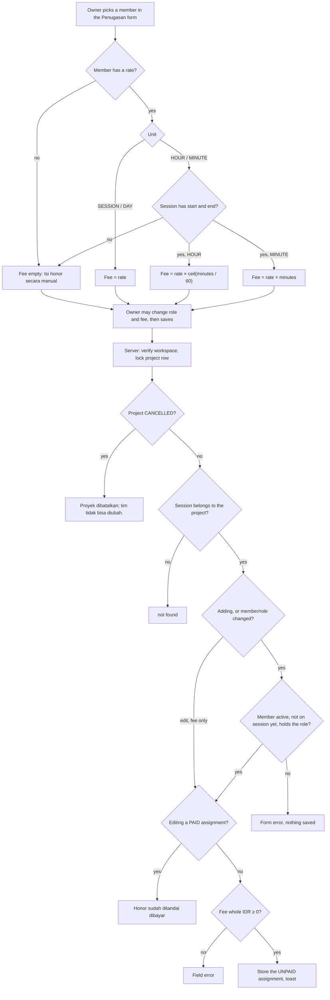
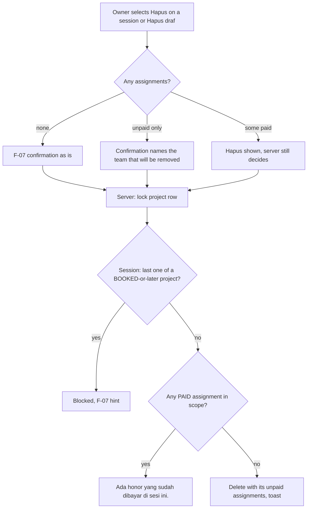

# F-08 Team — Activity

The images are rendered from the Mermaid sources below them. After you edit a source, save it to a `.mmd` file and render it again with `npx -y @mermaid-js/mermaid-cli@11 -i <name>.mmd -o img/<name>.svg -b white`.

## Save an assignment (BR-TEAM-006)

The prefill runs in the form. The server re-checks everything on save (C-004).

Mermaid source

## Delete a session or a draft project (BR-TEAM-006, BR-TEAM-003, BR-PRJ-010)

Mermaid source

The UI can't know about a payment made in another tab, so the paid check always runs on the server under the lock.
