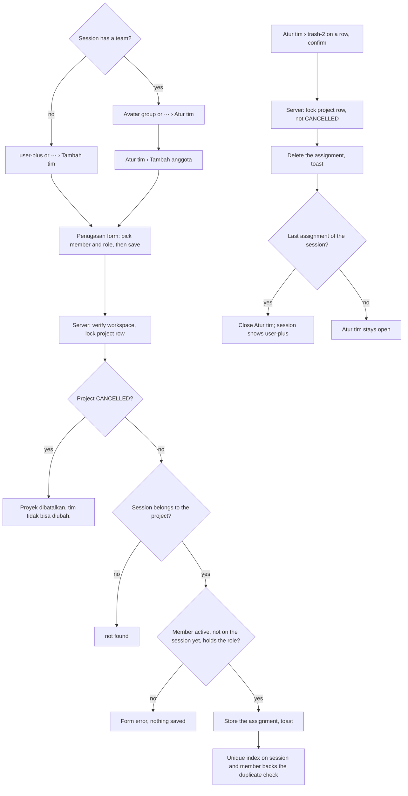
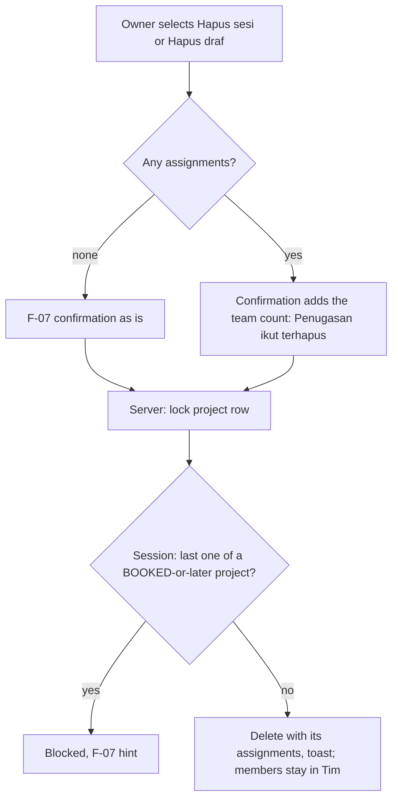

# F-08 Team — Activity

The images are rendered from the Mermaid sources below them. After you edit a source, save it to a `.mmd` file and render it again with `npx -y @mermaid-js/mermaid-cli@11 -i <name>.mmd -o img/<name>.svg -b white`.

## Add or remove an assignment (BR-TEAM-006)

Assignments are never edited: to change the role, remove and add again. The form only offers valid choices. The server checks everything again on save (C-004).

Mermaid source

## Delete a session or a draft project (BR-TEAM-006, BR-TEAM-003, BR-PRJ-010)

Mermaid source

