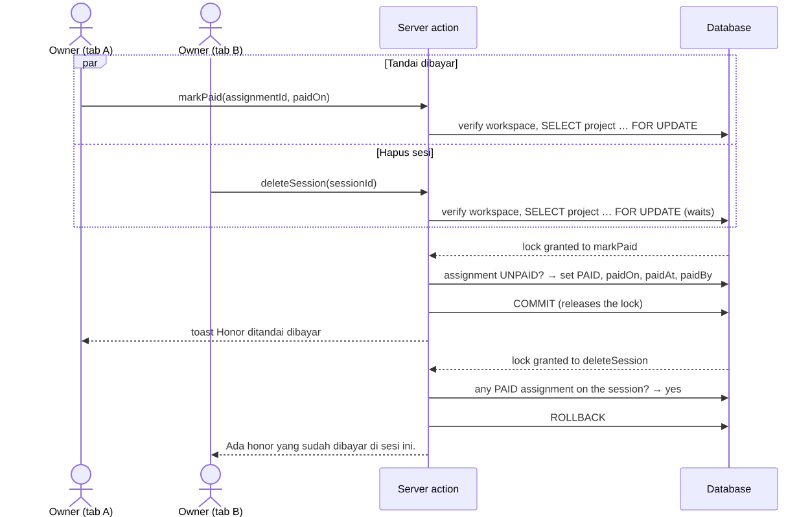
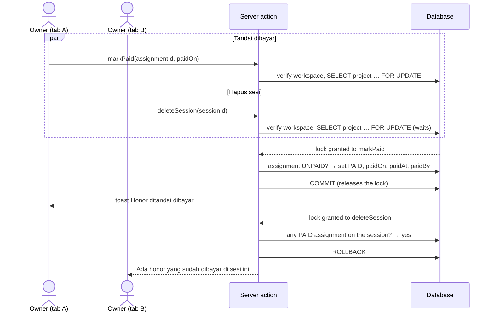

# F-08 Team — Sequence

The images are rendered from the Mermaid sources below them. After you edit a source, save it to a `.mmd` file and render it again with `npx -y @mermaid-js/mermaid-cli@11 -i <name>.mmd -o img/<name>.svg -b white`.

## Payment racing a session delete (C-005, AC-TEAM-025)

Every assignment write, payment, undo, and session or draft delete takes the **project row lock** first. Writes to one project's team therefore run one at a time, and the paid check in a delete always sees committed payments.

Mermaid source

If the delete gets the lock first, it removes the session and its unpaid assignment. The payment then finds no assignment and answers *not found*. Either way, a paid assignment is never deleted.

The same lock serializes the duplicate check (one member per session) and the paid lock (BR-TEAM-007). The database still backs both: a unique index on `(session, member)`, and a check that `paidOn` is set exactly when the status is `PAID` (C-003).
