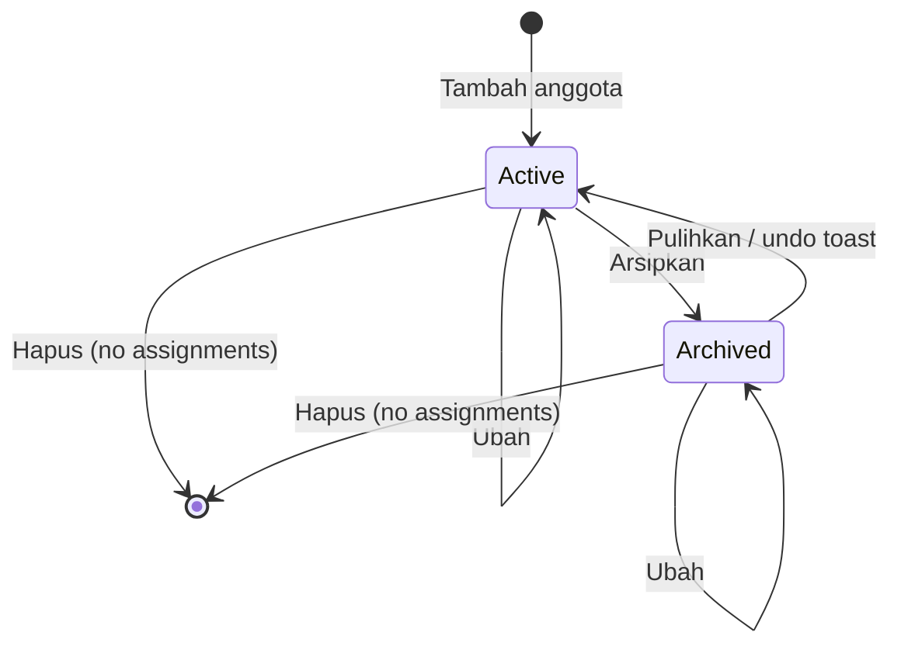

# F-08 Team — State Model

The image is rendered from the Mermaid source below it. After you edit the source, save it to a `.mmd` file and render it again with `npx -y @mermaid-js/mermaid-cli@11 -i <name>.mmd -o img/<name>.svg -b white`.

## Team member (BR-TEAM-004)

Mermaid source

Only `Active` members can be picked for a new assignment, or put on an existing one. An archived member keeps their assignments (BR-TEAM-006).

## Not modelled

- **Assignment:** no lifecycle. It is created, edited and removed, and has no status (BR-TEAM-002). Fees and their payment status moved to F-18 (Owner 2026-10-03; BR-TEAM-007 deprecated).
- **Session:** no stored status (BR-TEAM-002).
- **Role:** created, renamed and deleted while unused (BR-TEAM-005).
