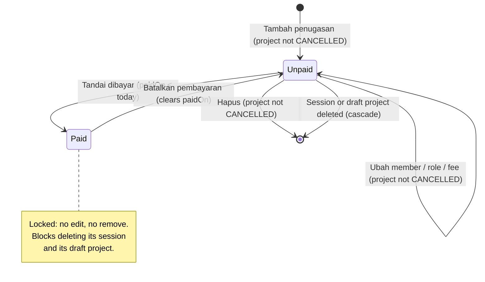
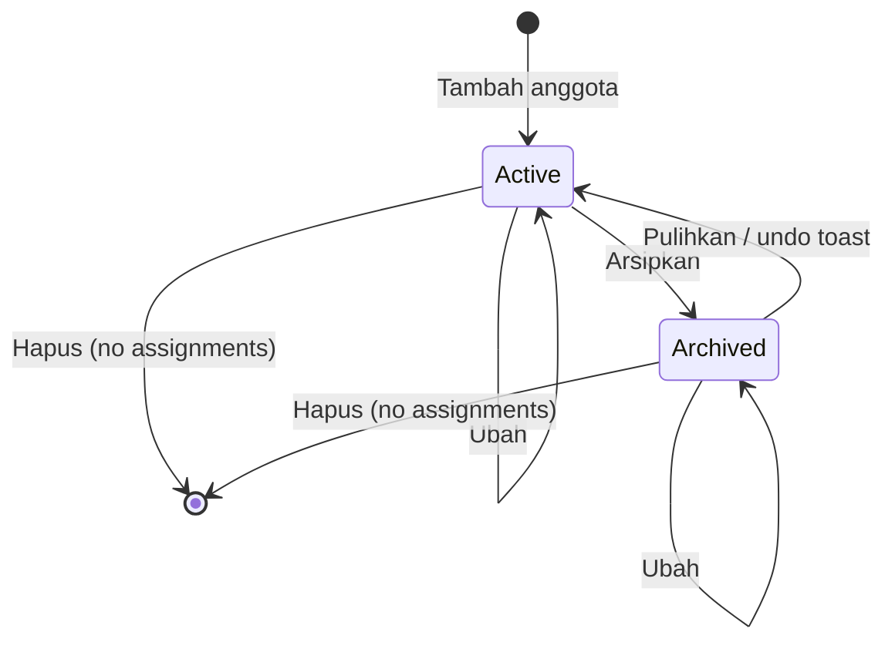

# F-08 Team — State Model

The images are rendered from the Mermaid sources below them. After you edit a source, save it to a `.mmd` file and render it again with `npx -y @mermaid-js/mermaid-cli@11 -i <name>.mmd -o img/<name>.svg -b white`.

## Assignment (BR-TEAM-006, BR-TEAM-007)

Mermaid source

Paying and undoing a payment are allowed in every project status, `CANCELLED` included. A project's status never changes because of an assignment, and an assignment's state never changes because of the project's status (BR-PRJ-006). Sessions have no state of their own (BR-TEAM-002).

## Team member (BR-TEAM-004)

Mermaid source

Only `Active` members can be picked for a new assignment, or put on an existing one. An archived member keeps their assignments, and those can still be paid and edited, fee only (BR-TEAM-006).

## Role (BR-TEAM-005)

A role has no lifecycle beyond being created, renamed and deleted while unused, so it has no diagram.
