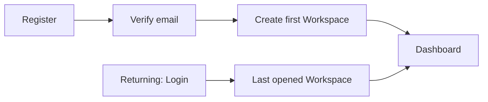
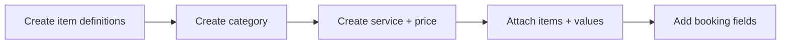
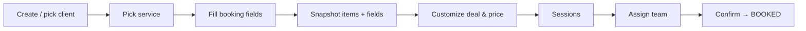
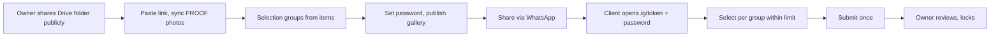
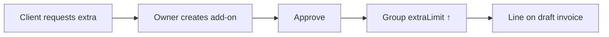
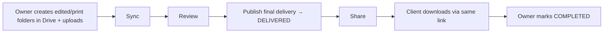
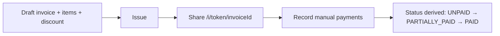

# User Journeys

These describe the intended complete MVP. They are workflow requirements, not evidence that all steps are currently available. Check [feature-map.md](feature-map.md) and owning feature verification before using them in present-tense product claims. Arrows do not imply scheduled or automatic actions.

## J-01 — Owner onboarding

**Actor:** Owner · **Entry:** no account · **Goal:** reach the dashboard of a first workspace.

**Alternate:** verification pending → resend; "Continue with Google" skips email verification (Google-verified email, BR-AUTH-006); verified user with zero workspaces is always redirected to onboarding; a returning Owner lands in the workspace they opened most recently, with no selection step, and switches brands from the sidebar (BR-WS-006).
**Success:** verified Owner with ≥1 workspace sees its dashboard.

## J-02 — Catalog setup

**Actor:** Owner · **Goal:** a sellable service with package items and booking fields.

## J-03 — Booking a project

**Actor:** Owner · **Goal:** record the client’s package, price and sessions independently of later catalog edits; explicitly adjust the deal until shooting starts, then lock it (BR-PRJ-009).

## J-04 — Proofing and selection

**Actors:** Owner, Client · **Goal:** client submits photo choices within each selection group’s allowance.

**Alternate:** limit exceeded / concurrent change → client revises; wrong password → rate-limited retry; Owner rotates password → old Shutrly gallery sessions invalidated. Submitted groups cannot be reopened. Public Drive links and retained public image URLs are outside gallery password/expiry enforcement (BR-ACC-005); do not imply complete media revocation.

## J-05 — Add-on

**Actors:** Client (asks), Owner · **Goal:** record extra package quantities/charges and update the affected selection allowance and draft invoice under BR-ADD-*. This is an explicit Owner approval flow, not automatic billing from a client’s selection.

## J-06 — Final delivery and completion

**Actors:** Owner, Client · **Goal:** client downloads finished files; project closed.

## J-07 — Billing

**Actors:** Owner, Client · **Goal:** issue an invoice and track its balance from payments the Owner records. Shutrly does not collect or verify payment through a gateway in MVP.

**Alternate:** mistaken payment → void with audit, status recalculated.

## Bilingual experience (Owner 2026-10-06)

All dashboard and client-gallery journeys follow [localization policy](localization.md): English default, explicit EN/ID switching, complete single-language presentation, bilingual descriptive content and templates, preserved identity/business values. Existing workflows and manual sending remain unchanged. Preference persistence, recipient-language choice and legacy-data rollout must be resolved before implementation. Localization applies to implemented features now and future journey surfaces when they are built.
