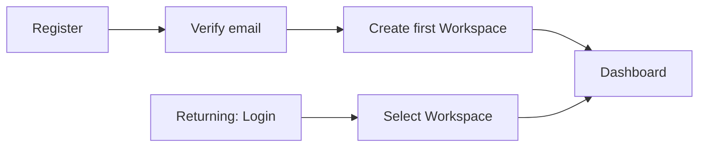
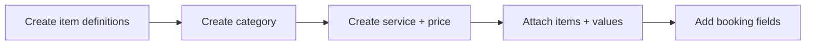
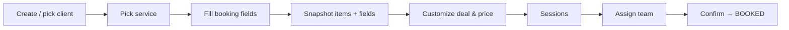
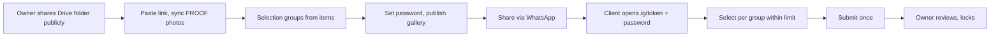
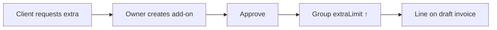
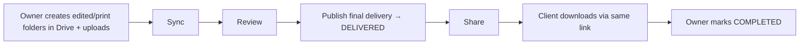
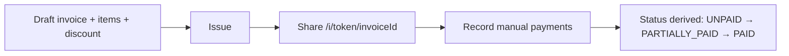

# User Journeys

## J-01 — Owner onboarding

**Actor:** Owner · **Entry:** no account · **Goal:** reach the dashboard of a first workspace.

**Alternate:** verification pending → resend; "Continue with Google" skips email verification (Google-verified email, BR-AUTH-006); verified user with zero workspaces is always redirected to onboarding.
**Success:** verified Owner with ≥1 workspace sees its dashboard.

## J-02 — Catalog setup

**Actor:** Owner · **Goal:** a sellable service with package items and booking fields.

## J-03 — Booking a project

**Actor:** Owner · **Goal:** a project whose agreed deal is frozen.

## J-04 — Proofing and selection

**Actors:** Owner, Client · **Goal:** client submits selections within entitlement.

**Alternate:** limit exceeded / concurrent change → client revises; wrong password → rate-limited retry; Owner rotates password → old sessions invalidated.

## J-05 — Add-on

**Actors:** Client (asks), Owner · **Goal:** extra entitlement billed consistently.

## J-06 — Final delivery and completion

**Actors:** Owner, Client · **Goal:** client downloads finished files; project closed.

## J-07 — Billing

**Actors:** Owner, Client · **Goal:** invoice issued, paid, status correct.

**Alternate:** mistaken payment → void with audit, status recalculated.
